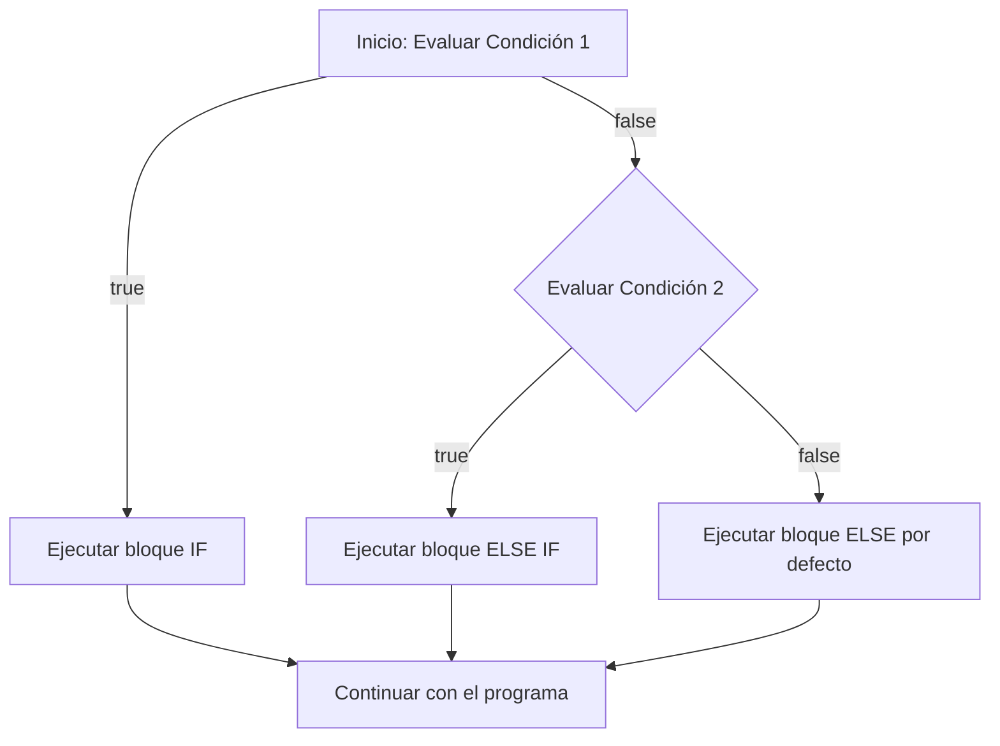
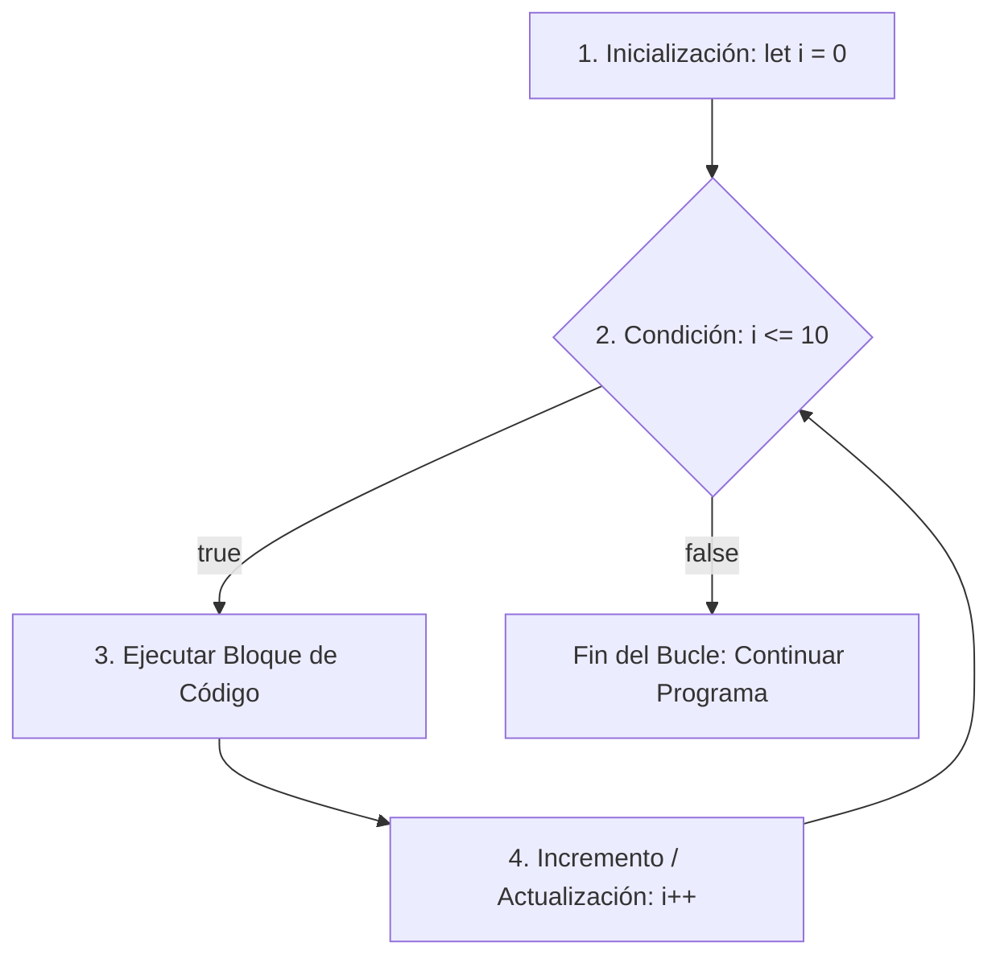
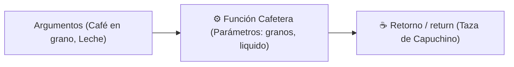
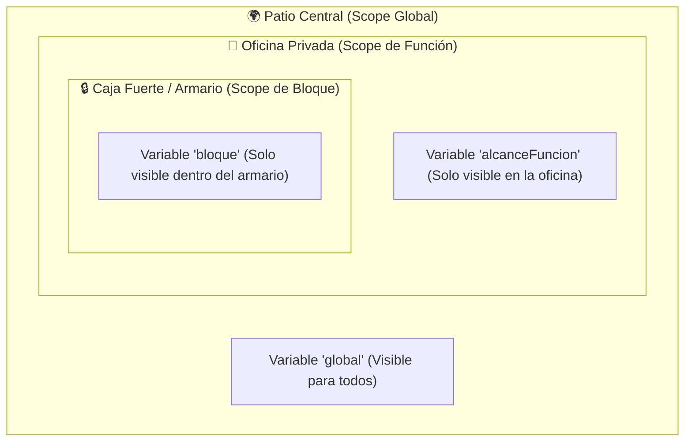
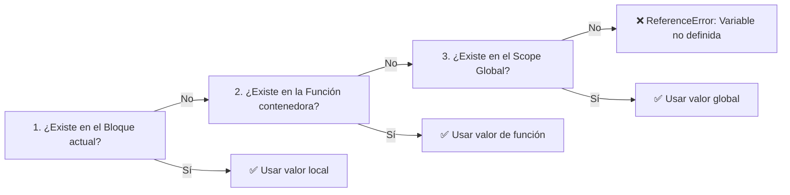
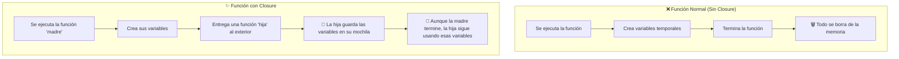
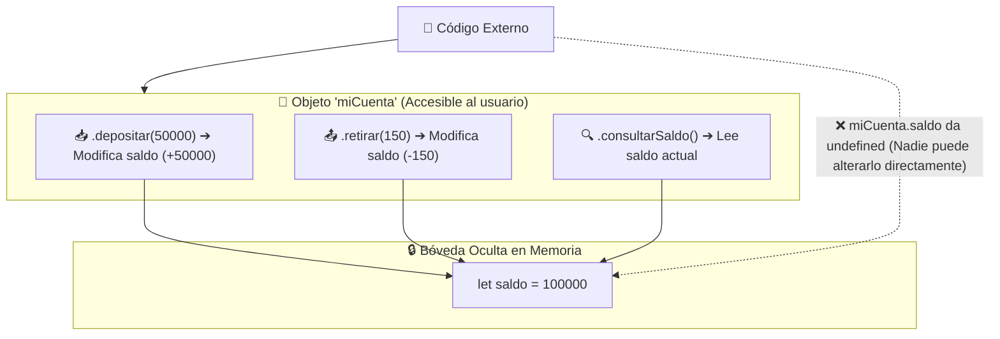

# 📘 Guía de Estudio: Fundamentos de JavaScript

Esta guía contiene los apuntes de estudio, explicaciones detalladas y conceptos clave aprendidos durante el curso de **Fundamentos de JavaScript** (Platzi). El objetivo es documentar las bases esenciales del lenguaje de forma **sencilla, gráfica y accesible**, explicando el porqué detrás de cada comportamiento técnico (como el _hoisting_, los tipos de datos, los operadores o el manejo de memoria).

---

## 📂 Índice de Clases

- [Clase 01: Variables (`var`, `let`, `const`) y Hoisting](#clase-01-variables-var-let-const-y-hoisting)
- [Clase 02: Tipos de Datos (Primitivos vs. Complejos) y `typeof`](#clase-02-tipos-de-datos-primitivos-vs-complejos-y-typeof)
- [Clase 03: Operadores Aritméticos, Asignación Compuesta y Valores Especiales (`NaN` / `Infinity`)](#clase-03-operadores-aritméticos-asignación-compuesta-y-valores-especiales-nan--infinity)
- [Clase 04: Strings, Template Literals y Métodos Principales](#clase-04-strings-template-literals-y-métodos-principales)
- [Clase 05: Coerción de Tipos (Implícita vs. Explícita) y Valores Truthy / Falsy](#clase-05-coerción-de-tipos-implícita-vs-explícita-y-valores-truthy--falsy)
- [Clase 06: Operadores de Comparación (Igualdad Débil vs. Estricta y Desigualdad)](#clase-06-operadores-de-comparación-igualdad-débil-vs-estricta-y-desigualdad)
- [Clase 07: Operadores Lógicos (`&&`, `||`, `!`) y Evaluación de Cortocircuito](#clase-07-operadores-lógicos--y-evaluación-de-cortocircuito)
- [Clase 08: Estructuras de Control (`if`, `else if`, `else`) y Operador Ternario](#clase-08-estructuras-de-control-if-else-if-else-y-operador-ternario)
- [Clase 09: Estructura de Control `switch`, Agrupación de Casos y `default`](#clase-09-estructura-de-control-switch-agrupación-de-casos-y-default)
- [Clase 10: Bucles e Iteraciones (`for`, `for...of`, `for...in`, `while` y `do...while`)](#clase-10-bucles-e-iteraciones-for-forof-forin-while-y-dowhile)
- [Clase 11: Funciones (Declaración, Parámetros vs. Argumentos, Arrow Functions y Parámetros por Defecto)](#clase-11-funciones-declaración-parámetros-vs-argumentos-arrow-functions-y-parámetros-por-defecto)
- [Clase 12: Scope o Alcance (Global, de Función, de Bloque y Cadena de Alcance)](#clase-12-scope-o-alcance-global-de-función-de-bloque-y-cadena-de-alcance)
- [Clase 13: Closures (Entorno Léxico, Memoria y Encapsulación de Datos Privados)](#clase-13-closures-entorno-léxico-memoria-y-encapsulación-de-datos-privados)

---

## Clase 01: Variables (`var`, `let`, `const`) y Hoisting

👉 [Ver código de la clase](./curso/src/01-vars.js)

En JavaScript, una variable es un contenedor en memoria donde almacenamos información para utilizarla y manipularla a lo largo del programa. La evolución de JavaScript (especialmente con ES6) introdujo formas más seguras y predecibles de gestionar datos en memoria.

---

### 📦 La Analogía de las Cajas de Almacenamiento

Imagina que declarar variables es como etiquetar cajas para organizar tu habitación:

- **`var` (La caja sin tapa de los años 90)**: Es una caja abierta que cualquiera en la casa puede ver, modificar o incluso cambiarle el nombre por error. Además, JavaScript la mueve "mágicamente" al techo de la habitación antes de que despiertes (_Hoisting_). **¡Mala práctica hoy en día!**
- **`let` (La caja con tapa de velcro)**: Está guardada dentro de una habitación específica (bloque `{}`). Puedes abrirla en cualquier momento, sacar su contenido y poner uno nuevo (reasignar). Pero **no puedes** comprar otra caja con el mismo nombre en la misma habitación (evita redeclaraciones accidentales).
- **`const` (La caja fuerte sellada)**: Una vez que guardas un valor y la cierras, queda blindada. No puedes reasignarle un valor completamente nuevo. Es la opción más segura y predecible.

---

### 🔑 Conceptos Clave

1. **Declaración vs. Reasignación**:
   - **Declarar**: Reservar el nombre de la variable en memoria (`let total;`).
   - **Inicializar / Asignar**: Darle un valor inicial (`total = 100;`).
   - **Reasignar**: Cambiar el valor existente por uno nuevo (`total = 150;`).
   - **Redeclarar**: Intentar volver a crear una variable con el mismo nombre (`var x = 1; var x = 2;`). `var` lo permite silenciosamente (generando bugs), mientras que `let` y `const` lanzan un error de sintaxis inmediato.

2. **Tabla Comparativa de Comportamiento**:

| Característica           | `var`                             | `let`                        | `const`                    |
| :----------------------- | :-------------------------------- | :--------------------------- | :------------------------- |
| **Ámbito (_Scope_)**     | Función o Global                  | Bloque `{}`                  | Bloque `{}`                |
| **¿Permite Reasignar?**  | ✅ Sí                             | ✅ Sí                        | ❌ No                      |
| **¿Permite Redeclarar?** | ✅ Sí (Peligroso)                 | ❌ No                        | ❌ No                      |
| **Hoisting**             | ✅ Sí (Inicializa en `undefined`) | ⚠️ Sí (Temporal Dead Zone)   | ⚠️ Sí (Temporal Dead Zone) |
| **Uso Recomendado**      | ⛔ Evitar siempre                 | 🟡 Solo si cambiará su valor | 🟢 **Uso por defecto**     |

3. **¿Qué es el Hoisting (Elevación)?**:
   - Es el comportamiento interno de JavaScript durante la fase de compilación/creación, donde las **declaraciones** de variables y funciones son procesadas en memoria antes de ejecutar cualquier línea de código.
   - Con `var`: La variable es "elevada" y se le asigna automáticamente el valor inicial `undefined`. Si intentas acceder a ella antes de su línea de asignación, no dará error, sino que devolverá `undefined`.
   - Con `let` y `const`: También son elevadas conceptualmente, pero **no son inicializadas**. Entran en un estado llamado **Zona Muerta Temporal (Temporal Dead Zone - TDZ)**. Si intentas utilizarlas antes de declararlas, el motor arrojará un `ReferenceError`.

---

### 💻 Código de la Clase Ilustrado

```javascript
// ==========================================
// 1. Comportamiento de 'var' (Problema de redeclaración)
// ==========================================
var bloquesRojos = true;
var bloquesRojos = 5; // ⚠️ Permitido con var: sobreescribe sin avisar

// ==========================================
// 2. Comportamiento de 'let' (Reasignable, no redeclarable)
// ==========================================
let contador = 0;
// let contador = 5; // ❌ Error: Identifier 'contador' has already been declared
contador = 5; // ✅ Válido: Reasignación de valor
let mensaje = "Hola";

// ==========================================
// 3. Comportamiento de 'const' (Constante)
// ==========================================
const PI = 3.1416;
// PI = 3.15; // ❌ TypeError: Assignment to constant variable.

// ==========================================
// 4. Hoisting (Elevación)
// ==========================================
console.log(nombre); // 👉 Imprime: undefined (No rompe el programa)
var nombre = "Christian";

/* 
🧠 ¿Qué hizo JavaScript internamente tras bambalinas?
------------------------------------------------------
var nombre;             // 1. Eleva la declaración y le asigna undefined
console.log(nombre);    // 2. Imprime undefined
nombre = "Christian";   // 3. Asigna el valor real en la línea original
*/
```

---

> [!TIP]
> **Regla de Oro en JavaScript Moderno:**
> Declara siempre todas tus variables con **`const`** por defecto. Si en algún momento descubres que el valor debe cambiar (por ejemplo, el acumulador de un bucle o un contador), cámbialo a **`let`**. **Nunca utilices `var`**.

---

## Clase 02: Tipos de Datos (Primitivos vs. Complejos) y `typeof`

👉 [Ver código de la clase](./curso/src/02-types.js)

En JavaScript, los datos que manipulamos se dividen en dos grandes categorías: **Tipos Primitivos** y **Tipos Complejos (o de Referencia)**. Conocer sus diferencias es vital para entender cómo se guardan en memoria y cómo se comportan al pasarlos como argumentos.

---

### 🪙 La Analogía de la Fotocopia vs. La Llave de Casa

- **Tipos Primitivos (Paso por Valor / La Fotocopia)**: Imagina que tienes una hoja con un poema y le sacas una fotocopia para dársela a un amigo. Si tu amigo mancha con café su fotocopia, tu hoja original sigue intacta. Cada variable guarda **su propio valor independiente** directamente en memoria (_Stack_).
- **Tipos Complejos (Paso por Referencia / La Llave Compartida)**: Imagina que le das una copia de la llave de tu casa a un amigo. Si tu amigo entra y pinta las paredes de verde, tú también verás las paredes verdes al entrar. La variable no guarda la casa entera, guarda únicamente la **dirección de memoria** (_Heap_) donde vive el objeto.

---

### 🔑 1. Los 7 Tipos de Datos Primitivos

Son valores simples, inmutables y de tamaño fijo:

| Tipo            | Descripción                                                                       | Ejemplo         | Resultado de `typeof`        |
| :-------------- | :-------------------------------------------------------------------------------- | :-------------- | :--------------------------- |
| **`string`**    | Texto o cadenas de caracteres envueltas en comillas (`""`, `''`, `` ` ``).        | `"Hola"`        | `"string"`                   |
| **`number`**    | Números enteros o decimales (punto flotante de 64 bits).                          | `42`, `3.14`    | `"number"`                   |
| **`boolean`**   | Valores lógicos de verdadero o falso.                                             | `true`, `false` | `"boolean"`                  |
| **`null`**      | Representa intencionalmente la ausencia de valor o valor vacío.                   | `null`          | `"object"` _(Bug histórico)_ |
| **`undefined`** | Variable declarada a la que aún no se le ha asignado un valor.                    | `undefined`     | `"undefined"`                |
| **`symbol`**    | Identificador único e inmutable (introducido en ES6).                             | `Symbol("id")`  | `"symbol"`                   |
| **`bigint`**    | Enteros de precisión arbitraria para números mayores a $2^{53} - 1$ (sufijo `n`). | `123n`          | `"bigint"`                   |

> [!WARNING]
> **El Bug Histórico de `typeof null`:**
> Al ejecutar `typeof null`, JavaScript devuelve `"object"`. Esto es un error de diseño que existe desde la primera versión de JS en 1995. No se ha corregido para no romper la compatibilidad con millones de sitios web antiguos. `null` es un **primitivo**, no un objeto.

---

### 🧩 2. Tipos Complejos (Estructuras de Referencia)

Son colecciones de valores o unidades de código ejecutable que pueden crecer de forma dinámica:

1. **Objetos Literales (`Object`)**: Colecciones de pares clave-valor `{ clave: valor }`.
2. **Arreglos (`Array`)**: Listas ordenadas indexadas numéricamente `[ elemento1, elemento2 ]`. En JavaScript, los arreglos son técnicamente un tipo especial de objeto (`typeof [] === "object"`).
3. **Funciones (`Function`)**: Bloques de código reutilizables y ejecutables. El operador `typeof` devuelve `"function"`.

---

### 💻 Código de la Clase Ilustrado

```javascript
// ==========================================
// 1. Tipos de Datos Primitivos
// ==========================================
const texto = "Hola"; // string
const numero = 42; // number
const boolean = true; // boolean (true o false)
const nulo = null; // null (ausencia intencional de valor)
const indefinido = undefined; // undefined (valor por defecto no asignado)
const simbolo = Symbol("id"); // symbol (identificador único garantizado)
const grande = 123n; // bigint (número entero gigante con sufijo 'n')

// Inspección con el operador typeof:
console.log(typeof texto); // "string"
console.log(typeof numero); // "number"
console.log(typeof boolean); // "boolean"
console.log(typeof nulo); // "object" ⚠️ (Bug histórico de JS)
console.log(typeof indefinido); // "undefined"
console.log(typeof simbolo); // "symbol"
console.log(typeof grande); // "bigint"

// ==========================================
// 2. Tipos de Datos Complejos (Por Referencia)
// ==========================================
const objeto = { nombre: "Juan", edad: 30 }; // Objeto literal
const arreglo = [1, 2, 3, "string"]; // Array (colección indexada)
const funcion = function () {}; // Función

console.log(typeof objeto); // "object"
console.log(typeof arreglo); // "object" (Usa Array.isArray(arreglo) para comprobar si es un array)
console.log(typeof funcion); // "function"
```

---

> [!NOTE]
> **¿Cómo comprobar si un dato es realmente un Arreglo?**
> Dado que `typeof []` devuelve `"object"`, la forma correcta y estándar de verificar si una variable es un array es utilizando el método nativo:
>
> ```javascript
> Array.isArray(arreglo); // Devuelve true
> ```

---

## Clase 03: Operadores Aritméticos, Asignación Compuesta y Valores Especiales (`NaN` / `Infinity`)

👉 [Ver código de la clase](./curso/src/03-operators.js)

Los operadores son símbolos que le indican al motor de JavaScript que realice operaciones matemáticas, manipulaciones de valores o asignaciones sobre una o más variables (operandos).

---

### 🧮 1. Operadores Aritméticos Básicos

Permiten realizar cálculos matemáticos directos:

| Operador   | Operación                       | Ejemplo  | Resultado   |
| :--------- | :------------------------------ | :------- | :---------- |
| **`+`**    | Suma                            | `2 + 2`  | `4`         |
| **`-`**    | Resta                           | `5 - 2`  | `3`         |
| **`*`**    | Multiplicación                  | `5 * 3`  | `15`        |
| **`/`**    | División                        | `10 / 2` | `5`         |
| **`%`**    | Módulo (Residuo de la división) | `5 % 2`  | `1`         |
| **`**`\*\* | Exponenciación / Potencia       | `2 ** 3` | `8` ($2^3$) |

> [!TIP]
> **El caso de uso estrella del operador Módulo (`%`):**
> Se utiliza frecuentemente para determinar si un número es **par** o **impar**:
>
> ```javascript
> const esPar = numero % 2 === 0; // Si el residuo es 0, es par
> ```

---

### 📝 2. Operadores de Asignación Compuesta

Son atajos sintácticos para tomar el valor actual de una variable, aplicarle una operación matemática y reasignar el resultado en la misma variable:

- **`a += 3`** $\rightarrow$ Equivale a: `a = a + 3`
- **`b -= 10`** $\rightarrow$ Equivale a: `b = b - 10`
- **`c *= 2`** $\rightarrow$ Equivale a: `c = c * 2`
- **`d /= 3`** $\rightarrow$ Equivale a: `d = d / 3`

---

### 🔄 3. Operadores de Incremento y Decremento

Permiten sumar o restar exactamente `1` a una variable:

- **Incremento (`++`)**: `contador++` (aumenta el valor en 1).
- **Decremento (`--`)**: `contador--` (disminuye el valor en 1).

> [!NOTE]
> **Post-incremento vs. Pre-incremento:**
>
> - `x++` (Post): Primero devuelve el valor actual y luego lo incrementa.
> - `++x` (Pre): Primero incrementa el valor y luego lo devuelve.

---

### ⚠️ 4. Valores Numéricos Especiales en JavaScript

JavaScript no se "rompe" ni detiene la ejecución del programa cuando ocurre un error matemático extremo; en su lugar, devuelve representaciones numéricas especiales:

1. **`Infinity` y `-Infinity`**:
   - Ocurren al dividir un número finito entre `0` (en otros lenguajes esto lanzaría una excepción).
   - `1 / 0` $\rightarrow$ `Infinity`
   - `-1 / 0` $\rightarrow$ `-Infinity`

2. **`NaN` (_Not a Number_)**:
   - Representa un cálculo que no tiene sentido matemático o una conversión fallida.
   - `0 / 0` $\rightarrow$ `NaN` (indeterminación matemática).
   - `"Hola" * 2` $\rightarrow$ `NaN` (intentar multiplicar un texto no numérico).
   - **Curiosidad técnica:** `typeof NaN` devuelve `"number"`. Para comprobar si un valor es `NaN`, usa siempre `Number.isNaN(valor)` (ya que por especificación `NaN !== NaN`).

---

### 💻 Código de la Clase Ilustrado

```javascript
// ==========================================
// 1. Operaciones Aritméticas Básicas
// ==========================================
const suma = 2 + 2; // 4
const resta = 5 - 2; // 3
const multiplicacion = 5 * 3; // 15
const divicion = 10 / 2; // 5
const modulo = 5 % 2; // 1 (Residuo de dividir 5 entre 2)
const potencia = 2 ** 3; // 8 (2 elevado al cubo: 2 * 2 * 2)

console.log({ suma, resta, multiplicacion, divicion, modulo, potencia });

// ==========================================
// 2. Operadores de Asignación Compuesta
// ==========================================
let a = 5;
a += 3; // a = 5 + 3 -> 8
console.log(a);

let b = 50;
b -= 10; // b = 50 - 10 -> 40
console.log(b);

let c = 6;
c *= 2; // c = 6 * 2 -> 12
console.log(c);

let d = 15;
d /= 3; // d = 15 / 3 -> 5
console.log(d);

// ==========================================
// 3. Incremento y Decremento
// ==========================================
let contador = 0;
contador++; // contador = 1
console.log(contador);

contador--; // contador = 0
console.log(contador);

// ==========================================
// 4. Valores Especiales: Infinity y NaN
// ==========================================
console.log(1 / 0); // Infinity
console.log(-1 / 0); // -Infinity

console.log(0 / 0); // NaN (Not-a-Number)
console.log("Hola" * 2); // NaN (Operación matemática inválida con string)
```

---

## Clase 04: Strings, Template Literals y Métodos Principales

👉 [Ver código de la clase](./curso/src/04-strings.js)

Los **Strings** (cadenas de texto) son secuencias de caracteres utilizadas para representar y manipular texto en JavaScript. Con la llegada de **ES6 (ECMAScript 2015)**, el trabajo con cadenas evolucionó drásticamente gracias a los **Template Literals** (plantillas literales) y a un conjunto completo de métodos utilitarios.

---

### 🧵 La Analogía del Collage vs. La Carta Personalizada

- **Concatenación Tradicional con `+` (El Collage de Recortes)**: Es como armar una frase recortando palabras de periódicos y pegándolas una por una con cinta adhesiva (`"Hola " + nombre + " tienes " + edad + " años"`). Es tedioso, fácil de romper si olvidas un espacio y difícil de leer.
- **Template Literals con Backticks `` ` `` (La Plantilla de Carta Inteligente)**: Es como un formulario pre-impreso con espacios en blanco rellenables (`${nombre}`). Escribes el texto de forma natural, insertas variables o cálculos directamente en su lugar y respetas saltos de línea sin trucos adicionales.

---

### 🔑 1. Formas de Declarar Cadenas de Texto

En JavaScript existen 3 formas de envolver texto:

1. **Comillas dobles (`"..."`)** o **comillas simples (`'...'`)**:
   - Forma clásica.
   - Requieren el operador `+` para unir variables.
   - No permiten saltos de línea directos (requieren caracteres de escape como `\n`).
2. **Backticks o Comillas Invertidas (`` `...` `` - Template Literals)**:
   - **Interpolación de variables y expresiones**: `${expresion}`.
   - **Cadenas multilínea**: Permiten saltos de línea limpios y directos en el editor de código.

---

### 💡 2. Poder de los Template Literals

#### A. Interpolación de Expresiones y Cálculos

Dentro de `${...}` puedes colocar cualquier expresión válida de JavaScript (operaciones matemáticas, llamadas a funciones, operadores ternarios, etc.):

```javascript
const precio = 100;
const cantidad = 3;
const total = `Total: $${precio * cantidad}`; // "Total: $300"
```

#### B. Texto Multilínea Nativo

Facilita la creación de plantillas HTML, notas formateadas o mensajes largos:

```javascript
const nota = `
# Mi nota
Este es el contenido sin necesidad de usar \\n
`;
```

---

### 🛠️ 3. Catálogo Completo de Propiedades y Métodos de Strings

Aunque los strings son datos primitivos e inmutables, JavaScript los envuelve temporalmente en un objeto (_wrapper_) para permitirnos invocar métodos y propiedades sobre ellos:

| Método / Propiedad               | Tipo      | Descripción                                                                         | Ejemplo                                                | Resultado              |
| :------------------------------- | :-------- | :---------------------------------------------------------------------------------- | :----------------------------------------------------- | :--------------------- |
| **`.length`**                    | Propiedad | Devuelve la longitud total (número de caracteres con espacios).                     | `"Hola".length`                                        | `4`                    |
| **`.slice(inicio, fin)`**        | Método    | Extrae un fragmento de texto. **Acepta índices negativos** contando desde el final. | `"JavaScript".slice(0, 4)`<br>`"JavaScript".slice(-6)` | `"Java"`<br>`"Script"` |
| **`.substring(inicio, fin)`**    | Método    | Extrae caracteres entre dos posiciones (si `inicio > fin`, los invierte).           | `"Hola Mundo".substring(0, 4)`                         | `"Hola"`               |
| **`.split(separador)`**          | Método    | Divide la cadena en un **Arreglo (`Array`)** a partir del delimitador indicado.     | `"L1 L2 L3".split(" ")`                                | `["L1", "L2", "L3"]`   |
| **`.trim()`**                    | Método    | Elimina los espacios en blanco sobrantes **al inicio y al final**.                  | `"  Hola  ".trim()`                                    | `"Hola"`               |
| **`.trimStart()`**               | Método    | Elimina espacios en blanco únicamente **al inicio**.                                | `"  Hola  ".trimStart()`                               | `"Hola  "`             |
| **`.trimEnd()`**                 | Método    | Elimina espacios en blanco únicamente **al final**.                                 | `"  Hola  ".trimEnd()`                                 | `"  Hola"`             |
| **`.toLowerCase()`**             | Método    | Convierte toda la cadena a **minúsculas**.                                          | `"JS".toLowerCase()`                                   | `"js"`                 |
| **`.toUpperCase()`**             | Método    | Convierte toda la cadena a **mayúsculas**.                                          | `"js".toUpperCase()`                                   | `"JS"`                 |
| **`.includes(subcadena)`**       | Método    | Evalúa si la cadena contiene el texto buscado (_Case Sensitive_).                   | `"Hola".includes("ol")`                                | `true`                 |
| **`.startsWith(texto)`**         | Método    | Comprueba si la cadena **comienza** con dicho texto.                                | `"doc.md".startsWith("doc")`                           | `true`                 |
| **`.endsWith(texto)`**           | Método    | Comprueba si la cadena **termina** con dicho texto (ideal para extensiones).        | `"doc.md".endsWith(".md")`                             | `true`                 |
| **`.replace(buscar, nuevo)`**    | Método    | Reemplaza la **primera aparición** encontrada por el nuevo texto.                   | `"Hola Hola".replace("Hola", "Hi")`                    | `"Hi Hola"`            |
| **`.replaceAll(buscar, nuevo)`** | Método    | Reemplaza **todas las apariciones** encontradas por el nuevo texto.                 | `"Hola Hola".replaceAll("Hola", "Hi")`                 | `"Hi Hi"`              |

---

### 🔍 Comparativas y Comportamientos Clave

1. **`.slice()` vs. `.substring()`**:
   - `.slice(-6)` cuenta los últimos 6 caracteres; `.substring(-6)` interpreta el negativo como `0`.
   - `.slice(10, 0)` devuelve `""`, mientras que `.substring(10, 0)` lo invierte automáticamente a `(0, 10)`.
   - **Recomendación moderna:** Usa `.slice()` por consistencia y soporte de índices negativos.

2. **Sensibilidad a Mayúsculas y Minúsculas (_Case-Sensitivity_)**:
   - Métodos como `.includes()`, `.startsWith()` y `.endsWith()` son estrictamente sensibles a mayúsculas/minúsculas.
   - Para búsquedas flexibles, combina con `.toLowerCase()`:
     ```javascript
     contenido.toLowerCase().includes("javascript");
     ```

3. **Reemplazo e Inmutabilidad (`replace` vs `replaceAll`)**:
   - `texto.replace("Hola", "Hi")` solo cambia la primera coincidencia.
   - `texto.replaceAll("Hola", "Hi")` actualiza todas las coincidencias.
   - **¡Atención!** Ninguno altera la variable original `texto`; siempre retornan una nueva cadena.

---

### 💻 Código de la Clase Ilustrado

```javascript
// ==========================================
// 1. Concatenación Tradicional vs. Template Literals
// ==========================================
const nombre = "Javascript";
const version = "ES6";

// Forma tradicional con operador +
const message = "Bienvenido a " + nombre + " version: " + version;
// console.log(message);

// Forma moderna con Template Literals (Interpolación)
const message2 = `Bienvenida y Bienvenido a el curso de ${nombre} en su version ${version}`;

// ==========================================
// 2. Evaluación de Expresiones Matemáticas
// ==========================================
const precio = 100;
const cantidad = 3;
const total = `Total: ${precio * cantidad}`;
console.log(total); // "Total: 300"

// ==========================================
// 3. Cadenas Multilínea
// ==========================================
const nota = `
# Mi nota
Este es el contenido

- Nota1
- Nota 2
- Nota 3
`;
console.log(nota);

// ==========================================
// 4. Métodos Principales en Strings
// ==========================================

// Length -> Propiedad con el conteo total de caracteres
const texto = "Hola Mundo";
console.log(texto.length); // 10

// Slice(inicio, fin) -> Extracción con soporte de índices positivos y negativos
const texto1 = "Javascript es Genial";
console.log(texto1.slice(0, 10)); // "Javascript"
console.log(texto1.slice(11)); // "es Genial"
console.log(texto1.slice(-6)); // "Genial" (últimos 6 caracteres)

// Substrings(inicio, fin)
const texto2 = "Hola Mundo";
console.log(texto2.substring(0, 4)); // "Hola"

// Split(separador) -> Convierte el texto en un Array
const texto3 = "Linea1 linea2 linea3";
const lineas = texto3.split(" ");
console.log(lineas); // [ 'Linea1', 'linea2', 'linea3' ]

// ==========================================
// 5. Limpieza de Espacios en Blanco (Trim)
// ==========================================
const texto4 = "    Hola Mundo.    ";
console.log(texto4.trim()); // "Hola Mundo." (Limpia ambos extremos)
console.log(texto4.trimStart()); // "Hola Mundo.    " (Limpia solo inicio)
console.log(texto4.trimEnd()); // "    Hola Mundo." (Limpia solo final)

// ==========================================
// 6. Conversión de Mayúsculas / Minúsculas
// ==========================================
const texto5 = "Javascript";
console.log(texto5.toLowerCase()); // "javascript"
// console.log(texto5.toUpperCase()); // "JAVASCRIPT"

// ==========================================
// 7. Búsqueda y Validación de Contenido
// ==========================================
const contenido = "Aprende JAvaScript desde cero";
console.log(contenido.includes("Javascirpt")); // false (Typo y case-sensitive)
console.log(contenido.includes("Python")); // false

// startsWith() y endsWith()
const archivo = "documento.md";
console.log(archivo.startsWith("doc")); // true
console.log(archivo.endsWith(".md")); // true (Muy útil para validar extensiones de archivo)

// ==========================================
// 8. Reemplazo de Contenido (Inmutabilidad)
// ==========================================
const texto6 = "Hola Mundo, Hola javascript";
console.log(texto6.replace("Hola", "Hi")); // "Hi Mundo, Hola javascript" (Solo el primer "Hola")
console.log(texto6.replaceAll("Hola", "Hi")); // "Hi Mundo, Hi javascript" (Todos los "Hola")
console.log(texto6); // "Hola Mundo, Hola javascript" (¡El original sigue intacto!)
```

---

> [!TIP]
> **Regla de Inmutabilidad en Primitivos:**
> Ningún método de strings modifica la variable existente. Si deseas conservar el resultado transformado (por ejemplo después de un `.trim()` o `.replaceAll()`), debes asignarlo a una nueva variable o reasignar con `let`:
>
> ```javascript
> let correo = "  usuario@correo.com  ";
> correo = correo.trim().toLowerCase(); // "usuario@correo.com"
> ```

---

## Clase 05: Coerción de Tipos (Implícita vs. Explícita) y Valores Truthy / Falsy

👉 [Ver código de la clase](./curso/src/05-coercion.js)

La **coerción de tipos** (_Type Coercion_) es la conversión automática o implícita de valores de un tipo de dato a otro realizada por el motor de JavaScript. La **conversión de tipos** (_Type Conversion_ o _Type Casting_), por el contrario, ocurre de forma explícita cuando el desarrollador indica intencionalmente la transformación.

---

### 🎭 La Analogía del Traductor Automático Entrometido

- **Coerción Implícita (El traductor que asume sin preguntar)**: Imagina que estás hablando con alguien que habla otro idioma y un traductor en medio decide traducir lo que cree que quisiste decir sin consultarte. A veces acierta, pero otras veces produce malentendidos absurdos que pueden arruinar la conversación (provocar _bugs_ difíciles de rastrear).
- **Conversión Explícita (El diccionario oficial)**: Tú mismo buscas la palabra en el diccionario y especificas la traducción exacta con precisión matemática. El código es 100% predecible, legible y seguro.

---

### ⚙️ 1. Coerción Implícita (Conversión Automática)

Ocurre cuando aplicamos operadores entre tipos de datos distintos y JavaScript intenta "ayudarnos" convirtiendo los tipos por su cuenta según sus reglas internas:

| Operación                      | Expresión         | Resultado      | Tipo Resultante | Explicación Técnica                                                                                 |
| :----------------------------- | :---------------- | :------------- | :-------------- | :-------------------------------------------------------------------------------------------------- |
| **Suma con String**            | `"5" + 3`         | `"53"`         | `string`        | Si al menos uno de los operandos del `+` es `string`, JS concatena convirtiendo el otro a `string`. |
| **Resta con String**           | `"5" - 3`         | `2`            | `number`        | El operador `-` solo tiene significado aritmético, así que JS convierte `"5"` a número `5`.         |
| **Multiplicación con String**  | `"4" * 2`         | `8`            | `number`        | El operador `*` convierte ambos operandos a números.                                                |
| **División con String**        | `"10" / "2"`      | `5`            | `number`        | El operador `/` convierte ambos strings a números.                                                  |
| **Suma de Booleano y Número**  | `true + 1`        | `2`            | `number`        | `true` se convierte implícitamente en `1` (`false` se convierte en `0`).                            |
| **Resta de Booleano y Número** | `false - 1`       | `-1`           | `number`        | `false` se convierte en `0`, por lo que $0 - 1 = -1$.                                               |
| **Suma de Booleano y String**  | `true + " mundo"` | `"true mundo"` | `string`        | El operador `+` con string convierte el booleano `true` en el texto `"true"`.                       |
| **Operación inválida**         | `"hola" - 2`      | `NaN`          | `number`        | No puede convertir `"hola"` a número, resultando en _Not a Number_.                                 |

---

### 🔧 2. Conversión Explícita (Type Casting Manual)

Es la práctica recomendada: transformar valores conscientemente usando funciones nativas constructoras o métodos:

#### A. A Tipo Numérico (`Number`, `parseInt`, `parseFloat`)

1. **`Number(valor)`**: Convierte toda la cadena a número (si contiene caracteres no numéricos retorna `NaN`).
2. **`parseInt(string, radix)`**: Parsea caracteres de izquierda a derecha hasta encontrar uno no numérico y retorna un entero. **Siempre debes especificar la base decimal `10`**.
3. **`parseFloat(string)`**: Parsea números con punto decimal flotante.
4. **Operador Unario `+`**: Forma concisa de convertir a número (`+"42"` da `42`).

```javascript
Number("42"); // 42
Number("3.1416"); // 3.1416
Number("42px"); // NaN ❌ (Number no tolera texto extra)
parseInt("42px", 10); // 42 ✅ (Extrae los números iniciales)
parseFloat("3.1415"); // 3.1415 ✅
```

#### B. A Tipo Texto (`String` y `.toString()`)

1. **`String(valor)`**: Convierte cualquier dato a string (incluso `null` y `undefined` se vuelven `"null"` y `"undefined"`).
2. **`valor.toString()`**: Método disponible en la mayoría de objetos y primitivos (excepto `null` y `undefined`, que lanzarán un error de tipo).

```javascript
String(123); // "123"
String(true); // "true"
String(null); // "null"
(123).toString(); // "123"
```

#### C. A Tipo Booleano (`Boolean` y Doble Negación `!!`)

1. **`Boolean(valor)`**: Evalúa si el valor es verdadero (_truthy_) o falso (_falsy_).
2. **`!!valor`**: Operador de doble negación que convierte cualquier valor a su representación booleana equivalente.

```javascript
Boolean(1); // true
Boolean(0); // false
Boolean("Hola"); // true
Boolean(""); // false
!!42; // true
```

---

### 🚦 3. Valores Falsy y Truthy en JavaScript

En JavaScript, cada valor tiene un valor booleano inherente cuando se evalúa en un contexto condicional (`if`, `while`, o `Boolean()`):

#### ❌ Los Únicos Valores Falsy (Se evalúan como `false`):

Cualquier cosa que **NO** esté en esta lista es automáticamente **Truthy**:

1. `false`
2. `0`, `-0` y `0n` (BigInt cero)
3. `""`, `''`, ```` (Strings vacíos)
4. `null`
5. `undefined`
6. `NaN`

> [!WARNING]
> **Ojo con los objetos y arreglos vacíos:**
> `[]` (Array vacío) y `{}` (Objeto vacío) son **TRUTHY** (`Boolean([]) === true` y `Boolean({}) === true`).

---

### 💻 Código de la Clase Ilustrado

```javascript
// ==========================================
// 1. Coerción Implícita (Automática por JS)
// ==========================================
console.log("5" + 3); // "53" (El + con string concatena)
console.log("5" - 3); // 2    (El - obliga a conversión numérica)
console.log("5" * 2); // 10   (El * obliga a conversión numérica)
console.log(true + 1); // 2    (true se convierte en 1)
console.log(false + 5); // 5    (false se convierte en 0)

// ==========================================
// 2. Conversión Explícita (Manual y Segura)
// ==========================================
const str = "42";

// Conversión a Number
const num = Number(str);
console.log(typeof num, num); // number 42

// Conversión a Entero con parseInt (radix 10)
const int = parseInt(str, 10);
console.log(typeof int, int); // number 42

// Conversión a Decimal con parseFloat
const float = parseFloat("3.1415");
console.log(typeof float, float); // number 3.1415

// Conversión a String
const texto = String(123);
console.log(typeof texto, texto); // string "123"

// Conversión a Boolean
const bool1 = Boolean(1);
console.log(typeof bool1, bool1); // boolean true

const bool2 = Boolean(0);
console.log(typeof bool2, bool2); // boolean false
```

---

> [!TIP]
> **Regla de Oro:**
> Evita depender de la coerción implícita. Escribe código explícito usando `Number()`, `String()` y `Boolean()`. Esto hace que tu código sea auto-documentado y libre de comportamientos inesperados.

---

## Clase 06: Operadores de Comparación (Igualdad Débil vs. Estricta y Desigualdad)

👉 [Ver código de la clase](./curso/src/06-comparison.js)

Los operadores de comparación permiten evaluar dos operandos y devuelven un valor booleano (`true` o `false`). Comprender la diferencia entre la **igualdad débil** y la **igualdad estricta** es fundamental para escribir código profesional en JavaScript.

---

### ⚖️ 1. Igualdad Débil (`==`) vs. Igualdad Estricta (`===`)

| Operador  | Nombre                                | ¿Compara Tipo? | ¿Aplica Coerción?                         | Ejemplo     | Resultado  |
| :-------- | :------------------------------------ | :------------- | :---------------------------------------- | :---------- | :--------- |
| **`==`**  | Igualdad Débil (_Abstract Equality_)  | ❌ No          | ✅ Sí (Convierte tipos antes de comparar) | `5 == "5"`  | `true` ⚠️  |
| **`===`** | Igualdad Estricta (_Strict Equality_) | ✅ Sí          | ❌ No (Requiere mismo tipo y mismo valor) | `5 === "5"` | `false` ✅ |
| **`!=`**  | Desigualdad Débil                     | ❌ No          | ✅ Sí (Aplica coerción)                   | `5 != "5"`  | `false` ⚠️ |
| **`!==`** | Desigualdad Estricta                  | ✅ Sí          | ❌ No (Sin coerción)                      | `5 !== "5"` | `true` ✅  |

---

### 📐 2. Operadores Relacionales

Comparan magnitudes numéricas o el orden alfabético/lexicográfico de strings:

- **Mayor que (`>`)**: `10 > 5` $\rightarrow$ `true`
- **Menor que (`<`)**: `3 < 8` $\rightarrow$ `true`
- **Mayor o igual que (`>=`)**: `5 >= 5` $\rightarrow$ `true`
- **Menor o igual que (`<=`)**: `4 <= 2` $\rightarrow$ `false`

---

### 🧪 3. Casos Especiales y Curiosidades en JavaScript

```javascript
// 1. null y undefined
null == undefined; // true  (Regla especial de JS en igualdad débil)
null === undefined; // false (Diferentes tipos de datos)

// 2. El caso único de NaN
NaN === NaN; // false (NaN nunca es igual a nada, ni a sí mismo)
Number.isNaN(NaN); // true  (Forma correcta de verificar NaN)

// 3. Comparación de Objetos / Arrays (Por Referencia)
const a = [1, 2];
const b = [1, 2];
console.log(a === b); // false (Apuntan a diferentes direcciones de memoria en el Heap)

const c = a;
console.log(a === c); // true (Apuntan exactamente a la misma referencia en memoria)
```

---

### 💻 Código de la Clase Ilustrado

```javascript
// ==========================================
// 1. Igualdad Débil (==) con Coerción Implícita
// ==========================================
// Convierte tipos antes de comparar si son diferentes:
console.log(5 == "5"); // true  ("5" es convertido al número 5)
console.log(true == 1); // true  (true se convierte al número 1)
console.log(false == 0); // true  (false se convierte al número 0)
console.log(null == undefined); // true  (Regla especial del estándar ECMAScript)

// ==========================================
// 2. Desigualdad Débil (!=)
// ==========================================
// Evalúa si NO son iguales aplicando coerción implícita:
console.log(5 != "5"); // false (Como 5 == "5" es true, la desigualdad es false)

// ==========================================
// 3. Igualdad Estricta (===) - Sin Coerción
// ==========================================
// Compara que AMBOS operandos compartan el mismo tipo Y el mismo valor:
console.log(5 === "5"); // false (Diferente tipo: number !== string)
console.log(5 === 5); // true  (Mismo tipo number y mismo valor 5)

// ==========================================
// 4. Desigualdad Estricta (!==) - Sin Coerción
// ==========================================
// Evalúa si son estrictamente diferentes en tipo O en valor:
console.log(5 !== "5"); // true  (Son diferentes tipos: number vs string)
console.log(5 !== 5); // false (Son exactamente idénticos en tipo y valor)
```

---

> [!TIP]
> **Regla de Oro en la Industria:**
> Usa **SIEMPRE** igualdad estricta (`===`) y desigualdad estricta (`!==`). Prácticamente nunca debes usar `==` o `!=` en bases de código modernas, ya que la coerción implícita puede ocultar errores de lógica críticos.

---

## Clase 07: Operadores Lógicos (`&&`, `||`, `!`) y Evaluación de Cortocircuito

👉 [Ver código de la clase](./curso/src/07-logic.js)

Los **operadores lógicos** permiten combinar o invertir valores booleanos y expresiones condicionales. Son el motor fundamental para la toma de decisiones complejas en cualquier programa.

---

### 🛡️ La Analogía de la Bóveda de Seguridad y las Salidas de Emergencia

- **`&&` (AND / La Bóveda de Doble Llave)**: Para abrir la caja fuerte se necesitan **ambas llaves girando al mismo tiempo**. Si falta una sola llave o falla, la bóveda permanece cerrada (`false`).
- **`||` (OR / Las Puertas de Emergencia)**: Para evacuar un edificio, basta con que **al menos una de las puertas esté abierta**. Solo si todas las puertas están bloqueadas te quedas atrapado (`false`).
- **`!` (NOT / El Interruptor Inversor)**: Cambia el estado actual al opuesto exacto: si la luz está encendida (`true`), la apaga (`false`); si está apagada, la enciende.

---

### 📊 1. Tablas de la Verdad

#### A. Operador AND (`&&` - Y Lógico)

Devuelve `true` **únicamente si todas las expresiones evaluadas son verdaderas**. Si encuentra un solo valor `false`, la operación completa se evalúa como `false`.

| Expresión A | Expresión B | Resultado (`A && B`) | Explicación                 |
| :---------: | :---------: | :------------------: | :-------------------------- |
|   `true`    |   `true`    |      `true` ✅       | Ambas son verdaderas.       |
|   `true`    |   `false`   |      `false` ❌      | La segunda condición falló. |
|   `false`   |   `true`    |      `false` ❌      | La primera condición falló. |
|   `false`   |   `false`   |      `false` ❌      | Ambas son falsas.           |

#### B. Operador OR (`||` - O Lógico)

Devuelve `true` **si al menos una de las expresiones es verdadera**. Solo devuelve `false` cuando todas las condiciones son falsas.

| Expresión A | Expresión B | Resultado (`A \|\| B`) | Explicación                            |
| :---------: | :---------: | :--------------------: | :------------------------------------- |
|   `true`    |   `true`    |       `true` ✅        | Ambas son verdaderas.                  |
|   `true`    |   `false`   |       `true` ✅        | La primera es suficiente para validar. |
|   `false`   |   `true`    |       `true` ✅        | La segunda cumple la condición.        |
|   `false`   |   `false`   |       `false` ❌       | Ninguna condición se cumplió.          |

#### C. Operador NOT (`!` - Negación Lógica)

Invierte el valor de verdad del operando:

| Expresión |    Resultado    | Explicación                                                                        |
| :-------: | :-------------: | :--------------------------------------------------------------------------------- |
|  `!true`  |     `false`     | Niega la verdad $\rightarrow$ falso.                                               |
| `!false`  |     `true`      | Niega la falsedad $\rightarrow$ verdadero.                                         |
| `!!valor` | Booleano nativo | Doble negación: convierte cualquier valor a su tipo booleano (`truthy` o `falsy`). |

---

### ⚡ 2. Evaluación de Cortocircuito (_Short-Circuit Evaluation_)

JavaScript evalúa las expresiones lógicas de izquierda a derecha y se detiene en cuanto el resultado es definitivo, devolviendo el **valor del operando evaluado**, no necesariamente un booleano literal:

1. **Cortocircuito con `&&`**:
   - Si el primer operando es _falsy_, JavaScript **se detiene de inmediato** y devuelve ese primer valor (no evalúa el segundo).
   - Si el primero es _truthy_, continúa y devuelve el segundo operando.

   ```javascript
   const usuarioLogueado = true;
   usuarioLogueado && console.log("Renderizar Dashboard"); // Se ejecuta
   ```

2. **Cortocircuito con `||` (Valores por Defecto Tradicionales)**:
   - Si el primer operando es _truthy_, **se detiene de inmediato** y devuelve ese valor.
   - Si el primero es _falsy_, devuelve el segundo operando.
   ```javascript
   const nombreIngresado = "";
   const nombreFinal = nombreIngresado || "Invitado"; // "Invitado"
   ```

> [!NOTE]
> **Diferencia entre `||` y el Operador Nullish Coalescing (`??`):**
> El operador `||` considera `0`, `""` y `false` como falsy y aplicará el valor por defecto. Si deseas aplicar el valor por defecto **únicamente** cuando la variable sea `null` o `undefined`, usa `??`:
>
> ```javascript
> const puntuacion = 0;
> const resultado1 = puntuacion || 10; // 10 ⚠️ (0 es falsy)
> const resultado2 = puntuacion ?? 10; // 0  ✅ (0 está definido)
> ```

---

### 💻 Código de la Clase Ilustrado

```javascript
// ==========================================
// 1. Operador AND (&&)
// Regresa true solo si AMBAS expresiones son verdaderas
// ==========================================
console.log(true && true); // true
console.log(true && false); // false
console.log(false && true); // false
console.log(false && false); // false

// ==========================================
// 2. Operador OR (||)
// Regresa true si AL MENOS UNA de las expresiones es verdadera
// ==========================================
console.log(true || true); // true
console.log(true || false); // true
console.log(false || true); // true
console.log(false || false); // false

// ==========================================
// 3. Operador NOT (!)
// Invierte el valor booleano actual
// ==========================================
console.log(!true); // false
console.log(!false); // true
```

---

## Clase 08: Estructuras de Control (`if`, `else if`, `else`) y Operador Ternario

👉 [Ver código de la clase](./curso/src/08-if-else.js)

Las **estructuras de control condicionales** dirigen el flujo de ejecución de un programa, permitiendo que ciertas líneas de código se ejecuten solo cuando se cumplen condiciones específicas.

---

### 🚦 La Analogía del Guardia de Seguridad en el Evento

Imagina la entrada a un evento exclusivo:

1. **`if` (El pase VIP)**: El guardia revisa si tienes pase VIP (`edad > 18`). Si lo tienes, pasas directamente y no revisa nada más.
2. **`else if` (La lista de invitados de cortesía)**: Si no tienes pase VIP, el guardia revisa una segunda condición alternativa (`edad === 18`).
3. **`else` (La regla general para todos los demás)**: Si no cumpliste ninguna de las condiciones anteriores, se ejecuta la acción por defecto (`"Alto ahí galán!"`).

---

### 🧱 1. Anatomía de la Estructura `if / else if / else`



- **`if (condicion)`**: Es obligatorio para iniciar la estructura. Se ejecuta si la condición es evaluada como _truthy_.
- **`else if (otraCondicion)`**: Opcional. Puedes encadenar múltiples `else if` secuenciales.
- **`else`**: Opcional. No lleva condición de evaluación; se ejecuta cuando **ningún** `if` o `else if` previo fue verdadero.

---

### ⚡ 2. El Operador Ternario (`condición ? expr1 : expr2`)

Es una alternativa concisa a `if / else` para asignaciones directas de una sola línea:

```javascript
const edad = 18;
const mensaje = edad >= 18 ? "Acceso permitido" : "Acceso denegado";
console.log(mensaje); // "Acceso permitido"
```

> [!TIP]
> **Cuándo usar el Operador Ternario:**
>
> - ✅ Úsalo para asignaciones simples o retornos directos de una sola línea.
> - ❌ Evita anidar operadores ternarios (`a ? b : c ? d : e`), ya que arruinan la legibilidad del código. Para múltiples ramas, prefiere `if / else if / else` o `switch`.

---

### 💻 Código de la Clase Ilustrado

```javascript
// ==========================================
// Control de Flujo Condicional: if / else if / else
// ==========================================
const edad = 18;

if (edad > 18) {
  // Se ejecuta si edad es estrictamente mayor que 18
  console.log("Acceso permitido!");
} else if (edad === 18) {
  // Se evalúa únicamente si la condición anterior fue falsa
  console.log("Tienes 18 años");
} else {
  // Se ejecuta como fallback si ninguna de las anteriores se cumplió
  console.log("Alto ahi galan!");
}
```

---

### 🛡️ Buenas Prácticas: Cláusulas de Guarda (_Guard Clauses_)

En desarrollo profesional se recomienda evitar anidamientos profundos (_Nested if statements_). En funciones, es preferible evaluar los casos de salida temprana (_Early Return_):

```javascript
// ❌ Código con anidamiento innecesario
function validarUsuario(usuario) {
  if (usuario) {
    if (usuario.activo) {
      if (usuario.edad >= 18) {
        return "Acceso concedido";
      }
    }
  }
  return "Acceso denegado";
}

// ✅ Código limpio con Cláusulas de Guarda (Early Return)
function validarUsuarioLimpio(usuario) {
  if (!usuario || !usuario.activo) return "Acceso denegado";
  if (usuario.edad < 18) return "Debes ser mayor de edad";

  return "Acceso concedido";
}
```

---

## Clase 09: Estructura de Control `switch`, Agrupación de Casos y `default`

👉 [Ver código de la clase](./curso/src/09-switch.js)

La estructura **`switch`** es una sentencia de control de flujo diseñada para evaluar una única expresión y ejecutar diferentes bloques de código según el valor coincidente (_pattern matching_ básico). Es una alternativa mucho más limpia y organizada que encadenar una larga serie de `if / else if / else`.

---

### 📞 La Analogía del Menú Telefónico Automatizado

Imagina llamar a la línea de atención al cliente de un banco:

- **`switch (opcion)`**: La centralita escucha el número que presionaste en el teclado.
- **`case "1":`**: Si presionaste 1, te transfiere a _Cuentas y Saldo_.
- **`case "2":`**: Si presionaste 2, te transfiere a _Tarjetas de Crédito_.
- **`break;`**: Finaliza la llamada una vez atendida tu solicitud (evita que el sistema continúe ejecutando las siguientes opciones por error).
- **`default:`**: Si presionaste un número no registrado (por ejemplo 9), te dice _"Opción no válida"_ y te envía con un asesor general.

---

### 🔑 Conceptos Clave

1. **Evaluación de Igualdad Estricta (`===`)**:
   - `switch` compara el valor evaluado contra cada `case` utilizando **igualdad estricta** (`===`).
   - Si evalúas el número `1`, **no** coincidirá con `case "1"` (tipo `string`).

2. **La Importancia del `break`**:
   - La sentencia `break` detiene inmediatamente la ejecución dentro del bloque `switch`.
   - Si omites el `break`, JavaScript continuará ejecutando los siguientes `case` hacia abajo **sin evaluar sus condiciones**, un comportamiento conocido como **Fall-Through**.

3. **Agrupación de Casos (_Multi-Case Matching_)**:
   - Puedes aprovechar el _fall-through_ intencionalmente para ejecutar la misma acción cuando varias opciones comparten la misma lógica (por ejemplo, agrupar `"sabado"` y `"domingo"` como fin de semana).

4. **La Cláusula `default`**:
   - Es el bloque de respaldo que se ejecuta cuando **ningún** `case` anterior coincide con el valor evaluado.

---

### ⚖️ ¿Cuándo usar `switch` vs. `if / else if`?

| Criterio                | `if / else if`                                          | `switch`                                         |
| :---------------------- | :------------------------------------------------------ | :----------------------------------------------- |
| **Tipo de condiciones** | Rangos, comparaciones complejas (`edad > 18 && activo`) | Valores discretos y exactos (`dia === "sabado"`) |
| **Cantidad de casos**   | Ideal para 1 a 3 condiciones                            | Ideal para 4 o más valores específicos           |
| **Legibilidad**         | Puede volverse engorroso con muchos `else if`           | Muy limpio y fácil de leer/mantener              |

---

### 💻 Código de la Clase Ilustrado

```javascript
// ==========================================
// Estructura de Control: switch / case / default
// ==========================================
const dia = "sabado";

switch (dia) {
  case "lunes":
    console.log("Es lunes, inicio de semana laboral");
    break;

  case "martes":
    console.log("Es martes");
    break;

  case "miercoles":
    console.log("Es miércoles");
    break;

  case "jueves":
    console.log("Es jueves, casi viernes");
    break;

  case "viernes":
    console.log("Es viernes");
    break;

  // ==========================================
  // Agrupación de Casos (Multi-case / Fall-Through intencional)
  // Tanto sábado como domingo ejecutan la misma lógica:
  // ==========================================
  case "sabado":
  case "domingo":
    console.log("Fin de semana");
    break;

  // ==========================================
  // Caso por Defecto (Fallback)
  // Se ejecuta si 'dia' no coincide con ningún case anterior
  // ==========================================
  default:
    console.log("Día no válido o no reconocido");
}
```

---

> [!WARNING]
> **El Peligro de Olvidar el `break`:**
> Omitir el `break` accidentalmente es una de las fuentes de _bugs_ más comunes en JavaScript principiante. Si omites el `break` en `case "lunes":`, el motor ejecutará el código de `"lunes"` y continuará de largo ejecutando `"martes"` hasta encontrar un `break` o el final del `switch`.

---

## Clase 10: Bucles e Iteraciones (`for`, `for...of`, `for...in`, `while` y `do...while`)

👉 [Ver código de la clase](./curso/src/10-for-while.js)

Las **estructuras de iteración o bucles** permiten ejecutar un bloque de código múltiples veces de forma automática mientras se cumpla una condición determinada. Son la herramienta fundamental para procesar colecciones de datos, automatizar tareas repetitivas y recorrer arreglos u objetos.

---

### 🏋️ La Analogía de las Series en el Gimnasio

Imagina que estás entrenando en el gimnasio:

- **`for` tradicional (La serie de 10 repeticiones con contador)**: Dices *"haré 10 repeticiones, empiezo en la 0, sumo 1 en cada una y paro al llegar a 10"*. Sabes exactamente cuántas veces vas a iterar desde el principio.
- **`for...of` (Sacar frutas de una canasta)**: Tienes una canasta de frutas (`["manzana", "pera", "uva"]`) y tomas cada fruta una por una directamente para revisarla o comerla, sin preocuparte por su posición numérica en la canasta.
- **`for...in` (Revisar la etiqueta de especificaciones de un producto)**: Tienes un objeto (un producto o una persona) y vas leyendo una por una sus etiquetas/propiedades (`nombre`, `edad`, `ciudad`) junto con su valor correspondiente.
- **`while` (Correr en la caminadora mientras tengas energía)**: Sigues corriendo *mientras* (`while (tengoEnergia)`) la condición sea verdadera. No sabes exactamente cuántas vueltas darás, pero te detienes en el instante en que la condición cambia a falsa.
- **`do...while` (Probar un bocado antes de decidir si sigues comiendo)**: Pruebas al menos una vez el platillo primero (`do`) y luego evalúas si continuas comiendo (`while (tengoHambre)`).

---

### 🔑 1. Tipos de Bucles en JavaScript

#### A. Ciclo `for` Tradicional
Ideal cuando conoces de antemano el número de iteraciones o necesitas manipular el índice numérico explícitamente:



Sintaxis:
```javascript
for (inicialización; condición; incremento) {
  // Código a repetir en cada vuelta
}
```

1. **Inicialización**: Se ejecuta una sola vez antes de que arranque el bucle (ej. `let i = 0`).
2. **Condición**: Se evalúa antes de cada iteración. Si es `true`, el bloque se ejecuta; si es `false`, el bucle termina.
3. **Incremento / Paso**: Se ejecuta al finalizar cada vuelta (ej. `i++`, `i += 2`, `i--`).

---

#### B. Ciclo `for...of` (Iterar sobre Valores)
Introducido en ES6, es la forma más limpia y moderna de recorrer elementos de estructuras **iterables** (Arreglos, Strings, Maps, Sets):

```javascript
const frutas = ["manzana", "pera", "uva"];

for (const fruta of frutas) {
  console.log(fruta); // Imprime directamente: "manzana", "pera", "uva"
}
```

> [!TIP]
> **¿Cuándo usar `for...of`?**
> Úsalo siempre que necesites acceder directamente al **valor de cada elemento** de un arreglo sin necesidad de calcular ni usar el índice numérico.

---

#### C. Ciclo `for...in` (Iterar sobre Claves / Propiedades)
Diseñado para recorrer los nombres de las **propiedades enumerables (claves)** de un **objeto**:

```javascript
const persona = {
  nombre: "Ana",
  edad: 25,
};

for (const clave in persona) {
  console.log(`${clave}: ${persona[clave]}`);
  // Salida:
  // nombre: Ana
  // edad: 25
}
```

> [!WARNING]
> **¡Evita usar `for...in` para recorrer Arreglos!**
> `for...in` itera sobre los nombres de las propiedades (los índices como strings `"0"`, `"1"`) y puede incluir propiedades heredadas del prototipo o en orden no garantizado. Para arreglos utiliza siempre **`for` tradicional**, **`for...of`** o métodos funcionales como **`.forEach()` / `.map()`**.

---

#### D. Ciclos Condicionales: `while` y `do...while`

- **`while`**: Evalúa la condición **antes** de entrar al bloque. Si la condición inicial es `false`, el bloque **nunca se ejecuta**.
- **`do...while`**: Ejecuta el bloque **al menos una vez** y luego evalúa la condición para decidir si repite.

```javascript
// Bucle while
let energia = 3;
while (energia > 0) {
  console.log(`Entrenando... energía restante: ${energia}`);
  energia--;
}

// Bucle do...while (Garantiza mínimo 1 ejecución)
let intentos = 0;
do {
  console.log(`Intento número: ${intentos + 1}`);
  intentos++;
} while (intentos < 1);
```

---

### 🛑 Control de Bucles: `break` vs. `continue`

| Sentencia      | Acción                                                        | Analogía                                                      |
| :------------- | :------------------------------------------------------------ | :------------------------------------------------------------ |
| **`break`**    | **Aborta y termina** el bucle por completo inmediatamente.    | Sonó la alarma de incendio: todos salen del edificio ahora.   |
| **`continue`** | **Salta la iteración actual** y pasa directo a la siguiente.  | Te saltas una canción en tu playlist que no quieres escuchar. |

```javascript
// Ejemplo de break: Detenerse al encontrar un objetivo
for (let i = 1; i <= 10; i++) {
  if (i === 5) break; // Termina el bucle al llegar a 5
  console.log(i); // Imprime 1, 2, 3, 4
}

// Ejemplo de continue: Omitir números impares
for (let i = 1; i <= 5; i++) {
  if (i % 2 !== 0) continue; // Salta los impares
  console.log(i); // Imprime 2, 4
}
```

---

### ⚖️ Tabla Comparativa de Bucles

| Estructura      | ¿Para qué se usa principalmente?               | ¿Sobre qué itera?         | ¿Garantiza al menos 1 vuelta? |
| :-------------- | :--------------------------------------------- | :------------------------ | :---------------------------- |
| **`for`**       | Rangos numéricos conocidos y acceso por índice | Índices / Contadores      | ❌ No (si la condición falla) |
| **`for...of`**  | Recorrer elementos de **Arreglos** y Strings   | **Valores** de iterables  | ❌ No (si el array está vacío)|
| **`for...in`**  | Recorrer propiedades de **Objetos**            | **Claves (keys)** / Nombres| ❌ No (si no hay propiedades)|
| **`while`**     | Repetición basada en condición dinámica        | Condición booleana        | ❌ No (evalúa al inicio)      |
| **`do...while`**| Repetición que debe ejecutarse al menos 1 vez  | Condición booleana        | ✅ **Sí (evalúa al final)**   |

---

### 💻 Código de la Clase Ilustrado

```javascript
// ==========================================
// 1. Ciclo for tradicional con contador
// ==========================================
// for (inicializacion; condicion; incremento)
for (let i = 0; i <= 10; i++) {
  console.log(i); // Imprime números del 0 al 10
}

// ==========================================
// 2. Iteración sobre un Arreglo por Índice
// ==========================================
const notas = ["Nota 1", "Nota 2", "Nota 3"];

for (let i = 0; i < notas.length; i++) {
  // notas[i] accede al elemento en la posición actual
  console.log(`Indice ${i}: ${notas[i]}`);
}

// ==========================================
// 3. Ciclo for...of (Iterar directamente sobre Valores)
// ==========================================
const frutas = ["manzana", "pera", "uva"];

for (const fruta of frutas) {
  if (fruta === "manzana") {
    console.log("Es una rica manzana");
  }
}

// ==========================================
// 4. Ciclo for...in (Iterar sobre Claves / Propiedades de un Objeto)
// ==========================================
const persona = {
  nombre: "Ana",
  edad: 25,
};

for (const clave in persona) {
  // 'clave' toma el nombre de cada propiedad ("nombre", luego "edad")
  // persona[clave] accede al valor asociado a esa propiedad
  console.log(`${clave}: ${persona[clave]}`);
}

// ==========================================
// 5. Ciclo while (Evalúa la condición antes de cada iteración)
// ==========================================
let contador = 0;

while (contador < 4) {
  console.log(contador); // Imprime: 0, 1, 2, 3
  contador++; // ⚠️ Esencial: actualizar el contador para evitar bucle infinito
}

// ==========================================
// 6. Ciclo do...while (Ejecuta primero, evalúa después)
// ==========================================
let numero = 0;

do {
  console.log("Entra en " + numero); // Imprime: "Entra en 0", "Entra en 1", "Entra en 2"
  numero++;
} while (numero < 3);

// Valor final de la variable tras terminar el bucle:
console.log(numero); // 👉 Imprime: 3
```

---

> [!CAUTION]
> **Peligro: El Bucle Infinito (_Infinite Loop_)**
> Si olvidas actualizar la variable de control (por ejemplo olvidar `i++` o `energia--`), o si la condición de salida nunca se vuelve `false`, el bucle se ejecutará indefinidamente consumiendo el 100% de la CPU hasta bloquear el navegador o la terminal. Asegúrate siempre de que tu bucle tenga una ruta garantizada de salida.

---

## Clase 11: Funciones (Declaración, Parámetros vs. Argumentos, Arrow Functions y Parámetros por Defecto)

👉 [Ver código de la clase](./curso/src/11-funciones.js)

Las **funciones** son los bloques de construcción fundamentales en JavaScript. Son conjuntos de instrucciones agrupadas bajo un nombre reutilizable diseñadas para realizar una tarea específica, procesar datos de entrada y devolver un resultado.

---

### ☕ La Analogía de la Máquina de Café Automática

Imagina una cafetera moderna programable:



1. **La Definición / Receta (Declaración de la función)**: Es el manual interno de la máquina que dice cómo procesar granos de café y líquidos.
2. **Los Parámetros (`granos`, `liquido`)**: Son las ranuras o contenedores vacíos definidos en el diseño de la máquina a la espera de ingredientes.
3. **Los Argumentos (`"Café Colombiano"`, `"Leche de Almendras"`)**: Son los ingredientes reales y concretos que introduces en la máquina al momento de presionar el botón de encendido.
4. **El `return`**: Es la taza de café servida que la máquina te entrega de vuelta. Si una función no tiene `return`, realiza el trabajo internamente pero devuelve `undefined` al exterior.

---

### 🔑 Conceptos Clave

#### 1. Parámetros vs. Argumentos (La Gran Diferencia)

| Concepto       | ¿Qué es?                                                     | Momento en que existe                  | Ejemplo en Código                |
| :------------- | :----------------------------------------------------------- | :------------------------------------- | :------------------------------- |
| **Parámetro**  | Variable receptora declarada en la definición de la función. | **Fase de definición** de la función   | `function sumar(a, b)`           |
| **Argumento**  | Valor real y concreto enviado al invocar la función.         | **Fase de ejecución / llamada** (`()`) | `sumar(10, 5)`                   |

---

#### 2. Funciones Tradicionales vs. Funciones Flecha (*Arrow Functions*)

Introducidas en ES6, las **Arrow Functions** proporcionan una sintaxis mucho más limpia, moderna y concisa:

```javascript
// 1. Función Declarada Tradicional
function multiplicarTradicional(a, b) {
  return a * b;
}

// 2. Función Flecha (Arrow Function con cuerpo de bloque y return explícito)
const multiplicarFlecha = (a, b) => {
  return a * b;
};

// 3. Función Flecha con Retorno Implícito (Una sola línea, sin llaves ni return)
const multiplicarCorto = (a, b) => a * b;
```

> [!TIP]
> **Ventajas de las Arrow Functions:**
> - Sintaxis más limpia y legible.
> - **Retorno implícito** en expresiones de una sola línea (`(a, b) => a * b`).
> - No crean su propio contexto de `this` (heredan el `this` léxico del entorno contenedor), lo cual es ideal para métodos de arrays y callbacks.

---

#### 3. Parámetros por Defecto (*Default Parameters*)

Permiten asignar un valor de respaldo a un parámetro en caso de que al invocar la función no se envíe ningún argumento o se envíe `undefined`:

```javascript
// Si no se envía 'titulo', tomará automáticamente "Sin Titulo"
const crearNota = (contenido, titulo = "Sin Titulo") => {
  return {
    titulo,
    contenido,
    creado: Date.now(),
  };
};

console.log(crearNota("Repasar funciones")); 
// 👉 { titulo: "Sin Titulo", contenido: "Repasar funciones", creado: 1727148581000 }
```

---

#### 4. Notación Simplificada de Propiedades de Objetos (*Object Property Shorthand*)

Cuando el nombre de la propiedad de un objeto coincide exactamente con el nombre de la variable que contiene su valor, puedes omitir la repetición:

```javascript
// ❌ Redundante:
return { nombre: nombre, edad: edad };

// ✅ Moderno y conciso (Property Shorthand):
return { nombre, edad };
```

---

### 💻 Código de la Clase Ilustrado

```javascript
// ==========================================
// 1. Declaración de Función y Sentencia return
// ==========================================
function saludar(nombre) {
  return `Hola ${nombre}`;
}

// Invocación y almacenamiento del valor retornado
let mensaje = saludar("Christian Camilo");
let mensaje2 = saludar("Johana");

console.log(mensaje, mensaje2); 
// 👉 Imprime: "Hola Christian Camilo" "Hola Johana"

// ==========================================
// 2. Parámetros vs. Argumentos y Shorthand de Objetos
// ==========================================
// Parámetros: 'nombre' y 'edad' son las variables receptoras
function crearUsuario(nombre, edad) {
  // Retorna un objeto utilizando Object Property Shorthand { nombre, edad }
  return { nombre, edad };
}

// Argumentos: "Christian" y 32 son los valores reales suministrados
const usuario = crearUsuario("Christian", 32);
console.log(usuario); // 👉 { nombre: "Christian", edad: 32 }

// ==========================================
// 3. Funciones Flecha (Arrow Functions)
// ==========================================
const multiplicar = (numero1, numero2) => {
  return numero1 * numero2;
};

let resultado = multiplicar(10, 5);
console.log(resultado); // 👉 50

// ==========================================
// 4. Parámetros por Defecto (Default Parameters) y Metadatos Dinámicos
// ==========================================
// 'titulo' tiene un valor por defecto si no es suministrado
const crearNota = (contenido, titulo = "Sin Titulo") => {
  return {
    titulo,
    contenido,
    creado: Date.now(), // Marca de tiempo actual en milisegundos
  };
};

let nota = crearNota(4.5, "Matematicas");
console.log(nota);
// 👉 { titulo: "Matematicas", contenido: 4.5, creado: 1727148581000 }
```

---

> [!NOTE]
> **¿Por qué usar `Date.now()` en registros u objetos?**
> `Date.now()` devuelve el número de milisegundos transcurridos desde el 1 de enero de 1970 UTC (*Unix Epoch*). Es un estándar muy utilizado para generar marcas de tiempo (*timestamps*) precisas, ordenar registros cronológicamente o calcular diferencias de tiempo.

---

_Hecho con ☕ y 💻 para el Curso de Fundamentos de JavaScript - Platzi_

---

## Clase 12: Scope o Alcance (Global, de Función, de Bloque y Cadena de Alcance)

👉 [Ver código de la clase](./curso/src/12-scope.js)

El **Scope** (o alcance) es el conjunto de reglas que determina **dónde es accesible y visible una variable** dentro de tu programa. En palabras sencillas: define qué partes de tu código pueden "ver" y utilizar una variable específica.

---

### 🏢 La Analogía del Edificio con Vidrios Polarizados

Imagina un edificio de oficinas con tres niveles de seguridad:



1. **El Patio Central (Scope Global)**: Todos en el edificio pueden mirar hacia el patio y ver lo que hay allí. Las variables globales están al alcance de cualquier función o bloque.
2. **La Oficina Privada (Scope de Función)**: Quienes están dentro de la oficina pueden ver su propio escritorio y también mirar por la ventana hacia el patio global. Pero la gente que camina por el patio **no puede ver** lo que hay dentro de la oficina.
3. **El Armario / Caja Fuerte (Scope de Bloque `{}`)**: Quien entra al armario puede ver lo que hay en el armario, en la oficina y en el patio. Pero quien está afuera en la oficina **no puede ver** lo que hay dentro del armario cerrado.

> [!IMPORTANT]
> **Regla de Oro del Scope (Dirección de Visibilidad):**
> La búsqueda de variables siempre va **de adentro hacia afuera** (hacia los padres), **NUNCA de afuera hacia adentro** (hacia los hijos).

---

### 🔑 Conceptos Clave

#### 1. Los Tres Tipos de Scope en JavaScript

| Tipo de Scope | ¿Dónde se declara? | ¿Quién puede acceder? | Creado por |
| :--- | :--- | :--- | :--- |
| **Global Scope** | Fuera de cualquier función o bloque `{}` | Todo el programa en cualquier lugar | `var`, `let`, `const` |
| **Function Scope (Local)** | Dentro del cuerpo de una `function` | Solo dentro de esa misma función | `var`, `let`, `const` |
| **Block Scope** | Dentro de un bloque delimitado por llaves `{}` (`if`, `for`, `while`, etc.) | Solo dentro de ese bloque `{}` específico | `let` y `const` (*`var` NO lo respeta*) |

---

#### 2. La Cadena de Alcance (*Scope Chain*)

Cuando JavaScript intenta leer una variable, sigue un camino de búsqueda muy estricto:



Si llega al nivel global y la variable no existe en ningún lado, JavaScript arroja un `ReferenceError: [variable] is not defined`.

---

#### 3. El Peligro de `var` vs. la Seguridad de `let` y `const`

- `let` y `const` tienen **Block Scope**: Nacen y mueren dentro de las llaves `{}` donde fueron creadas.
- `var` **NO tiene Block Scope**: Se "escapa" de los `if` y bucles `for`, viviendo en el ámbito de la función completa o global, lo que suele causar errores inesperados.

---

### 💻 Código de la Clase Ilustrado

```javascript
// ==========================================
// 1. Scope Global
// ==========================================
const global = "Soy global"; // Accesible desde cualquier lugar

function ejemplo() {
  // ==========================================
  // 2. Scope de Función (Local)
  // ==========================================
  const alcanceFuncion = "soy de funcion";

  if (true) {
    // ==========================================
    // 3. Scope de Bloque (Delimitado por llaves {})
    // ==========================================
    const bloque = "Soy de Bloque";

    console.log(bloque); // 👉 "Soy de Bloque" (Scope actual)
    console.log(`Bloque - Funcion = ${alcanceFuncion}`); // 👉 "soy de funcion" (Mira hacia la función padre)
    console.log(`Bloque - Bloque = ${bloque}`);           // 👉 "Soy de Bloque" (Scope local)
    console.log(`Bloque - Bloque = ${global}`);           // 👉 "Soy global" (Mira hacia el entorno global)
  }

  // Fuera del bloque 'if', pero dentro de la función:
  console.log(alcanceFuncion); // 👉 "soy de funcion" (Accesible dentro de la función)
  console.log(`Funcion - Funcion = ${alcanceFuncion}`); // 👉 "Funcion - Funcion = soy de funcion"

  // ❌ console.log(`Funcion - Bloque = ${bloque}`);
  // 🚨 Error si se descomenta: ReferenceError: bloque is not defined
  // (La función NO puede ver hacia el interior del bloque 'if')

  console.log(`Funcion - Bloque = ${global}`); // 👉 "Funcion - Bloque = Soy global" (Mira hacia el scope global)
}

ejemplo();

// ==========================================
// 4. Intentos de acceso desde el Scope Global
// ==========================================
console.log(global); // 👉 "Soy global"

// ❌ console.log(`Global - Funcion = ${alcanceFuncion}`);
// 🚨 Error: ReferenceError: alcanceFuncion is not defined
// (El scope global NO puede acceder a las variables internas de una función)

// ❌ console.log(`Global - Bloque = ${bloque}`);
// 🚨 Error: ReferenceError: bloque is not defined
// (El scope global NO puede acceder a las variables internas de un bloque)

console.log(`Global - Bloque = ${global}`); // 👉 "Global - Bloque = Soy global"
```

---

## Clase 13: Closures (Entorno Léxico, Memoria y Encapsulación de Datos Privados)

👉 [Ver código de la clase](./curso/src/13-closure.js)

Un **Closure** (o clausura) suele parecer intimidante al principio, pero su idea central es muy sencilla:

> [!IMPORTANT]
> **Definición en Palabras Simples:**
> Un **Closure** ocurre cuando **una función "hija" recuerda las variables de la función "madre" donde nació**, incluso después de que la función madre ya terminó de ejecutarse y desapareció.
> 
> Es como si la función hija saliera al mundo exterior llevando una **"mochila mágica"** que contiene todas las variables de la casa donde fue creada.

---

### 🎒 La Analogía de la Mochila Mágica

Imagina cómo se comportan las funciones normales vs. las funciones con Closure:



---

### 🧪 Ejemplos Progresivos (De lo Más Fácil a lo Avanzado)

Para entender un Closure sin complicaciones, vayamos paso a paso con tres ejemplos:

---

#### Nivel 1: El Contador Mágico (El Ejemplo Clásico)

Normalmente, una variable dentro de una función se reinicia cada vez que la llamas. Con un closure, la variable **recuerda su estado anterior**:

```javascript
function crearContador() {
  let cuenta = 0; // 🔒 Variable guardada en la "mochila"

  // Retornamos la función hija:
  return function () {
    cuenta++; // Incrementa la variable recordada
    return cuenta;
  };
}

// 1. Creamos un contador independiente:
const miContador = crearContador();

console.log(miContador()); // 👉 1
console.log(miContador()); // 👉 2
console.log(miContador()); // 👉 3 (¡Recuerda los llamados anteriores!)

// 2. Si creamos un segundo contador, tiene su PROPIA mochila separada:
const otroContador = crearContador();
console.log(otroContador()); // 👉 1 (Empieza desde cero, no afecta a miContador)
```

---

#### Nivel 2: Fábrica de Funciones (*Function Factory*)

Un Closure permite crear funciones personalizadas que recuerdan una configuración inicial:

```javascript
function crearMultiplicador(factor) {
  // 'factor' queda atrapado en el closure de la función que retornamos
  return function (numero) {
    return numero * factor;
  };
}

// Creamos funciones especializadas:
const duplicar = crearMultiplicador(2); // Recuerda que factor = 2
const triplicar = crearMultiplicador(3); // Recuerda que factor = 3

console.log(duplicar(5)); // 👉 10  (5 * 2)
console.log(duplicar(8)); // 👉 16  (8 * 2)

console.log(triplicar(5)); // 👉 15  (5 * 3)
console.log(triplicar(8)); // 👉 24  (8 * 3)
```

---

#### Nivel 3: El Ejemplo de la Clase (La Cuenta Bancaria y la Bóveda Privada)

👉 [Ver archivo: 13-closure.js](./curso/src/13-closure.js)

En este ejemplo del curso, la función madre no retorna una sola función, sino un **objeto con 3 funciones (métodos)**. Todas comparten acceso a la misma variable privada `saldo`:



---

### 💻 Código de la Clase Ilustrado y Comentado Paso a Paso

```javascript
// ==========================================
// 1. Declaración de la Función con Closure
// ==========================================
function crearCuentaBancaria(saldoInicial) {
  // 'saldo' es una variable PRIVADA. Nadie desde afuera puede tocarla directamente.
  let saldo = saldoInicial;

  // Retornamos un conjunto de métodos que tienen la llave de acceso a 'saldo':
  return {
    // Método 1: Sumar dinero al saldo privado
    depositar(cantidad) {
      saldo += cantidad;
      return `Depositado $${cantidad}. Saldo actual: $${saldo}`;
    },

    // Método 2: Restar dinero con validación de seguridad
    retirar(cantidad) {
      // Si piden más de lo que hay, no permitimos el retiro:
      if (cantidad > saldo) {
        return "Fondos Insuficientes";
      }
      saldo -= cantidad;
      return `Retirado $${cantidad}. Saldo actual: $${saldo}`;
    },

    // Método 3: Consultar el saldo sin modificarlo
    consultarSaldo() {
      return `Saldo: $${saldo}`;
    },
  };
}

// ==========================================
// 2. Creación de una Cuenta Real
// ==========================================
// Al ejecutar esta línea:
// 1. Se crea 'saldo = 100000'.
// 2. Se retorna el objeto con los métodos.
// 3. 'crearCuentaBancaria' finaliza, pero los métodos GUARDAN 'saldo' en su closure.
const miCuenta = crearCuentaBancaria(100000);

// ==========================================
// 3. Demostración de Privacidad (Encapsulación)
// ==========================================
// ¿Qué pasa si intentamos leer o modificar 'saldo' directamente?
console.log(miCuenta.saldo); 
// 👉 undefined  (¡No existe como propiedad pública, está blindada!)

// ==========================================
// 4. Operaciones a través de los Métodos Autorizados
// ==========================================

// Consulta inicial:
console.log(miCuenta.consultarSaldo()); 
// 👉 "Saldo: $100000"

// Depositamos $50,000:
console.log(miCuenta.depositar(50000)); 
// 👉 "Depositado $50000. Saldo actual: $150000"

// Retiramos $150:
console.log(miCuenta.retirar(150)); 
// 👉 "Retirado $150. Saldo actual: $149850"

// Verificamos el saldo tras las operaciones:
console.log(miCuenta.consultarSaldo()); 
// 👉 "Saldo: $149850"

// Intentamos retirar más dinero del que tenemos:
console.log(miCuenta.retirar(200000));
// 👉 "Fondos Insuficientes" (La validación protege el saldo)
```

---

### 📋 Resumen Rápido: ¿Por qué usar Closures?

| Beneficio | ¿Para qué sirve? | Ejemplo en la vida real |
| :--- | :--- | :--- |
| **1. Variables Privadas** | Proteger datos para que nadie los cambie por accidente. | El saldo de tu cuenta bancaria. |
| **2. Memoria de Estado** | Recordar datos entre llamadas sin usar variables globales. | Un contador de clics o turnos. |
| **3. Fábricas de Código** | Crear funciones especializadas reutilizables. | Un conversor de monedas (`aDolares`, `aEuros`). |

---

> [!TIP]
> **Regla Mnemotécnica para Recordar:**
> - **Scope** = *¿Dónde puedo ver una variable ahora mismo?*
> - **Closure** = *¿Qué variables se llevó la función en su mochila para usarlas después?*

---

_Hecho con ☕ y 💻 para el Curso de Fundamentos de JavaScript - Platzi_


