# 📘 Guía de Estudio: Fundamentos de JavaScript

Esta guía contiene los apuntes de estudio, explicaciones detalladas y conceptos clave aprendidos durante el curso de **Fundamentos de JavaScript** (Platzi). El objetivo es documentar las bases esenciales del lenguaje de forma **sencilla, gráfica y accesible**, explicando el porqué detrás de cada comportamiento técnico (como el _hoisting_, los tipos de datos, los operadores o el manejo de memoria).

---

## 📂 Índice de Clases

- [Clase 01: Variables (`var`, `let`, `const`) y Hoisting](#clase-01-variables-var-let-const-y-hoisting)
- [Clase 02: Tipos de Datos (Primitivos vs. Complejos) y `typeof`](#clase-02-tipos-de-datos-primitivos-vs-complejos-y-typeof)
- [Clase 03: Operadores Aritméticos, Asignación Compuesta y Valores Especiales (`NaN` / `Infinity`)](#clase-03-operadores-aritméticos-asignación-compuesta-y-valores-especiales-nan--infinity)
- [Clase 04: Strings, Template Literals y Métodos Principales](#clase-04-strings-template-literals-y-métodos-principales)
- [Clase 05: Coerción de Tipos (Implícita vs. Explícita) y Valores Truthy / Falsy](#clase-05-coerción-de-tipos-implícita-vs-explícita-y-valores-truthy--falsy)
- [Clase 06: Operadores de Comparación (Igualdad Débil vs. Estricta y Desigualdad)](#clase-06-operadores-de-comparación-igualdad-débil-vs-estricta-y-desigualdad)
- [Clase 07: Operadores Lógicos (`&&`, `||`, `!`) y Evaluación de Cortocircuito](#clase-07-operadores-lógicos--y-evaluación-de-cortocircuito)
- [Clase 08: Estructuras de Control (`if`, `else if`, `else`) y Operador Ternario](#clase-08-estructuras-de-control-if-else-if-else-y-operador-ternario)
- [Clase 09: Estructura de Control `switch`, Agrupación de Casos y `default`](#clase-09-estructura-de-control-switch-agrupación-de-casos-y-default)
- [Clase 10: Bucles e Iteraciones (`for`, `for...of`, `for...in`, `while` y `do...while`)](#clase-10-bucles-e-iteraciones-for-forof-forin-while-y-dowhile)
- [Clase 11: Funciones (Declaración, Parámetros vs. Argumentos, Arrow Functions y Parámetros por Defecto)](#clase-11-funciones-declaración-parámetros-vs-argumentos-arrow-functions-y-parámetros-por-defecto)
- [Clase 12: Scope o Alcance (Global, de Función, de Bloque y Cadena de Alcance)](#clase-12-scope-o-alcance-global-de-función-de-bloque-y-cadena-de-alcance)
- [Clase 13: Closures (Entorno Léxico, Memoria y Encapsulación de Datos Privados)](#clase-13-closures-entorno-léxico-memoria-y-encapsulación-de-datos-privados)
- [Clase 14: Arreglos / Arrays (Estructura, Acceso por Índice y Operaciones CRUD Mutables)](#clase-14-arreglos--arrays-estructura-acceso-por-índice-y-operaciones-crud-mutables)
- [Clase 15: Objetos Literales (Acceso, Optional Chaining, Desestructuración, Spread Operator y Métodos Estáticos)](#clase-15-objetos-literales-acceso-optional-chaining-desestructuración-spread-operator-y-métodos-estáticos)
- [Clase 16: Métodos de Arreglos de Orden Superior (`map`, `filter`, `find`, `reduce`)](#clase-16-métodos-de-arreglos-de-orden-superior-map-filter-find-reduce)
- [Clase 17: Manipulación del DOM: Selección, Creación y Renderizado Dinámico](#clase-17-manipulación-del-dom-selección-creación-y-renderizado-dinámico)
- [Clase 18: Eventos del DOM y Manejo de Estado (`addEventListener`)](#clase-18-eventos-del-dom-y-manejo-de-estado-addeventlistener)
- [Clase 19: Formularios (`FormData`, `submit`, `preventDefault`) y Persistencia con `localStorage`](#clase-19-formularios-formdata-submit-preventdefault-y-persistencia-con-localstorage)
- [Clase 20: Módulos en JavaScript (ES Modules: `import` / `export`, Named vs. Default y Arquitectura Modular)](#clase-20-módulos-en-javascript-es-modules-import--export-named-vs-default-y-arquitectura-modular)
- [Proyecto Integrador: Sistema de Gestión de Notas en Markdown (`notes-md`)](#proyecto-integrador-sistema-de-gestión-de-notas-en-markdown-notes-md)

---


## Clase 01: Variables (`var`, `let`, `const`) y Hoisting

👉 [Ver código de la clase](./curso/src/01-vars.js)

En JavaScript, una variable es un contenedor en memoria donde almacenamos información para utilizarla y manipularla a lo largo del programa. La evolución de JavaScript (especialmente con ES6) introdujo formas más seguras y predecibles de gestionar datos en memoria.

---

### 📦 La Analogía de las Cajas de Almacenamiento

Imagina que declarar variables es como etiquetar cajas para organizar tu habitación:

- **`var` (La caja sin tapa de los años 90)**: Es una caja abierta que cualquiera en la casa puede ver, modificar o incluso cambiarle el nombre por error. Además, JavaScript la mueve "mágicamente" al techo de la habitación antes de que despiertes (_Hoisting_). **¡Mala práctica hoy en día!**
- **`let` (La caja con tapa de velcro)**: Está guardada dentro de una habitación específica (bloque `{}`). Puedes abrirla en cualquier momento, sacar su contenido y poner uno nuevo (reasignar). Pero **no puedes** comprar otra caja con el mismo nombre en la misma habitación (evita redeclaraciones accidentales).
- **`const` (La caja fuerte sellada)**: Una vez que guardas un valor y la cierras, queda blindada. No puedes reasignarle un valor completamente nuevo. Es la opción más segura y predecible.

---

### 🔑 Conceptos Clave

1. **Declaración vs. Reasignación**:
   - **Declarar**: Reservar el nombre de la variable en memoria (`let total;`).
   - **Inicializar / Asignar**: Darle un valor inicial (`total = 100;`).
   - **Reasignar**: Cambiar el valor existente por uno nuevo (`total = 150;`).
   - **Redeclarar**: Intentar volver a crear una variable con el mismo nombre (`var x = 1; var x = 2;`). `var` lo permite silenciosamente (generando bugs), mientras que `let` y `const` lanzan un error de sintaxis inmediato.

2. **Tabla Comparativa de Comportamiento**:

| Característica           | `var`                             | `let`                        | `const`                    |
| :----------------------- | :-------------------------------- | :--------------------------- | :------------------------- |
| **Ámbito (_Scope_)**     | Función o Global                  | Bloque `{}`                  | Bloque `{}`                |
| **¿Permite Reasignar?**  | ✅ Sí                             | ✅ Sí                        | ❌ No                      |
| **¿Permite Redeclarar?** | ✅ Sí (Peligroso)                 | ❌ No                        | ❌ No                      |
| **Hoisting**             | ✅ Sí (Inicializa en `undefined`) | ⚠️ Sí (Temporal Dead Zone)   | ⚠️ Sí (Temporal Dead Zone) |
| **Uso Recomendado**      | ⛔ Evitar siempre                 | 🟡 Solo si cambiará su valor | 🟢 **Uso por defecto**     |

3. **¿Qué es el Hoisting (Elevación)?**:
   - Es el comportamiento interno de JavaScript durante la fase de compilación/creación, donde las **declaraciones** de variables y funciones son procesadas en memoria antes de ejecutar cualquier línea de código.
   - Con `var`: La variable es "elevada" y se le asigna automáticamente el valor inicial `undefined`. Si intentas acceder a ella antes de su línea de asignación, no dará error, sino que devolverá `undefined`.
   - Con `let` y `const`: También son elevadas conceptualmente, pero **no son inicializadas**. Entran en un estado llamado **Zona Muerta Temporal (Temporal Dead Zone - TDZ)**. Si intentas utilizarlas antes de declararlas, el motor arrojará un `ReferenceError`.

---

### 💻 Código de la Clase Ilustrado

```javascript
// ==========================================
// 1. Comportamiento de 'var' (Problema de redeclaración)
// ==========================================
var bloquesRojos = true;
var bloquesRojos = 5; // ⚠️ Permitido con var: sobreescribe sin avisar

// ==========================================
// 2. Comportamiento de 'let' (Reasignable, no redeclarable)
// ==========================================
let contador = 0;
// let contador = 5; // ❌ Error: Identifier 'contador' has already been declared
contador = 5; // ✅ Válido: Reasignación de valor
let mensaje = "Hola";

// ==========================================
// 3. Comportamiento de 'const' (Constante)
// ==========================================
const PI = 3.1416;
// PI = 3.15; // ❌ TypeError: Assignment to constant variable.

// ==========================================
// 4. Hoisting (Elevación)
// ==========================================
console.log(nombre); // 👉 Imprime: undefined (No rompe el programa)
var nombre = "Christian";

/* 
🧠 ¿Qué hizo JavaScript internamente tras bambalinas?
------------------------------------------------------
var nombre;             // 1. Eleva la declaración y le asigna undefined
console.log(nombre);    // 2. Imprime undefined
nombre = "Christian";   // 3. Asigna el valor real en la línea original
*/
```

---

> [!TIP]
> **Regla de Oro en JavaScript Moderno:**
> Declara siempre todas tus variables con **`const`** por defecto. Si en algún momento descubres que el valor debe cambiar (por ejemplo, el acumulador de un bucle o un contador), cámbialo a **`let`**. **Nunca utilices `var`**.

---

## Clase 02: Tipos de Datos (Primitivos vs. Complejos) y `typeof`

👉 [Ver código de la clase](./curso/src/02-types.js)

En JavaScript, los datos que manipulamos se dividen en dos grandes categorías: **Tipos Primitivos** y **Tipos Complejos (o de Referencia)**. Conocer sus diferencias es vital para entender cómo se guardan en memoria y cómo se comportan al pasarlos como argumentos.

---

### 🪙 La Analogía de la Fotocopia vs. La Llave de Casa

- **Tipos Primitivos (Paso por Valor / La Fotocopia)**: Imagina que tienes una hoja con un poema y le sacas una fotocopia para dársela a un amigo. Si tu amigo mancha con café su fotocopia, tu hoja original sigue intacta. Cada variable guarda **su propio valor independiente** directamente en memoria (_Stack_).
- **Tipos Complejos (Paso por Referencia / La Llave Compartida)**: Imagina que le das una copia de la llave de tu casa a un amigo. Si tu amigo entra y pinta las paredes de verde, tú también verás las paredes verdes al entrar. La variable no guarda la casa entera, guarda únicamente la **dirección de memoria** (_Heap_) donde vive el objeto.

---

### 🔑 1. Los 7 Tipos de Datos Primitivos

Son valores simples, inmutables y de tamaño fijo:

| Tipo            | Descripción                                                                       | Ejemplo         | Resultado de `typeof`        |
| :-------------- | :-------------------------------------------------------------------------------- | :-------------- | :--------------------------- |
| **`string`**    | Texto o cadenas de caracteres envueltas en comillas (`""`, `''`, `` ` ``).        | `"Hola"`        | `"string"`                   |
| **`number`**    | Números enteros o decimales (punto flotante de 64 bits).                          | `42`, `3.14`    | `"number"`                   |
| **`boolean`**   | Valores lógicos de verdadero o falso.                                             | `true`, `false` | `"boolean"`                  |
| **`null`**      | Representa intencionalmente la ausencia de valor o valor vacío.                   | `null`          | `"object"` _(Bug histórico)_ |
| **`undefined`** | Variable declarada a la que aún no se le ha asignado un valor.                    | `undefined`     | `"undefined"`                |
| **`symbol`**    | Identificador único e inmutable (introducido en ES6).                             | `Symbol("id")`  | `"symbol"`                   |
| **`bigint`**    | Enteros de precisión arbitraria para números mayores a $2^{53} - 1$ (sufijo `n`). | `123n`          | `"bigint"`                   |

> [!WARNING]
> **El Bug Histórico de `typeof null`:**
> Al ejecutar `typeof null`, JavaScript devuelve `"object"`. Esto es un error de diseño que existe desde la primera versión de JS en 1995. No se ha corregido para no romper la compatibilidad con millones de sitios web antiguos. `null` es un **primitivo**, no un objeto.

---

### 🧩 2. Tipos Complejos (Estructuras de Referencia)

Son colecciones de valores o unidades de código ejecutable que pueden crecer de forma dinámica:

1. **Objetos Literales (`Object`)**: Colecciones de pares clave-valor `{ clave: valor }`.
2. **Arreglos (`Array`)**: Listas ordenadas indexadas numéricamente `[ elemento1, elemento2 ]`. En JavaScript, los arreglos son técnicamente un tipo especial de objeto (`typeof [] === "object"`).
3. **Funciones (`Function`)**: Bloques de código reutilizables y ejecutables. El operador `typeof` devuelve `"function"`.

---

### 💻 Código de la Clase Ilustrado

```javascript
// ==========================================
// 1. Tipos de Datos Primitivos
// ==========================================
const texto = "Hola"; // string
const numero = 42; // number
const boolean = true; // boolean (true o false)
const nulo = null; // null (ausencia intencional de valor)
const indefinido = undefined; // undefined (valor por defecto no asignado)
const simbolo = Symbol("id"); // symbol (identificador único garantizado)
const grande = 123n; // bigint (número entero gigante con sufijo 'n')

// Inspección con el operador typeof:
console.log(typeof texto); // "string"
console.log(typeof numero); // "number"
console.log(typeof boolean); // "boolean"
console.log(typeof nulo); // "object" ⚠️ (Bug histórico de JS)
console.log(typeof indefinido); // "undefined"
console.log(typeof simbolo); // "symbol"
console.log(typeof grande); // "bigint"

// ==========================================
// 2. Tipos de Datos Complejos (Por Referencia)
// ==========================================
const objeto = { nombre: "Juan", edad: 30 }; // Objeto literal
const arreglo = [1, 2, 3, "string"]; // Array (colección indexada)
const funcion = function () {}; // Función

console.log(typeof objeto); // "object"
console.log(typeof arreglo); // "object" (Usa Array.isArray(arreglo) para comprobar si es un array)
console.log(typeof funcion); // "function"
```

---

> [!NOTE]
> **¿Cómo comprobar si un dato es realmente un Arreglo?**
> Dado que `typeof []` devuelve `"object"`, la forma correcta y estándar de verificar si una variable es un array es utilizando el método nativo:
>
> ```javascript
> Array.isArray(arreglo); // Devuelve true
> ```

---

## Clase 03: Operadores Aritméticos, Asignación Compuesta y Valores Especiales (`NaN` / `Infinity`)

👉 [Ver código de la clase](./curso/src/03-operators.js)

Los operadores son símbolos que le indican al motor de JavaScript que realice operaciones matemáticas, manipulaciones de valores o asignaciones sobre una o más variables (operandos).

---

### 🧮 1. Operadores Aritméticos Básicos

Permiten realizar cálculos matemáticos directos:

| Operador   | Operación                       | Ejemplo  | Resultado   |
| :--------- | :------------------------------ | :------- | :---------- |
| **`+`**    | Suma                            | `2 + 2`  | `4`         |
| **`-`**    | Resta                           | `5 - 2`  | `3`         |
| **`*`**    | Multiplicación                  | `5 * 3`  | `15`        |
| **`/`**    | División                        | `10 / 2` | `5`         |
| **`%`**    | Módulo (Residuo de la división) | `5 % 2`  | `1`         |
| **`**`\*\* | Exponenciación / Potencia       | `2 ** 3` | `8` ($2^3$) |

> [!TIP]
> **El caso de uso estrella del operador Módulo (`%`):**
> Se utiliza frecuentemente para determinar si un número es **par** o **impar**:
>
> ```javascript
> const esPar = numero % 2 === 0; // Si el residuo es 0, es par
> ```

---

### 📝 2. Operadores de Asignación Compuesta

Son atajos sintácticos para tomar el valor actual de una variable, aplicarle una operación matemática y reasignar el resultado en la misma variable:

- **`a += 3`** $\rightarrow$ Equivale a: `a = a + 3`
- **`b -= 10`** $\rightarrow$ Equivale a: `b = b - 10`
- **`c *= 2`** $\rightarrow$ Equivale a: `c = c * 2`
- **`d /= 3`** $\rightarrow$ Equivale a: `d = d / 3`

---

### 🔄 3. Operadores de Incremento y Decremento

Permiten sumar o restar exactamente `1` a una variable:

- **Incremento (`++`)**: `contador++` (aumenta el valor en 1).
- **Decremento (`--`)**: `contador--` (disminuye el valor en 1).

> [!NOTE]
> **Post-incremento vs. Pre-incremento:**
>
> - `x++` (Post): Primero devuelve el valor actual y luego lo incrementa.
> - `++x` (Pre): Primero incrementa el valor y luego lo devuelve.

---

### ⚠️ 4. Valores Numéricos Especiales en JavaScript

JavaScript no se "rompe" ni detiene la ejecución del programa cuando ocurre un error matemático extremo; en su lugar, devuelve representaciones numéricas especiales:

1. **`Infinity` y `-Infinity`**:
   - Ocurren al dividir un número finito entre `0` (en otros lenguajes esto lanzaría una excepción).
   - `1 / 0` $\rightarrow$ `Infinity`
   - `-1 / 0` $\rightarrow$ `-Infinity`

2. **`NaN` (_Not a Number_)**:
   - Representa un cálculo que no tiene sentido matemático o una conversión fallida.
   - `0 / 0` $\rightarrow$ `NaN` (indeterminación matemática).
   - `"Hola" * 2` $\rightarrow$ `NaN` (intentar multiplicar un texto no numérico).
   - **Curiosidad técnica:** `typeof NaN` devuelve `"number"`. Para comprobar si un valor es `NaN`, usa siempre `Number.isNaN(valor)` (ya que por especificación `NaN !== NaN`).

---

### 💻 Código de la Clase Ilustrado

```javascript
// ==========================================
// 1. Operaciones Aritméticas Básicas
// ==========================================
const suma = 2 + 2; // 4
const resta = 5 - 2; // 3
const multiplicacion = 5 * 3; // 15
const divicion = 10 / 2; // 5
const modulo = 5 % 2; // 1 (Residuo de dividir 5 entre 2)
const potencia = 2 ** 3; // 8 (2 elevado al cubo: 2 * 2 * 2)

console.log({ suma, resta, multiplicacion, divicion, modulo, potencia });

// ==========================================
// 2. Operadores de Asignación Compuesta
// ==========================================
let a = 5;
a += 3; // a = 5 + 3 -> 8
console.log(a);

let b = 50;
b -= 10; // b = 50 - 10 -> 40
console.log(b);

let c = 6;
c *= 2; // c = 6 * 2 -> 12
console.log(c);

let d = 15;
d /= 3; // d = 15 / 3 -> 5
console.log(d);

// ==========================================
// 3. Incremento y Decremento
// ==========================================
let contador = 0;
contador++; // contador = 1
console.log(contador);

contador--; // contador = 0
console.log(contador);

// ==========================================
// 4. Valores Especiales: Infinity y NaN
// ==========================================
console.log(1 / 0); // Infinity
console.log(-1 / 0); // -Infinity

console.log(0 / 0); // NaN (Not-a-Number)
console.log("Hola" * 2); // NaN (Operación matemática inválida con string)
```

---

## Clase 04: Strings, Template Literals y Métodos Principales

👉 [Ver código de la clase](./curso/src/04-strings.js)

Los **Strings** (cadenas de texto) son secuencias de caracteres utilizadas para representar y manipular texto en JavaScript. Con la llegada de **ES6 (ECMAScript 2015)**, el trabajo con cadenas evolucionó drásticamente gracias a los **Template Literals** (plantillas literales) y a un conjunto completo de métodos utilitarios.

---

### 🧵 La Analogía del Collage vs. La Carta Personalizada

- **Concatenación Tradicional con `+` (El Collage de Recortes)**: Es como armar una frase recortando palabras de periódicos y pegándolas una por una con cinta adhesiva (`"Hola " + nombre + " tienes " + edad + " años"`). Es tedioso, fácil de romper si olvidas un espacio y difícil de leer.
- **Template Literals con Backticks `` ` `` (La Plantilla de Carta Inteligente)**: Es como un formulario pre-impreso con espacios en blanco rellenables (`${nombre}`). Escribes el texto de forma natural, insertas variables o cálculos directamente en su lugar y respetas saltos de línea sin trucos adicionales.

---

### 🔑 1. Formas de Declarar Cadenas de Texto

En JavaScript existen 3 formas de envolver texto:

1. **Comillas dobles (`"..."`)** o **comillas simples (`'...'`)**:
   - Forma clásica.
   - Requieren el operador `+` para unir variables.
   - No permiten saltos de línea directos (requieren caracteres de escape como `\n`).
2. **Backticks o Comillas Invertidas (`` `...` `` - Template Literals)**:
   - **Interpolación de variables y expresiones**: `${expresion}`.
   - **Cadenas multilínea**: Permiten saltos de línea limpios y directos en el editor de código.

---

### 💡 2. Poder de los Template Literals

#### A. Interpolación de Expresiones y Cálculos

Dentro de `${...}` puedes colocar cualquier expresión válida de JavaScript (operaciones matemáticas, llamadas a funciones, operadores ternarios, etc.):

```javascript
const precio = 100;
const cantidad = 3;
const total = `Total: $${precio * cantidad}`; // "Total: $300"
```

#### B. Texto Multilínea Nativo

Facilita la creación de plantillas HTML, notas formateadas o mensajes largos:

```javascript
const nota = `
# Mi nota
Este es el contenido sin necesidad de usar \\n
`;
```

---

### 🛠️ 3. Catálogo Completo de Propiedades y Métodos de Strings

Aunque los strings son datos primitivos e inmutables, JavaScript los envuelve temporalmente en un objeto (_wrapper_) para permitirnos invocar métodos y propiedades sobre ellos:

| Método / Propiedad               | Tipo      | Descripción                                                                         | Ejemplo                                                | Resultado              |
| :------------------------------- | :-------- | :---------------------------------------------------------------------------------- | :----------------------------------------------------- | :--------------------- |
| **`.length`**                    | Propiedad | Devuelve la longitud total (número de caracteres con espacios).                     | `"Hola".length`                                        | `4`                    |
| **`.slice(inicio, fin)`**        | Método    | Extrae un fragmento de texto. **Acepta índices negativos** contando desde el final. | `"JavaScript".slice(0, 4)`<br>`"JavaScript".slice(-6)` | `"Java"`<br>`"Script"` |
| **`.substring(inicio, fin)`**    | Método    | Extrae caracteres entre dos posiciones (si `inicio > fin`, los invierte).           | `"Hola Mundo".substring(0, 4)`                         | `"Hola"`               |
| **`.split(separador)`**          | Método    | Divide la cadena en un **Arreglo (`Array`)** a partir del delimitador indicado.     | `"L1 L2 L3".split(" ")`                                | `["L1", "L2", "L3"]`   |
| **`.trim()`**                    | Método    | Elimina los espacios en blanco sobrantes **al inicio y al final**.                  | `"  Hola  ".trim()`                                    | `"Hola"`               |
| **`.trimStart()`**               | Método    | Elimina espacios en blanco únicamente **al inicio**.                                | `"  Hola  ".trimStart()`                               | `"Hola  "`             |
| **`.trimEnd()`**                 | Método    | Elimina espacios en blanco únicamente **al final**.                                 | `"  Hola  ".trimEnd()`                                 | `"  Hola"`             |
| **`.toLowerCase()`**             | Método    | Convierte toda la cadena a **minúsculas**.                                          | `"JS".toLowerCase()`                                   | `"js"`                 |
| **`.toUpperCase()`**             | Método    | Convierte toda la cadena a **mayúsculas**.                                          | `"js".toUpperCase()`                                   | `"JS"`                 |
| **`.includes(subcadena)`**       | Método    | Evalúa si la cadena contiene el texto buscado (_Case Sensitive_).                   | `"Hola".includes("ol")`                                | `true`                 |
| **`.startsWith(texto)`**         | Método    | Comprueba si la cadena **comienza** con dicho texto.                                | `"doc.md".startsWith("doc")`                           | `true`                 |
| **`.endsWith(texto)`**           | Método    | Comprueba si la cadena **termina** con dicho texto (ideal para extensiones).        | `"doc.md".endsWith(".md")`                             | `true`                 |
| **`.replace(buscar, nuevo)`**    | Método    | Reemplaza la **primera aparición** encontrada por el nuevo texto.                   | `"Hola Hola".replace("Hola", "Hi")`                    | `"Hi Hola"`            |
| **`.replaceAll(buscar, nuevo)`** | Método    | Reemplaza **todas las apariciones** encontradas por el nuevo texto.                 | `"Hola Hola".replaceAll("Hola", "Hi")`                 | `"Hi Hi"`              |

---

### 🔍 Comparativas y Comportamientos Clave

1. **`.slice()` vs. `.substring()`**:
   - `.slice(-6)` cuenta los últimos 6 caracteres; `.substring(-6)` interpreta el negativo como `0`.
   - `.slice(10, 0)` devuelve `""`, mientras que `.substring(10, 0)` lo invierte automáticamente a `(0, 10)`.
   - **Recomendación moderna:** Usa `.slice()` por consistencia y soporte de índices negativos.

2. **Sensibilidad a Mayúsculas y Minúsculas (_Case-Sensitivity_)**:
   - Métodos como `.includes()`, `.startsWith()` y `.endsWith()` son estrictamente sensibles a mayúsculas/minúsculas.
   - Para búsquedas flexibles, combina con `.toLowerCase()`:
     ```javascript
     contenido.toLowerCase().includes("javascript");
     ```

3. **Reemplazo e Inmutabilidad (`replace` vs `replaceAll`)**:
   - `texto.replace("Hola", "Hi")` solo cambia la primera coincidencia.
   - `texto.replaceAll("Hola", "Hi")` actualiza todas las coincidencias.
   - **¡Atención!** Ninguno altera la variable original `texto`; siempre retornan una nueva cadena.

---

### 💻 Código de la Clase Ilustrado

```javascript
// ==========================================
// 1. Concatenación Tradicional vs. Template Literals
// ==========================================
const nombre = "Javascript";
const version = "ES6";

// Forma tradicional con operador +
const message = "Bienvenido a " + nombre + " version: " + version;
// console.log(message);

// Forma moderna con Template Literals (Interpolación)
const message2 = `Bienvenida y Bienvenido a el curso de ${nombre} en su version ${version}`;

// ==========================================
// 2. Evaluación de Expresiones Matemáticas
// ==========================================
const precio = 100;
const cantidad = 3;
const total = `Total: ${precio * cantidad}`;
console.log(total); // "Total: 300"

// ==========================================
// 3. Cadenas Multilínea
// ==========================================
const nota = `
# Mi nota
Este es el contenido

- Nota1
- Nota 2
- Nota 3
`;
console.log(nota);

// ==========================================
// 4. Métodos Principales en Strings
// ==========================================

// Length -> Propiedad con el conteo total de caracteres
const texto = "Hola Mundo";
console.log(texto.length); // 10

// Slice(inicio, fin) -> Extracción con soporte de índices positivos y negativos
const texto1 = "Javascript es Genial";
console.log(texto1.slice(0, 10)); // "Javascript"
console.log(texto1.slice(11)); // "es Genial"
console.log(texto1.slice(-6)); // "Genial" (últimos 6 caracteres)

// Substrings(inicio, fin)
const texto2 = "Hola Mundo";
console.log(texto2.substring(0, 4)); // "Hola"

// Split(separador) -> Convierte el texto en un Array
const texto3 = "Linea1 linea2 linea3";
const lineas = texto3.split(" ");
console.log(lineas); // [ 'Linea1', 'linea2', 'linea3' ]

// ==========================================
// 5. Limpieza de Espacios en Blanco (Trim)
// ==========================================
const texto4 = "    Hola Mundo.    ";
console.log(texto4.trim()); // "Hola Mundo." (Limpia ambos extremos)
console.log(texto4.trimStart()); // "Hola Mundo.    " (Limpia solo inicio)
console.log(texto4.trimEnd()); // "    Hola Mundo." (Limpia solo final)

// ==========================================
// 6. Conversión de Mayúsculas / Minúsculas
// ==========================================
const texto5 = "Javascript";
console.log(texto5.toLowerCase()); // "javascript"
// console.log(texto5.toUpperCase()); // "JAVASCRIPT"

// ==========================================
// 7. Búsqueda y Validación de Contenido
// ==========================================
const contenido = "Aprende JAvaScript desde cero";
console.log(contenido.includes("Javascirpt")); // false (Typo y case-sensitive)
console.log(contenido.includes("Python")); // false

// startsWith() y endsWith()
const archivo = "documento.md";
console.log(archivo.startsWith("doc")); // true
console.log(archivo.endsWith(".md")); // true (Muy útil para validar extensiones de archivo)

// ==========================================
// 8. Reemplazo de Contenido (Inmutabilidad)
// ==========================================
const texto6 = "Hola Mundo, Hola javascript";
console.log(texto6.replace("Hola", "Hi")); // "Hi Mundo, Hola javascript" (Solo el primer "Hola")
console.log(texto6.replaceAll("Hola", "Hi")); // "Hi Mundo, Hi javascript" (Todos los "Hola")
console.log(texto6); // "Hola Mundo, Hola javascript" (¡El original sigue intacto!)
```

---

> [!TIP]
> **Regla de Inmutabilidad en Primitivos:**
> Ningún método de strings modifica la variable existente. Si deseas conservar el resultado transformado (por ejemplo después de un `.trim()` o `.replaceAll()`), debes asignarlo a una nueva variable o reasignar con `let`:
>
> ```javascript
> let correo = "  usuario@correo.com  ";
> correo = correo.trim().toLowerCase(); // "usuario@correo.com"
> ```

---

## Clase 05: Coerción de Tipos (Implícita vs. Explícita) y Valores Truthy / Falsy

👉 [Ver código de la clase](./curso/src/05-coercion.js)

La **coerción de tipos** (_Type Coercion_) es la conversión automática o implícita de valores de un tipo de dato a otro realizada por el motor de JavaScript. La **conversión de tipos** (_Type Conversion_ o _Type Casting_), por el contrario, ocurre de forma explícita cuando el desarrollador indica intencionalmente la transformación.

---

### 🎭 La Analogía del Traductor Automático Entrometido

- **Coerción Implícita (El traductor que asume sin preguntar)**: Imagina que estás hablando con alguien que habla otro idioma y un traductor en medio decide traducir lo que cree que quisiste decir sin consultarte. A veces acierta, pero otras veces produce malentendidos absurdos que pueden arruinar la conversación (provocar _bugs_ difíciles de rastrear).
- **Conversión Explícita (El diccionario oficial)**: Tú mismo buscas la palabra en el diccionario y especificas la traducción exacta con precisión matemática. El código es 100% predecible, legible y seguro.

---

### ⚙️ 1. Coerción Implícita (Conversión Automática)

Ocurre cuando aplicamos operadores entre tipos de datos distintos y JavaScript intenta "ayudarnos" convirtiendo los tipos por su cuenta según sus reglas internas:

| Operación                      | Expresión         | Resultado      | Tipo Resultante | Explicación Técnica                                                                                 |
| :----------------------------- | :---------------- | :------------- | :-------------- | :-------------------------------------------------------------------------------------------------- |
| **Suma con String**            | `"5" + 3`         | `"53"`         | `string`        | Si al menos uno de los operandos del `+` es `string`, JS concatena convirtiendo el otro a `string`. |
| **Resta con String**           | `"5" - 3`         | `2`            | `number`        | El operador `-` solo tiene significado aritmético, así que JS convierte `"5"` a número `5`.         |
| **Multiplicación con String**  | `"4" * 2`         | `8`            | `number`        | El operador `*` convierte ambos operandos a números.                                                |
| **División con String**        | `"10" / "2"`      | `5`            | `number`        | El operador `/` convierte ambos strings a números.                                                  |
| **Suma de Booleano y Número**  | `true + 1`        | `2`            | `number`        | `true` se convierte implícitamente en `1` (`false` se convierte en `0`).                            |
| **Resta de Booleano y Número** | `false - 1`       | `-1`           | `number`        | `false` se convierte en `0`, por lo que $0 - 1 = -1$.                                               |
| **Suma de Booleano y String**  | `true + " mundo"` | `"true mundo"` | `string`        | El operador `+` con string convierte el booleano `true` en el texto `"true"`.                       |
| **Operación inválida**         | `"hola" - 2`      | `NaN`          | `number`        | No puede convertir `"hola"` a número, resultando en _Not a Number_.                                 |

---

### 🔧 2. Conversión Explícita (Type Casting Manual)

Es la práctica recomendada: transformar valores conscientemente usando funciones nativas constructoras o métodos:

#### A. A Tipo Numérico (`Number`, `parseInt`, `parseFloat`)

1. **`Number(valor)`**: Convierte toda la cadena a número (si contiene caracteres no numéricos retorna `NaN`).
2. **`parseInt(string, radix)`**: Parsea caracteres de izquierda a derecha hasta encontrar uno no numérico y retorna un entero. **Siempre debes especificar la base decimal `10`**.
3. **`parseFloat(string)`**: Parsea números con punto decimal flotante.
4. **Operador Unario `+`**: Forma concisa de convertir a número (`+"42"` da `42`).

```javascript
Number("42"); // 42
Number("3.1416"); // 3.1416
Number("42px"); // NaN ❌ (Number no tolera texto extra)
parseInt("42px", 10); // 42 ✅ (Extrae los números iniciales)
parseFloat("3.1415"); // 3.1415 ✅
```

#### B. A Tipo Texto (`String` y `.toString()`)

1. **`String(valor)`**: Convierte cualquier dato a string (incluso `null` y `undefined` se vuelven `"null"` y `"undefined"`).
2. **`valor.toString()`**: Método disponible en la mayoría de objetos y primitivos (excepto `null` y `undefined`, que lanzarán un error de tipo).

```javascript
String(123); // "123"
String(true); // "true"
String(null); // "null"
(123).toString(); // "123"
```

#### C. A Tipo Booleano (`Boolean` y Doble Negación `!!`)

1. **`Boolean(valor)`**: Evalúa si el valor es verdadero (_truthy_) o falso (_falsy_).
2. **`!!valor`**: Operador de doble negación que convierte cualquier valor a su representación booleana equivalente.

```javascript
Boolean(1); // true
Boolean(0); // false
Boolean("Hola"); // true
Boolean(""); // false
!!42; // true
```

---

### 🚦 3. Valores Falsy y Truthy en JavaScript

En JavaScript, cada valor tiene un valor booleano inherente cuando se evalúa en un contexto condicional (`if`, `while`, o `Boolean()`):

#### ❌ Los Únicos Valores Falsy (Se evalúan como `false`):

Cualquier cosa que **NO** esté en esta lista es automáticamente **Truthy**:

1. `false`
2. `0`, `-0` y `0n` (BigInt cero)
3. `""`, `''`, ```` (Strings vacíos)
4. `null`
5. `undefined`
6. `NaN`

> [!WARNING]
> **Ojo con los objetos y arreglos vacíos:**
> `[]` (Array vacío) y `{}` (Objeto vacío) son **TRUTHY** (`Boolean([]) === true` y `Boolean({}) === true`).

---

### 💻 Código de la Clase Ilustrado

```javascript
// ==========================================
// 1. Coerción Implícita (Automática por JS)
// ==========================================
console.log("5" + 3); // "53" (El + con string concatena)
console.log("5" - 3); // 2    (El - obliga a conversión numérica)
console.log("5" * 2); // 10   (El * obliga a conversión numérica)
console.log(true + 1); // 2    (true se convierte en 1)
console.log(false + 5); // 5    (false se convierte en 0)

// ==========================================
// 2. Conversión Explícita (Manual y Segura)
// ==========================================
const str = "42";

// Conversión a Number
const num = Number(str);
console.log(typeof num, num); // number 42

// Conversión a Entero con parseInt (radix 10)
const int = parseInt(str, 10);
console.log(typeof int, int); // number 42

// Conversión a Decimal con parseFloat
const float = parseFloat("3.1415");
console.log(typeof float, float); // number 3.1415

// Conversión a String
const texto = String(123);
console.log(typeof texto, texto); // string "123"

// Conversión a Boolean
const bool1 = Boolean(1);
console.log(typeof bool1, bool1); // boolean true

const bool2 = Boolean(0);
console.log(typeof bool2, bool2); // boolean false
```

---

> [!TIP]
> **Regla de Oro:**
> Evita depender de la coerción implícita. Escribe código explícito usando `Number()`, `String()` y `Boolean()`. Esto hace que tu código sea auto-documentado y libre de comportamientos inesperados.

---

## Clase 06: Operadores de Comparación (Igualdad Débil vs. Estricta y Desigualdad)

👉 [Ver código de la clase](./curso/src/06-comparison.js)

Los operadores de comparación permiten evaluar dos operandos y devuelven un valor booleano (`true` o `false`). Comprender la diferencia entre la **igualdad débil** y la **igualdad estricta** es fundamental para escribir código profesional en JavaScript.

---

### ⚖️ 1. Igualdad Débil (`==`) vs. Igualdad Estricta (`===`)

| Operador  | Nombre                                | ¿Compara Tipo? | ¿Aplica Coerción?                         | Ejemplo     | Resultado  |
| :-------- | :------------------------------------ | :------------- | :---------------------------------------- | :---------- | :--------- |
| **`==`**  | Igualdad Débil (_Abstract Equality_)  | ❌ No          | ✅ Sí (Convierte tipos antes de comparar) | `5 == "5"`  | `true` ⚠️  |
| **`===`** | Igualdad Estricta (_Strict Equality_) | ✅ Sí          | ❌ No (Requiere mismo tipo y mismo valor) | `5 === "5"` | `false` ✅ |
| **`!=`**  | Desigualdad Débil                     | ❌ No          | ✅ Sí (Aplica coerción)                   | `5 != "5"`  | `false` ⚠️ |
| **`!==`** | Desigualdad Estricta                  | ✅ Sí          | ❌ No (Sin coerción)                      | `5 !== "5"` | `true` ✅  |

---

### 📐 2. Operadores Relacionales

Comparan magnitudes numéricas o el orden alfabético/lexicográfico de strings:

- **Mayor que (`>`)**: `10 > 5` $\rightarrow$ `true`
- **Menor que (`<`)**: `3 < 8` $\rightarrow$ `true`
- **Mayor o igual que (`>=`)**: `5 >= 5` $\rightarrow$ `true`
- **Menor o igual que (`<=`)**: `4 <= 2` $\rightarrow$ `false`

---

### 🧪 3. Casos Especiales y Curiosidades en JavaScript

```javascript
// 1. null y undefined
null == undefined; // true  (Regla especial de JS en igualdad débil)
null === undefined; // false (Diferentes tipos de datos)

// 2. El caso único de NaN
NaN === NaN; // false (NaN nunca es igual a nada, ni a sí mismo)
Number.isNaN(NaN); // true  (Forma correcta de verificar NaN)

// 3. Comparación de Objetos / Arrays (Por Referencia)
const a = [1, 2];
const b = [1, 2];
console.log(a === b); // false (Apuntan a diferentes direcciones de memoria en el Heap)

const c = a;
console.log(a === c); // true (Apuntan exactamente a la misma referencia en memoria)
```

---

### 💻 Código de la Clase Ilustrado

```javascript
// ==========================================
// 1. Igualdad Débil (==) con Coerción Implícita
// ==========================================
// Convierte tipos antes de comparar si son diferentes:
console.log(5 == "5"); // true  ("5" es convertido al número 5)
console.log(true == 1); // true  (true se convierte al número 1)
console.log(false == 0); // true  (false se convierte al número 0)
console.log(null == undefined); // true  (Regla especial del estándar ECMAScript)

// ==========================================
// 2. Desigualdad Débil (!=)
// ==========================================
// Evalúa si NO son iguales aplicando coerción implícita:
console.log(5 != "5"); // false (Como 5 == "5" es true, la desigualdad es false)

// ==========================================
// 3. Igualdad Estricta (===) - Sin Coerción
// ==========================================
// Compara que AMBOS operandos compartan el mismo tipo Y el mismo valor:
console.log(5 === "5"); // false (Diferente tipo: number !== string)
console.log(5 === 5); // true  (Mismo tipo number y mismo valor 5)

// ==========================================
// 4. Desigualdad Estricta (!==) - Sin Coerción
// ==========================================
// Evalúa si son estrictamente diferentes en tipo O en valor:
console.log(5 !== "5"); // true  (Son diferentes tipos: number vs string)
console.log(5 !== 5); // false (Son exactamente idénticos en tipo y valor)
```

---

> [!TIP]
> **Regla de Oro en la Industria:**
> Usa **SIEMPRE** igualdad estricta (`===`) y desigualdad estricta (`!==`). Prácticamente nunca debes usar `==` o `!=` en bases de código modernas, ya que la coerción implícita puede ocultar errores de lógica críticos.

---

## Clase 07: Operadores Lógicos (`&&`, `||`, `!`) y Evaluación de Cortocircuito

👉 [Ver código de la clase](./curso/src/07-logic.js)

Los **operadores lógicos** permiten combinar o invertir valores booleanos y expresiones condicionales. Son el motor fundamental para la toma de decisiones complejas en cualquier programa.

---

### 🛡️ La Analogía de la Bóveda de Seguridad y las Salidas de Emergencia

- **`&&` (AND / La Bóveda de Doble Llave)**: Para abrir la caja fuerte se necesitan **ambas llaves girando al mismo tiempo**. Si falta una sola llave o falla, la bóveda permanece cerrada (`false`).
- **`||` (OR / Las Puertas de Emergencia)**: Para evacuar un edificio, basta con que **al menos una de las puertas esté abierta**. Solo si todas las puertas están bloqueadas te quedas atrapado (`false`).
- **`!` (NOT / El Interruptor Inversor)**: Cambia el estado actual al opuesto exacto: si la luz está encendida (`true`), la apaga (`false`); si está apagada, la enciende.

---

### 📊 1. Tablas de la Verdad

#### A. Operador AND (`&&` - Y Lógico)

Devuelve `true` **únicamente si todas las expresiones evaluadas son verdaderas**. Si encuentra un solo valor `false`, la operación completa se evalúa como `false`.

| Expresión A | Expresión B | Resultado (`A && B`) | Explicación                 |
| :---------: | :---------: | :------------------: | :-------------------------- |
|   `true`    |   `true`    |      `true` ✅       | Ambas son verdaderas.       |
|   `true`    |   `false`   |      `false` ❌      | La segunda condición falló. |
|   `false`   |   `true`    |      `false` ❌      | La primera condición falló. |
|   `false`   |   `false`   |      `false` ❌      | Ambas son falsas.           |

#### B. Operador OR (`||` - O Lógico)

Devuelve `true` **si al menos una de las expresiones es verdadera**. Solo devuelve `false` cuando todas las condiciones son falsas.

| Expresión A | Expresión B | Resultado (`A \|\| B`) | Explicación                            |
| :---------: | :---------: | :--------------------: | :------------------------------------- |
|   `true`    |   `true`    |       `true` ✅        | Ambas son verdaderas.                  |
|   `true`    |   `false`   |       `true` ✅        | La primera es suficiente para validar. |
|   `false`   |   `true`    |       `true` ✅        | La segunda cumple la condición.        |
|   `false`   |   `false`   |       `false` ❌       | Ninguna condición se cumplió.          |

#### C. Operador NOT (`!` - Negación Lógica)

Invierte el valor de verdad del operando:

| Expresión |    Resultado    | Explicación                                                                        |
| :-------: | :-------------: | :--------------------------------------------------------------------------------- |
|  `!true`  |     `false`     | Niega la verdad $\rightarrow$ falso.                                               |
| `!false`  |     `true`      | Niega la falsedad $\rightarrow$ verdadero.                                         |
| `!!valor` | Booleano nativo | Doble negación: convierte cualquier valor a su tipo booleano (`truthy` o `falsy`). |

---

### ⚡ 2. Evaluación de Cortocircuito (_Short-Circuit Evaluation_)

JavaScript evalúa las expresiones lógicas de izquierda a derecha y se detiene en cuanto el resultado es definitivo, devolviendo el **valor del operando evaluado**, no necesariamente un booleano literal:

1. **Cortocircuito con `&&`**:
   - Si el primer operando es _falsy_, JavaScript **se detiene de inmediato** y devuelve ese primer valor (no evalúa el segundo).
   - Si el primero es _truthy_, continúa y devuelve el segundo operando.

   ```javascript
   const usuarioLogueado = true;
   usuarioLogueado && console.log("Renderizar Dashboard"); // Se ejecuta
   ```

2. **Cortocircuito con `||` (Valores por Defecto Tradicionales)**:
   - Si el primer operando es _truthy_, **se detiene de inmediato** y devuelve ese valor.
   - Si el primero es _falsy_, devuelve el segundo operando.
   ```javascript
   const nombreIngresado = "";
   const nombreFinal = nombreIngresado || "Invitado"; // "Invitado"
   ```

> [!NOTE]
> **Diferencia entre `||` y el Operador Nullish Coalescing (`??`):**
> El operador `||` considera `0`, `""` y `false` como falsy y aplicará el valor por defecto. Si deseas aplicar el valor por defecto **únicamente** cuando la variable sea `null` o `undefined`, usa `??`:
>
> ```javascript
> const puntuacion = 0;
> const resultado1 = puntuacion || 10; // 10 ⚠️ (0 es falsy)
> const resultado2 = puntuacion ?? 10; // 0  ✅ (0 está definido)
> ```

---

### 💻 Código de la Clase Ilustrado

```javascript
// ==========================================
// 1. Operador AND (&&)
// Regresa true solo si AMBAS expresiones son verdaderas
// ==========================================
console.log(true && true); // true
console.log(true && false); // false
console.log(false && true); // false
console.log(false && false); // false

// ==========================================
// 2. Operador OR (||)
// Regresa true si AL MENOS UNA de las expresiones es verdadera
// ==========================================
console.log(true || true); // true
console.log(true || false); // true
console.log(false || true); // true
console.log(false || false); // false

// ==========================================
// 3. Operador NOT (!)
// Invierte el valor booleano actual
// ==========================================
console.log(!true); // false
console.log(!false); // true
```

---

## Clase 08: Estructuras de Control (`if`, `else if`, `else`) y Operador Ternario

👉 [Ver código de la clase](./curso/src/08-if-else.js)

Las **estructuras de control condicionales** dirigen el flujo de ejecución de un programa, permitiendo que ciertas líneas de código se ejecuten solo cuando se cumplen condiciones específicas.

---

### 🚦 La Analogía del Guardia de Seguridad en el Evento

Imagina la entrada a un evento exclusivo:

1. **`if` (El pase VIP)**: El guardia revisa si tienes pase VIP (`edad > 18`). Si lo tienes, pasas directamente y no revisa nada más.
2. **`else if` (La lista de invitados de cortesía)**: Si no tienes pase VIP, el guardia revisa una segunda condición alternativa (`edad === 18`).
3. **`else` (La regla general para todos los demás)**: Si no cumpliste ninguna de las condiciones anteriores, se ejecuta la acción por defecto (`"Alto ahí galán!"`).

---

### 🧱 1. Anatomía de la Estructura `if / else if / else`

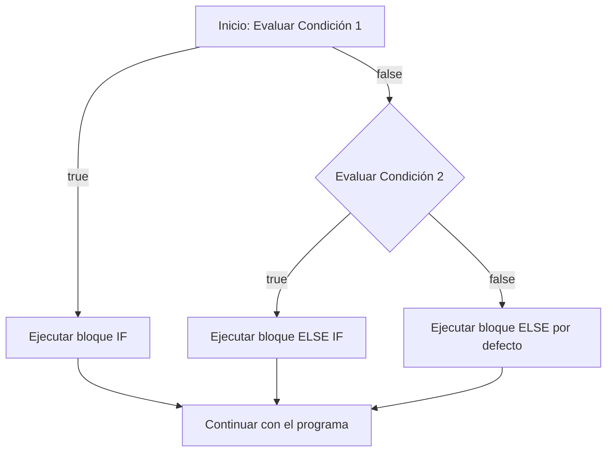
```mermaid
graph TD
    A[Inicio: Evaluar Condición 1] -->|true| B[Ejecutar bloque IF]
    A -->|false| C{Evaluar Condición 2}
    C -->|true| D[Ejecutar bloque ELSE IF]
    C -->|false| E[Ejecutar bloque ELSE por defecto]
    B --> F[Continuar con el programa]
    D --> F
    E --> F
```

- **`if (condicion)`**: Es obligatorio para iniciar la estructura. Se ejecuta si la condición es evaluada como _truthy_.
- **`else if (otraCondicion)`**: Opcional. Puedes encadenar múltiples `else if` secuenciales.
- **`else`**: Opcional. No lleva condición de evaluación; se ejecuta cuando **ningún** `if` o `else if` previo fue verdadero.

---

### ⚡ 2. El Operador Ternario (`condición ? expr1 : expr2`)

Es una alternativa concisa a `if / else` para asignaciones directas de una sola línea:

```javascript
const edad = 18;
const mensaje = edad >= 18 ? "Acceso permitido" : "Acceso denegado";
console.log(mensaje); // "Acceso permitido"
```

> [!TIP]
> **Cuándo usar el Operador Ternario:**
>
> - ✅ Úsalo para asignaciones simples o retornos directos de una sola línea.
> - ❌ Evita anidar operadores ternarios (`a ? b : c ? d : e`), ya que arruinan la legibilidad del código. Para múltiples ramas, prefiere `if / else if / else` o `switch`.

---

### 💻 Código de la Clase Ilustrado

```javascript
// ==========================================
// Control de Flujo Condicional: if / else if / else
// ==========================================
const edad = 18;

if (edad > 18) {
  // Se ejecuta si edad es estrictamente mayor que 18
  console.log("Acceso permitido!");
} else if (edad === 18) {
  // Se evalúa únicamente si la condición anterior fue falsa
  console.log("Tienes 18 años");
} else {
  // Se ejecuta como fallback si ninguna de las anteriores se cumplió
  console.log("Alto ahi galan!");
}
```

---

### 🛡️ Buenas Prácticas: Cláusulas de Guarda (_Guard Clauses_)

En desarrollo profesional se recomienda evitar anidamientos profundos (_Nested if statements_). En funciones, es preferible evaluar los casos de salida temprana (_Early Return_):

```javascript
// ❌ Código con anidamiento innecesario
function validarUsuario(usuario) {
  if (usuario) {
    if (usuario.activo) {
      if (usuario.edad >= 18) {
        return "Acceso concedido";
      }
    }
  }
  return "Acceso denegado";
}

// ✅ Código limpio con Cláusulas de Guarda (Early Return)
function validarUsuarioLimpio(usuario) {
  if (!usuario || !usuario.activo) return "Acceso denegado";
  if (usuario.edad < 18) return "Debes ser mayor de edad";

  return "Acceso concedido";
}
```

---

## Clase 09: Estructura de Control `switch`, Agrupación de Casos y `default`

👉 [Ver código de la clase](./curso/src/09-switch.js)

La estructura **`switch`** es una sentencia de control de flujo diseñada para evaluar una única expresión y ejecutar diferentes bloques de código según el valor coincidente (_pattern matching_ básico). Es una alternativa mucho más limpia y organizada que encadenar una larga serie de `if / else if / else`.

---

### 📞 La Analogía del Menú Telefónico Automatizado

Imagina llamar a la línea de atención al cliente de un banco:

- **`switch (opcion)`**: La centralita escucha el número que presionaste en el teclado.
- **`case "1":`**: Si presionaste 1, te transfiere a _Cuentas y Saldo_.
- **`case "2":`**: Si presionaste 2, te transfiere a _Tarjetas de Crédito_.
- **`break;`**: Finaliza la llamada una vez atendida tu solicitud (evita que el sistema continúe ejecutando las siguientes opciones por error).
- **`default:`**: Si presionaste un número no registrado (por ejemplo 9), te dice _"Opción no válida"_ y te envía con un asesor general.

---

### 🔑 Conceptos Clave

1. **Evaluación de Igualdad Estricta (`===`)**:
   - `switch` compara el valor evaluado contra cada `case` utilizando **igualdad estricta** (`===`).
   - Si evalúas el número `1`, **no** coincidirá con `case "1"` (tipo `string`).

2. **La Importancia del `break`**:
   - La sentencia `break` detiene inmediatamente la ejecución dentro del bloque `switch`.
   - Si omites el `break`, JavaScript continuará ejecutando los siguientes `case` hacia abajo **sin evaluar sus condiciones**, un comportamiento conocido como **Fall-Through**.

3. **Agrupación de Casos (_Multi-Case Matching_)**:
   - Puedes aprovechar el _fall-through_ intencionalmente para ejecutar la misma acción cuando varias opciones comparten la misma lógica (por ejemplo, agrupar `"sabado"` y `"domingo"` como fin de semana).

4. **La Cláusula `default`**:
   - Es el bloque de respaldo que se ejecuta cuando **ningún** `case` anterior coincide con el valor evaluado.

---

### ⚖️ ¿Cuándo usar `switch` vs. `if / else if`?

| Criterio                | `if / else if`                                          | `switch`                                         |
| :---------------------- | :------------------------------------------------------ | :----------------------------------------------- |
| **Tipo de condiciones** | Rangos, comparaciones complejas (`edad > 18 && activo`) | Valores discretos y exactos (`dia === "sabado"`) |
| **Cantidad de casos**   | Ideal para 1 a 3 condiciones                            | Ideal para 4 o más valores específicos           |
| **Legibilidad**         | Puede volverse engorroso con muchos `else if`           | Muy limpio y fácil de leer/mantener              |

---

### 💻 Código de la Clase Ilustrado

```javascript
// ==========================================
// Estructura de Control: switch / case / default
// ==========================================
const dia = "sabado";

switch (dia) {
  case "lunes":
    console.log("Es lunes, inicio de semana laboral");
    break;

  case "martes":
    console.log("Es martes");
    break;

  case "miercoles":
    console.log("Es miércoles");
    break;

  case "jueves":
    console.log("Es jueves, casi viernes");
    break;

  case "viernes":
    console.log("Es viernes");
    break;

  // ==========================================
  // Agrupación de Casos (Multi-case / Fall-Through intencional)
  // Tanto sábado como domingo ejecutan la misma lógica:
  // ==========================================
  case "sabado":
  case "domingo":
    console.log("Fin de semana");
    break;

  // ==========================================
  // Caso por Defecto (Fallback)
  // Se ejecuta si 'dia' no coincide con ningún case anterior
  // ==========================================
  default:
    console.log("Día no válido o no reconocido");
}
```

---

> [!WARNING]
> **El Peligro de Olvidar el `break`:**
> Omitir el `break` accidentalmente es una de las fuentes de _bugs_ más comunes en JavaScript principiante. Si omites el `break` en `case "lunes":`, el motor ejecutará el código de `"lunes"` y continuará de largo ejecutando `"martes"` hasta encontrar un `break` o el final del `switch`.

---

## Clase 10: Bucles e Iteraciones (`for`, `for...of`, `for...in`, `while` y `do...while`)

👉 [Ver código de la clase](./curso/src/10-for-while.js)

Las **estructuras de iteración o bucles** permiten ejecutar un bloque de código múltiples veces de forma automática mientras se cumpla una condición determinada. Son la herramienta fundamental para procesar colecciones de datos, automatizar tareas repetitivas y recorrer arreglos u objetos.

---

### 🏋️ La Analogía de las Series en el Gimnasio

Imagina que estás entrenando en el gimnasio:

- **`for` tradicional (La serie de 10 repeticiones con contador)**: Dices *"haré 10 repeticiones, empiezo en la 0, sumo 1 en cada una y paro al llegar a 10"*. Sabes exactamente cuántas veces vas a iterar desde el principio.
- **`for...of` (Sacar frutas de una canasta)**: Tienes una canasta de frutas (`["manzana", "pera", "uva"]`) y tomas cada fruta una por una directamente para revisarla o comerla, sin preocuparte por su posición numérica en la canasta.
- **`for...in` (Revisar la etiqueta de especificaciones de un producto)**: Tienes un objeto (un producto o una persona) y vas leyendo una por una sus etiquetas/propiedades (`nombre`, `edad`, `ciudad`) junto con su valor correspondiente.
- **`while` (Correr en la caminadora mientras tengas energía)**: Sigues corriendo *mientras* (`while (tengoEnergia)`) la condición sea verdadera. No sabes exactamente cuántas vueltas darás, pero te detienes en el instante en que la condición cambia a falsa.
- **`do...while` (Probar un bocado antes de decidir si sigues comiendo)**: Pruebas al menos una vez el platillo primero (`do`) y luego evalúas si continuas comiendo (`while (tengoHambre)`).

---

### 🔑 1. Tipos de Bucles en JavaScript

#### A. Ciclo `for` Tradicional
Ideal cuando conoces de antemano el número de iteraciones o necesitas manipular el índice numérico explícitamente:

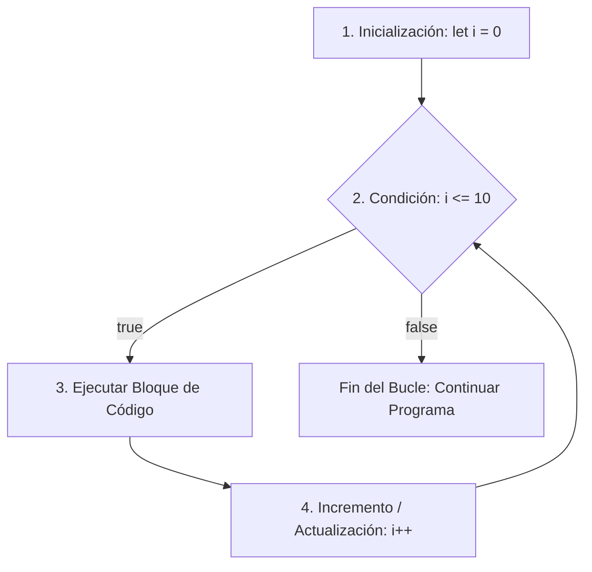
```mermaid
graph TD
    A[1. Inicialización: let i = 0] --> B{2. Condición: i <= 10}
    B -->|true| C[3. Ejecutar Bloque de Código]
    C --> D[4. Incremento / Actualización: i++]
    D --> B
    B -->|false| E[Fin del Bucle: Continuar Programa]
```

Sintaxis:
```javascript
for (inicialización; condición; incremento) {
  // Código a repetir en cada vuelta
}
```

1. **Inicialización**: Se ejecuta una sola vez antes de que arranque el bucle (ej. `let i = 0`).
2. **Condición**: Se evalúa antes de cada iteración. Si es `true`, el bloque se ejecuta; si es `false`, el bucle termina.
3. **Incremento / Paso**: Se ejecuta al finalizar cada vuelta (ej. `i++`, `i += 2`, `i--`).

---

#### B. Ciclo `for...of` (Iterar sobre Valores)
Introducido en ES6, es la forma más limpia y moderna de recorrer elementos de estructuras **iterables** (Arreglos, Strings, Maps, Sets):

```javascript
const frutas = ["manzana", "pera", "uva"];

for (const fruta of frutas) {
  console.log(fruta); // Imprime directamente: "manzana", "pera", "uva"
}
```

> [!TIP]
> **¿Cuándo usar `for...of`?**
> Úsalo siempre que necesites acceder directamente al **valor de cada elemento** de un arreglo sin necesidad de calcular ni usar el índice numérico.

---

#### C. Ciclo `for...in` (Iterar sobre Claves / Propiedades)
Diseñado para recorrer los nombres de las **propiedades enumerables (claves)** de un **objeto**:

```javascript
const persona = {
  nombre: "Ana",
  edad: 25,
};

for (const clave in persona) {
  console.log(`${clave}: ${persona[clave]}`);
  // Salida:
  // nombre: Ana
  // edad: 25
}
```

> [!WARNING]
> **¡Evita usar `for...in` para recorrer Arreglos!**
> `for...in` itera sobre los nombres de las propiedades (los índices como strings `"0"`, `"1"`) y puede incluir propiedades heredadas del prototipo o en orden no garantizado. Para arreglos utiliza siempre **`for` tradicional**, **`for...of`** o métodos funcionales como **`.forEach()` / `.map()`**.

---

#### D. Ciclos Condicionales: `while` y `do...while`

- **`while`**: Evalúa la condición **antes** de entrar al bloque. Si la condición inicial es `false`, el bloque **nunca se ejecuta**.
- **`do...while`**: Ejecuta el bloque **al menos una vez** y luego evalúa la condición para decidir si repite.

```javascript
// Bucle while
let energia = 3;
while (energia > 0) {
  console.log(`Entrenando... energía restante: ${energia}`);
  energia--;
}

// Bucle do...while (Garantiza mínimo 1 ejecución)
let intentos = 0;
do {
  console.log(`Intento número: ${intentos + 1}`);
  intentos++;
} while (intentos < 1);
```

---

### 🛑 Control de Bucles: `break` vs. `continue`

| Sentencia      | Acción                                                        | Analogía                                                      |
| :------------- | :------------------------------------------------------------ | :------------------------------------------------------------ |
| **`break`**    | **Aborta y termina** el bucle por completo inmediatamente.    | Sonó la alarma de incendio: todos salen del edificio ahora.   |
| **`continue`** | **Salta la iteración actual** y pasa directo a la siguiente.  | Te saltas una canción en tu playlist que no quieres escuchar. |

```javascript
// Ejemplo de break: Detenerse al encontrar un objetivo
for (let i = 1; i <= 10; i++) {
  if (i === 5) break; // Termina el bucle al llegar a 5
  console.log(i); // Imprime 1, 2, 3, 4
}

// Ejemplo de continue: Omitir números impares
for (let i = 1; i <= 5; i++) {
  if (i % 2 !== 0) continue; // Salta los impares
  console.log(i); // Imprime 2, 4
}
```

---

### ⚖️ Tabla Comparativa de Bucles

| Estructura      | ¿Para qué se usa principalmente?               | ¿Sobre qué itera?         | ¿Garantiza al menos 1 vuelta? |
| :-------------- | :--------------------------------------------- | :------------------------ | :---------------------------- |
| **`for`**       | Rangos numéricos conocidos y acceso por índice | Índices / Contadores      | ❌ No (si la condición falla) |
| **`for...of`**  | Recorrer elementos de **Arreglos** y Strings   | **Valores** de iterables  | ❌ No (si el array está vacío)|
| **`for...in`**  | Recorrer propiedades de **Objetos**            | **Claves (keys)** / Nombres| ❌ No (si no hay propiedades)|
| **`while`**     | Repetición basada en condición dinámica        | Condición booleana        | ❌ No (evalúa al inicio)      |
| **`do...while`**| Repetición que debe ejecutarse al menos 1 vez  | Condición booleana        | ✅ **Sí (evalúa al final)**   |

---

### 💻 Código de la Clase Ilustrado

```javascript
// ==========================================
// 1. Ciclo for tradicional con contador
// ==========================================
// for (inicializacion; condicion; incremento)
for (let i = 0; i <= 10; i++) {
  console.log(i); // Imprime números del 0 al 10
}

// ==========================================
// 2. Iteración sobre un Arreglo por Índice
// ==========================================
const notas = ["Nota 1", "Nota 2", "Nota 3"];

for (let i = 0; i < notas.length; i++) {
  // notas[i] accede al elemento en la posición actual
  console.log(`Indice ${i}: ${notas[i]}`);
}

// ==========================================
// 3. Ciclo for...of (Iterar directamente sobre Valores)
// ==========================================
const frutas = ["manzana", "pera", "uva"];

for (const fruta of frutas) {
  if (fruta === "manzana") {
    console.log("Es una rica manzana");
  }
}

// ==========================================
// 4. Ciclo for...in (Iterar sobre Claves / Propiedades de un Objeto)
// ==========================================
const persona = {
  nombre: "Ana",
  edad: 25,
};

for (const clave in persona) {
  // 'clave' toma el nombre de cada propiedad ("nombre", luego "edad")
  // persona[clave] accede al valor asociado a esa propiedad
  console.log(`${clave}: ${persona[clave]}`);
}

// ==========================================
// 5. Ciclo while (Evalúa la condición antes de cada iteración)
// ==========================================
let contador = 0;

while (contador < 4) {
  console.log(contador); // Imprime: 0, 1, 2, 3
  contador++; // ⚠️ Esencial: actualizar el contador para evitar bucle infinito
}

// ==========================================
// 6. Ciclo do...while (Ejecuta primero, evalúa después)
// ==========================================
let numero = 0;

do {
  console.log("Entra en " + numero); // Imprime: "Entra en 0", "Entra en 1", "Entra en 2"
  numero++;
} while (numero < 3);

// Valor final de la variable tras terminar el bucle:
console.log(numero); // 👉 Imprime: 3
```

---

> [!CAUTION]
> **Peligro: El Bucle Infinito (_Infinite Loop_)**
> Si olvidas actualizar la variable de control (por ejemplo olvidar `i++` o `energia--`), o si la condición de salida nunca se vuelve `false`, el bucle se ejecutará indefinidamente consumiendo el 100% de la CPU hasta bloquear el navegador o la terminal. Asegúrate siempre de que tu bucle tenga una ruta garantizada de salida.

---

## Clase 11: Funciones (Declaración, Parámetros vs. Argumentos, Arrow Functions y Parámetros por Defecto)

👉 [Ver código de la clase](./curso/src/11-funciones.js)

Las **funciones** son los bloques de construcción fundamentales en JavaScript. Son conjuntos de instrucciones agrupadas bajo un nombre reutilizable diseñadas para realizar una tarea específica, procesar datos de entrada y devolver un resultado.

---

### ☕ La Analogía de la Máquina de Café Automática

Imagina una cafetera moderna programable:

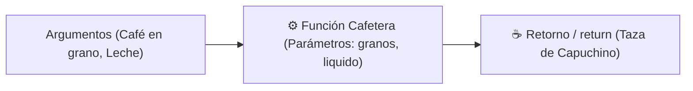
```mermaid
graph LR
    A["Argumentos (Café en grano, Leche)"] --> B["⚙️ Función Cafetera (Parámetros: granos, liquido)"]
    B --> C["☕ Retorno / return (Taza de Capuchino)"]
```

1. **La Definición / Receta (Declaración de la función)**: Es el manual interno de la máquina que dice cómo procesar granos de café y líquidos.
2. **Los Parámetros (`granos`, `liquido`)**: Son las ranuras o contenedores vacíos definidos en el diseño de la máquina a la espera de ingredientes.
3. **Los Argumentos (`"Café Colombiano"`, `"Leche de Almendras"`)**: Son los ingredientes reales y concretos que introduces en la máquina al momento de presionar el botón de encendido.
4. **El `return`**: Es la taza de café servida que la máquina te entrega de vuelta. Si una función no tiene `return`, realiza el trabajo internamente pero devuelve `undefined` al exterior.

---

### 🔑 Conceptos Clave

#### 1. Parámetros vs. Argumentos (La Gran Diferencia)

| Concepto       | ¿Qué es?                                                     | Momento en que existe                  | Ejemplo en Código                |
| :------------- | :----------------------------------------------------------- | :------------------------------------- | :------------------------------- |
| **Parámetro**  | Variable receptora declarada en la definición de la función. | **Fase de definición** de la función   | `function sumar(a, b)`           |
| **Argumento**  | Valor real y concreto enviado al invocar la función.         | **Fase de ejecución / llamada** (`()`) | `sumar(10, 5)`                   |

---

#### 2. Funciones Tradicionales vs. Funciones Flecha (*Arrow Functions*)

Introducidas en ES6, las **Arrow Functions** proporcionan una sintaxis mucho más limpia, moderna y concisa:

```javascript
// 1. Función Declarada Tradicional
function multiplicarTradicional(a, b) {
  return a * b;
}

// 2. Función Flecha (Arrow Function con cuerpo de bloque y return explícito)
const multiplicarFlecha = (a, b) => {
  return a * b;
};

// 3. Función Flecha con Retorno Implícito (Una sola línea, sin llaves ni return)
const multiplicarCorto = (a, b) => a * b;
```

> [!TIP]
> **Ventajas de las Arrow Functions:**
> - Sintaxis más limpia y legible.
> - **Retorno implícito** en expresiones de una sola línea (`(a, b) => a * b`).
> - No crean su propio contexto de `this` (heredan el `this` léxico del entorno contenedor), lo cual es ideal para métodos de arrays y callbacks.

---

#### 3. Parámetros por Defecto (*Default Parameters*)

Permiten asignar un valor de respaldo a un parámetro en caso de que al invocar la función no se envíe ningún argumento o se envíe `undefined`:

```javascript
// Si no se envía 'titulo', tomará automáticamente "Sin Titulo"
const crearNota = (contenido, titulo = "Sin Titulo") => {
  return {
    titulo,
    contenido,
    creado: Date.now(),
  };
};

console.log(crearNota("Repasar funciones")); 
// 👉 { titulo: "Sin Titulo", contenido: "Repasar funciones", creado: 1727148581000 }
```

---

#### 4. Notación Simplificada de Propiedades de Objetos (*Object Property Shorthand*)

Cuando el nombre de la propiedad de un objeto coincide exactamente con el nombre de la variable que contiene su valor, puedes omitir la repetición:

```javascript
// ❌ Redundante:
return { nombre: nombre, edad: edad };

// ✅ Moderno y conciso (Property Shorthand):
return { nombre, edad };
```

---

### 💻 Código de la Clase Ilustrado

```javascript
// ==========================================
// 1. Declaración de Función y Sentencia return
// ==========================================
function saludar(nombre) {
  return `Hola ${nombre}`;
}

// Invocación y almacenamiento del valor retornado
let mensaje = saludar("Christian Camilo");
let mensaje2 = saludar("Johana");

console.log(mensaje, mensaje2); 
// 👉 Imprime: "Hola Christian Camilo" "Hola Johana"

// ==========================================
// 2. Parámetros vs. Argumentos y Shorthand de Objetos
// ==========================================
// Parámetros: 'nombre' y 'edad' son las variables receptoras
function crearUsuario(nombre, edad) {
  // Retorna un objeto utilizando Object Property Shorthand { nombre, edad }
  return { nombre, edad };
}

// Argumentos: "Christian" y 32 son los valores reales suministrados
const usuario = crearUsuario("Christian", 32);
console.log(usuario); // 👉 { nombre: "Christian", edad: 32 }

// ==========================================
// 3. Funciones Flecha (Arrow Functions)
// ==========================================
const multiplicar = (numero1, numero2) => {
  return numero1 * numero2;
};

let resultado = multiplicar(10, 5);
console.log(resultado); // 👉 50

// ==========================================
// 4. Parámetros por Defecto (Default Parameters) y Metadatos Dinámicos
// ==========================================
// 'titulo' tiene un valor por defecto si no es suministrado
const crearNota = (contenido, titulo = "Sin Titulo") => {
  return {
    titulo,
    contenido,
    creado: Date.now(), // Marca de tiempo actual en milisegundos
  };
};

let nota = crearNota(4.5, "Matematicas");
console.log(nota);
// 👉 { titulo: "Matematicas", contenido: 4.5, creado: 1727148581000 }
```

---

> [!NOTE]
> **¿Por qué usar `Date.now()` en registros u objetos?**
> `Date.now()` devuelve el número de milisegundos transcurridos desde el 1 de enero de 1970 UTC (*Unix Epoch*). Es un estándar muy utilizado para generar marcas de tiempo (*timestamps*) precisas, ordenar registros cronológicamente o calcular diferencias de tiempo.

---

_Hecho con ☕ y 💻 para el Curso de Fundamentos de JavaScript - Platzi_

---

## Clase 12: Scope o Alcance (Global, de Función, de Bloque y Cadena de Alcance)

👉 [Ver código de la clase](./curso/src/12-scope.js)

El **Scope** (o alcance) es el conjunto de reglas que determina **dónde es accesible y visible una variable** dentro de tu programa. En palabras sencillas: define qué partes de tu código pueden "ver" y utilizar una variable específica.

---

### 🏢 La Analogía del Edificio con Vidrios Polarizados

Imagina un edificio de oficinas con tres niveles de seguridad:

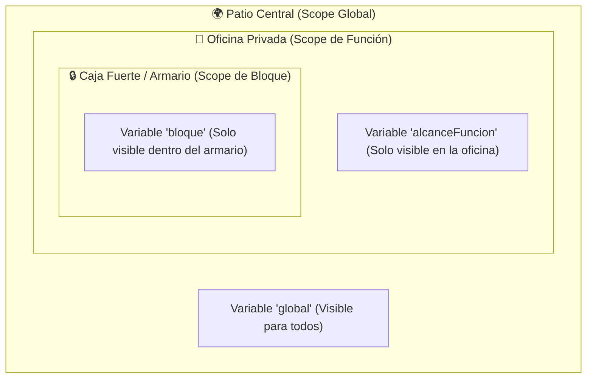
```mermaid
graph TD
    subgraph Global ["🌍 Patio Central (Scope Global)"]
        G["Variable 'global' (Visible para todos)"]
        subgraph Funcion ["🏢 Oficina Privada (Scope de Función)"]
            F["Variable 'alcanceFuncion' (Solo visible en la oficina)"]
            subgraph Bloque ["🔒 Caja Fuerte / Armario (Scope de Bloque)"]
                B["Variable 'bloque' (Solo visible dentro del armario)"]
            end
        end
    end
```

1. **El Patio Central (Scope Global)**: Todos en el edificio pueden mirar hacia el patio y ver lo que hay allí. Las variables globales están al alcance de cualquier función o bloque.
2. **La Oficina Privada (Scope de Función)**: Quienes están dentro de la oficina pueden ver su propio escritorio y también mirar por la ventana hacia el patio global. Pero la gente que camina por el patio **no puede ver** lo que hay dentro de la oficina.
3. **El Armario / Caja Fuerte (Scope de Bloque `{}`)**: Quien entra al armario puede ver lo que hay en el armario, en la oficina y en el patio. Pero quien está afuera en la oficina **no puede ver** lo que hay dentro del armario cerrado.

> [!IMPORTANT]
> **Regla de Oro del Scope (Dirección de Visibilidad):**
> La búsqueda de variables siempre va **de adentro hacia afuera** (hacia los padres), **NUNCA de afuera hacia adentro** (hacia los hijos).

---

### 🔑 Conceptos Clave

#### 1. Los Tres Tipos de Scope en JavaScript

| Tipo de Scope | ¿Dónde se declara? | ¿Quién puede acceder? | Creado por |
| :--- | :--- | :--- | :--- |
| **Global Scope** | Fuera de cualquier función o bloque `{}` | Todo el programa en cualquier lugar | `var`, `let`, `const` |
| **Function Scope (Local)** | Dentro del cuerpo de una `function` | Solo dentro de esa misma función | `var`, `let`, `const` |
| **Block Scope** | Dentro de un bloque delimitado por llaves `{}` (`if`, `for`, `while`, etc.) | Solo dentro de ese bloque `{}` específico | `let` y `const` (*`var` NO lo respeta*) |

---

#### 2. La Cadena de Alcance (*Scope Chain*)

Cuando JavaScript intenta leer una variable, sigue un camino de búsqueda muy estricto:

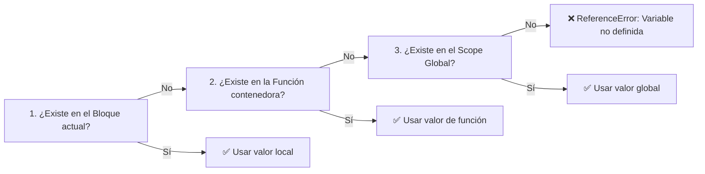
```mermaid
graph LR
    A["1. ¿Existe en el Bloque actual?"] -- No --> B["2. ¿Existe en la Función contenedora?"]
    B -- No --> C["3. ¿Existe en el Scope Global?"]
    C -- No --> D["❌ ReferenceError: Variable no definida"]
    A -- Sí --> E["✅ Usar valor local"]
    B -- Sí --> F["✅ Usar valor de función"]
    C -- Sí --> G["✅ Usar valor global"]
```

Si llega al nivel global y la variable no existe en ningún lado, JavaScript arroja un `ReferenceError: [variable] is not defined`.

---

#### 3. El Peligro de `var` vs. la Seguridad de `let` y `const`

- `let` y `const` tienen **Block Scope**: Nacen y mueren dentro de las llaves `{}` donde fueron creadas.
- `var` **NO tiene Block Scope**: Se "escapa" de los `if` y bucles `for`, viviendo en el ámbito de la función completa o global, lo que suele causar errores inesperados.

---

### 💻 Código de la Clase Ilustrado

```javascript
// ==========================================
// 1. Scope Global
// ==========================================
const global = "Soy global"; // Accesible desde cualquier lugar

function ejemplo() {
  // ==========================================
  // 2. Scope de Función (Local)
  // ==========================================
  const alcanceFuncion = "soy de funcion";

  if (true) {
    // ==========================================
    // 3. Scope de Bloque (Delimitado por llaves {})
    // ==========================================
    const bloque = "Soy de Bloque";

    console.log(bloque); // 👉 "Soy de Bloque" (Scope actual)
    console.log(`Bloque - Funcion = ${alcanceFuncion}`); // 👉 "soy de funcion" (Mira hacia la función padre)
    console.log(`Bloque - Bloque = ${bloque}`);           // 👉 "Soy de Bloque" (Scope local)
    console.log(`Bloque - Bloque = ${global}`);           // 👉 "Soy global" (Mira hacia el entorno global)
  }

  // Fuera del bloque 'if', pero dentro de la función:
  console.log(alcanceFuncion); // 👉 "soy de funcion" (Accesible dentro de la función)
  console.log(`Funcion - Funcion = ${alcanceFuncion}`); // 👉 "Funcion - Funcion = soy de funcion"

  // ❌ console.log(`Funcion - Bloque = ${bloque}`);
  // 🚨 Error si se descomenta: ReferenceError: bloque is not defined
  // (La función NO puede ver hacia el interior del bloque 'if')

  console.log(`Funcion - Bloque = ${global}`); // 👉 "Funcion - Bloque = Soy global" (Mira hacia el scope global)
}

ejemplo();

// ==========================================
// 4. Intentos de acceso desde el Scope Global
// ==========================================
console.log(global); // 👉 "Soy global"

// ❌ console.log(`Global - Funcion = ${alcanceFuncion}`);
// 🚨 Error: ReferenceError: alcanceFuncion is not defined
// (El scope global NO puede acceder a las variables internas de una función)

// ❌ console.log(`Global - Bloque = ${bloque}`);
// 🚨 Error: ReferenceError: bloque is not defined
// (El scope global NO puede acceder a las variables internas de un bloque)

console.log(`Global - Bloque = ${global}`); // 👉 "Global - Bloque = Soy global"
```

---

## Clase 13: Closures (Entorno Léxico, Memoria y Encapsulación de Datos Privados)

👉 [Ver código de la clase](./curso/src/13-closure.js)

Un **Closure** (o clausura) suele parecer intimidante al principio, pero su idea central es muy sencilla:

> [!IMPORTANT]
> **Definición en Palabras Simples:**
> Un **Closure** ocurre cuando **una función "hija" recuerda las variables de la función "madre" donde nació**, incluso después de que la función madre ya terminó de ejecutarse y desapareció.
> 
> Es como si la función hija saliera al mundo exterior llevando una **"mochila mágica"** que contiene todas las variables de la casa donde fue creada.

---

### 🎒 La Analogía de la Mochila Mágica

Imagina cómo se comportan las funciones normales vs. las funciones con Closure:

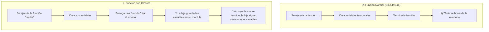
```mermaid
graph TD
    subgraph Normal ["❌ Función Normal (Sin Closure)"]
        N1["Se ejecuta la función"] --> N2["Crea variables temporales"]
        N2 --> N3["Termina la función"]
        N3 --> N4["🗑️ Todo se borra de la memoria"]
    end

    subgraph Closure ["✨ Función con Closure"]
        C1["Se ejecuta la función 'madre'"] --> C2["Crea sus variables"]
        C2 --> C3["Entrega una función 'hija' al exterior"]
        C3 --> C4["🎒 La hija guarda las variables en su mochila"]
        C4 --> C5["🧠 Aunque la madre termine, la hija sigue usando esas variables"]
    end
```

---

### 🧪 Ejemplos Progresivos (De lo Más Fácil a lo Avanzado)

Para entender un Closure sin complicaciones, vayamos paso a paso con tres ejemplos:

---

#### Nivel 1: El Contador Mágico (El Ejemplo Clásico)

Normalmente, una variable dentro de una función se reinicia cada vez que la llamas. Con un closure, la variable **recuerda su estado anterior**:

```javascript
function crearContador() {
  let cuenta = 0; // 🔒 Variable guardada en la "mochila"

  // Retornamos la función hija:
  return function () {
    cuenta++; // Incrementa la variable recordada
    return cuenta;
  };
}

// 1. Creamos un contador independiente:
const miContador = crearContador();

console.log(miContador()); // 👉 1
console.log(miContador()); // 👉 2
console.log(miContador()); // 👉 3 (¡Recuerda los llamados anteriores!)

// 2. Si creamos un segundo contador, tiene su PROPIA mochila separada:
const otroContador = crearContador();
console.log(otroContador()); // 👉 1 (Empieza desde cero, no afecta a miContador)
```

---

#### Nivel 2: Fábrica de Funciones (*Function Factory*)

Un Closure permite crear funciones personalizadas que recuerdan una configuración inicial:

```javascript
function crearMultiplicador(factor) {
  // 'factor' queda atrapado en el closure de la función que retornamos
  return function (numero) {
    return numero * factor;
  };
}

// Creamos funciones especializadas:
const duplicar = crearMultiplicador(2); // Recuerda que factor = 2
const triplicar = crearMultiplicador(3); // Recuerda que factor = 3

console.log(duplicar(5)); // 👉 10  (5 * 2)
console.log(duplicar(8)); // 👉 16  (8 * 2)

console.log(triplicar(5)); // 👉 15  (5 * 3)
console.log(triplicar(8)); // 👉 24  (8 * 3)
```

---

#### Nivel 3: El Ejemplo de la Clase (La Cuenta Bancaria y la Bóveda Privada)

👉 [Ver archivo: 13-closure.js](./curso/src/13-closure.js)

En este ejemplo del curso, la función madre no retorna una sola función, sino un **objeto con 3 funciones (métodos)**. Todas comparten acceso a la misma variable privada `saldo`:

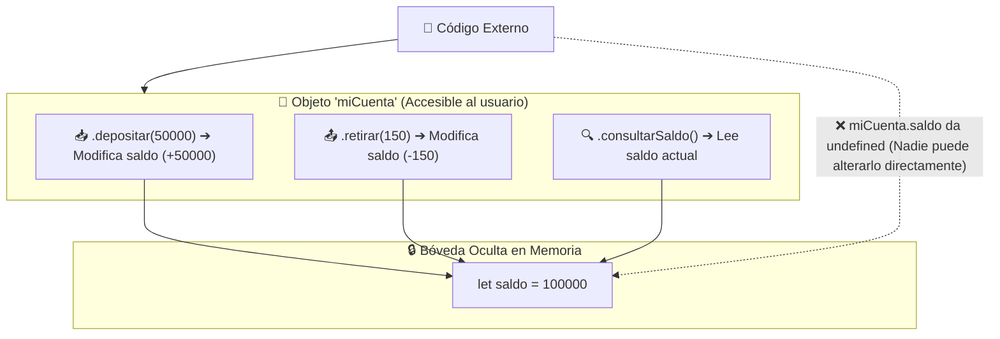
```mermaid
graph TD
    subgraph Boveda ["🔒 Bóveda Oculta en Memoria"]
        S["let saldo = 100000"]
    end

    subgraph Cuenta ["🏦 Objeto 'miCuenta' (Accesible al usuario)"]
        M1["📥 .depositar(50000) ➔ Modifica saldo (+50000)"]
        M2["📤 .retirar(150) ➔ Modifica saldo (-150)"]
        M3["🔍 .consultarSaldo() ➔ Lee saldo actual"]
    end

    M1 --> S
    M2 --> S
    M3 --> S

    Usuario["👤 Código Externo"] --> Cuenta
    Usuario -. "❌ miCuenta.saldo da undefined (Nadie puede alterarlo directamente)" .-> S
```

---

### 💻 Código de la Clase Ilustrado y Comentado Paso a Paso

```javascript
// ==========================================
// 1. Declaración de la Función con Closure
// ==========================================
function crearCuentaBancaria(saldoInicial) {
  // 'saldo' es una variable PRIVADA. Nadie desde afuera puede tocarla directamente.
  let saldo = saldoInicial;

  // Retornamos un conjunto de métodos que tienen la llave de acceso a 'saldo':
  return {
    // Método 1: Sumar dinero al saldo privado
    depositar(cantidad) {
      saldo += cantidad;
      return `Depositado $${cantidad}. Saldo actual: $${saldo}`;
    },

    // Método 2: Restar dinero con validación de seguridad
    retirar(cantidad) {
      // Si piden más de lo que hay, no permitimos el retiro:
      if (cantidad > saldo) {
        return "Fondos Insuficientes";
      }
      saldo -= cantidad;
      return `Retirado $${cantidad}. Saldo actual: $${saldo}`;
    },

    // Método 3: Consultar el saldo sin modificarlo
    consultarSaldo() {
      return `Saldo: $${saldo}`;
    },
  };
}

// ==========================================
// 2. Creación de una Cuenta Real
// ==========================================
// Al ejecutar esta línea:
// 1. Se crea 'saldo = 100000'.
// 2. Se retorna el objeto con los métodos.
// 3. 'crearCuentaBancaria' finaliza, pero los métodos GUARDAN 'saldo' en su closure.
const miCuenta = crearCuentaBancaria(100000);

// ==========================================
// 3. Demostración de Privacidad (Encapsulación)
// ==========================================
// ¿Qué pasa si intentamos leer o modificar 'saldo' directamente?
console.log(miCuenta.saldo); 
// 👉 undefined  (¡No existe como propiedad pública, está blindada!)

// ==========================================
// 4. Operaciones a través de los Métodos Autorizados
// ==========================================

// Consulta inicial:
console.log(miCuenta.consultarSaldo()); 
// 👉 "Saldo: $100000"

// Depositamos $50,000:
console.log(miCuenta.depositar(50000)); 
// 👉 "Depositado $50000. Saldo actual: $150000"

// Retiramos $150:
console.log(miCuenta.retirar(150)); 
// 👉 "Retirado $150. Saldo actual: $149850"

// Verificamos el saldo tras las operaciones:
console.log(miCuenta.consultarSaldo()); 
// 👉 "Saldo: $149850"

// Intentamos retirar más dinero del que tenemos:
console.log(miCuenta.retirar(200000));
// 👉 "Fondos Insuficientes" (La validación protege el saldo)
```

---

### 📋 Resumen Rápido: ¿Por qué usar Closures?

| Beneficio | ¿Para qué sirve? | Ejemplo en la vida real |
| :--- | :--- | :--- |
| **1. Variables Privadas** | Proteger datos para que nadie los cambie por accidente. | El saldo de tu cuenta bancaria. |
| **2. Memoria de Estado** | Recordar datos entre llamadas sin usar variables globales. | Un contador de clics o turnos. |
| **3. Fábricas de Código** | Crear funciones especializadas reutilizables. | Un conversor de monedas (`aDolares`, `aEuros`). |

---

> [!TIP]
> **Regla Mnemotécnica para Recordar:**
> - **Scope** = *¿Dónde puedo ver una variable ahora mismo?*
> - **Closure** = *¿Qué variables se llevó la función en su mochila para usarlas después?*

---

## Clase 14: Arreglos / Arrays (Estructura, Acceso por Índice y Operaciones CRUD Mutables)

👉 [Ver código de la clase](./curso/src/14-arrays.js)

Un **Arreglo (`Array`)** en JavaScript es una estructura de datos ordenada y dinámica que permite almacenar múltiples valores bajo una misma variable. A diferencia de otros lenguajes donde los arrays tienen un tamaño estricto y un tipo de dato único, en JavaScript son flexibles, heterogéneos y redimensionables de forma automática.

---

### 🗄️ La Analogía de la Estantería de Casilleros Numerados

Imagina que un arreglo es una **estantería de casilleros numerados**:

- Cada casillero tiene una etiqueta numérica llamada **Índice (`Index`)**, que **siempre comienza en `0`** (Base Cero).
- En cada casillero puedes guardar cualquier objeto: un texto, un número, un booleano, una función o incluso otro arreglo u objeto completo.
- Puedes agregar o quitar casilleros según lo necesites:
  - **Por el frente (`.unshift()` / `.shift()`)**: Agregar o retirar casilleros desde el inicio (lo que obliga a renumerar todos los demás).
  - **Por el fondo (`.push()` / `.pop()`)**: Agregar o retirar casilleros desde el final (muy rápido y eficiente).
  - **En medio (`.splice()`)**: Insertar o extraer casilleros en cualquier posición intermedia.

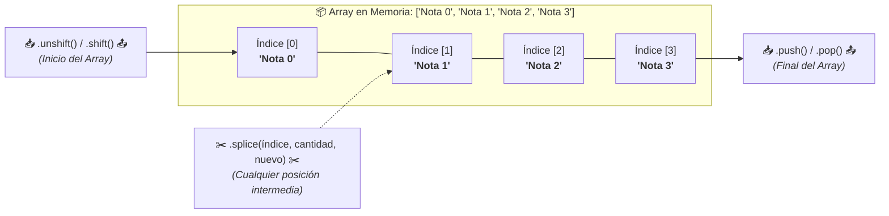
```mermaid
flowchart LR
    subgraph Array ["📦 Array en Memoria: ['Nota 0', 'Nota 1', 'Nota 2', 'Nota 3']"]
        direction LR
        I0["Índice [0]<br><b>'Nota 0'</b>"]
        I1["Índice [1]<br><b>'Nota 1'</b>"]
        I2["Índice [2]<br><b>'Nota 2'</b>"]
        I3["Índice [3]<br><b>'Nota 3'</b>"]
        I0 --- I1 --- I2 --- I3
    end

    U["📥 .unshift() / .shift() 📤<br><i>(Inicio del Array)</i>"] --> I0
    I3 --> P["📥 .push() / .pop() 📤<br><i>(Final del Array)</i>"]
    S["✂️ .splice(índice, cantidad, nuevo) ✂️<br><i>(Cualquier posición intermedia)</i>"] -.-> I1
```

---

### 🔑 1. Creación y Tipos de Arreglos

En JavaScript, los arrays se definen habitualmente utilizando **corchetes literales `[]`**:

1. **Homogéneos**: Contienen elementos de un mismo tipo (números, strings, etc.).
2. **Heterogéneos (Mixtos)**: Pueden combinar diferentes tipos de datos primitivos y complejos en la misma colección.

```javascript
const notas = ["Nota 1", "Nota 2", "Nota 3"]; // Homogéneo (strings)
const numeros = [1, 2, 3, 4, 5, 6];           // Homogéneo (números)
const mixtos = [1, "texto", true, null, { id: 1 }]; // Heterogéneo (mixto)
```

---

### 📏 2. Indexación Base Cero y la Propiedad `.length`

- **Primer elemento**: Siempre se ubica en el índice `[0]`.
- **Propiedad `.length`**: Indica la cantidad total de elementos dentro del array.
- **Último elemento**: Siempre se encuentra en la posición `[array.length - 1]`.
- **Índice fuera de rango**: Si intentas acceder a un índice inexistente (ej. `notas[99]`), JavaScript devuelve `undefined` sin lanzar un error.

---

### 🔄 3. Operaciones CRUD Fundamentales en Arreglos

El acrónimo **CRUD** describe las cuatro operaciones básicas sobre datos: **C**reate (Crear/Insertar), **R**ead (Leer/Consultar), **U**pdate (Actualizar/Modificar) y **D**elete (Eliminar).

#### A. Create (Insertar / Agregar Elementos)

| Método / Sintaxis | Posición de Inserción | ¿Qué retorna? | Ejemplo |
| :--- | :--- | :--- | :--- |
| **`.push(elem)`** | Al **final** del arreglo | La **nueva longitud** (`length`) del array | `notas.push("Nota 4")` |
| **`.unshift(elem)`** | Al **inicio** del arreglo (desplaza los demás) | La **nueva longitud** (`length`) del array | `notas.unshift("Nota 0")` |
| **`.splice(idx, 0, elem)`** | En una **posición intermedia específica** | Un array vacío `[]` (ya que no elimina nada) | `notas.splice(1, 0, "Nota 1.2")` |

#### B. Read (Leer / Acceder a Elementos)

- **Por posición**: `notas[0]`, `notas[1]`, `notas[2]`.
- **Cantidad total**: `notas.length`.

#### C. Update (Actualizar / Reemplazar Elementos)

- **Por Asignación Directa**: Sobrescribe el valor en la posición indicada.
  ```javascript
  notas2[1] = "nota 3"; // Modifica directamente el índice 1
  ```
- **Con `.splice(idx, 1, nuevo)`**: Elimina 1 elemento en la posición `idx` e inserta el nuevo en su lugar.

#### D. Delete (Eliminar Elementos)

| Método | Posición de Eliminación | ¿Qué retorna? | Efecto Colateral |
| :--- | :--- | :--- | :--- |
| **`.pop()`** | El **último** elemento | El elemento eliminado | Reduce `.length` en 1 |
| **`.shift()`** | El **primer** elemento | El elemento eliminado | Desplaza todos los índices restantes |
| **`.splice(idx, cant)`** | A partir del índice `idx`, elimina `cant` elementos | Un **Array** con los elementos eliminados | Muta el array original reduciendo su tamaño |

---

### 📊 Tabla Comparativa de Métodos de Mutación

| Método | ¿Dónde actúa? | ¿Qué hace? | ¿Qué retorna? | ¿Muta el Array original? |
| :--- | :--- | :--- | :--- | :--- |
| **`push()`** | Final | Agrega 1 o más elementos al final | Nueva longitud (`number`) | ✅ Sí |
| **`pop()`** | Final | Quita el último elemento | Elemento extraído | ✅ Sí |
| **`unshift()`** | Inicio | Agrega 1 o más elementos al inicio | Nueva longitud (`number`) | ✅ Sí |
| **`shift()`** | Inicio | Quita el primer elemento | Elemento extraído | ✅ Sí |
| **`splice()`** | Cualquier índice | Agrega, elimina o reemplaza elementos | Array con elementos eliminados | ✅ Sí |

---

### 💻 Código de la Clase Ilustrado y Comentado Paso a Paso

```javascript
// ==========================================
// 1. Declaración y Creación de Arrays
// ==========================================
const notas = ["Nota 1", "Nota 2", "Nota 3"];
const numeros = [1, 2, 3, 4, 5, 6];
const mixtos = [1, "texto", true, null, { id: 1 }];

// ==========================================
// 2. CREATE (Agregar Elementos)
// ==========================================

// .push() -> Agrega al final del array
notas.push("Nota 4");
console.log(notas); 
// 👉 [ 'Nota 1', 'Nota 2', 'Nota 3', 'Nota 4' ]

// .unshift() -> Agrega al inicio del array
notas.unshift("Nota 0");
console.log(notas); 
// 👉 [ 'Nota 0', 'Nota 1', 'Nota 2', 'Nota 3', 'Nota 4' ]

// .splice(inicio, elementosAEliminar, ...elementosAInsertar)
// En el índice 1, elimina 0 elementos e inserta "Notas 1.2"
notas.splice(1, 0, "Notas 1.2");
console.log(notas); 
// 👉 [ 'Nota 0', 'Notas 1.2', 'Nota 1', 'Nota 2', 'Nota 3', 'Nota 4' ]

// ==========================================
// 3. READ (Leer Elementos y Longitud)
// ==========================================
console.log(notas[1]); // 👉 "Notas 1.2"
console.log(notas[2]); // 👉 "Nota 1"
console.log(notas[0]); // 👉 "Nota 0"

// Longitud total del array
console.log(`La cantidad de elementos contenidos son: ${notas.length}`);
// 👉 "La cantidad de elementos contenidos son: 6"

// ==========================================
// 4. UPDATE (Actualizar Elementos)
// ==========================================
const notas2 = ["nota 1", "nota 2"];

// Actualización por asignación de índice:
notas2[1] = "nota 3";
console.log(notas2); 
// 👉 [ 'nota 1', 'nota 3' ]

// Inserción / Reubicación con splice:
notas2.splice(1, 0, "Nota 4");
console.log(notas2); 
// 👉 [ 'nota 1', 'Nota 4', 'nota 3' ]

// ==========================================
// 5. DELETE (Eliminar Elementos)
// ==========================================

// .pop() -> Extrae y elimina el ÚLTIMO elemento
const notas3 = ["nota 1", "nota 2"];
console.log(notas3.pop()); // 👉 "nota 2" (retorna el valor eliminado)
console.log(notas3);        // 👉 [ 'nota 1' ]

// .shift() y .splice() -> Eliminación al inicio o intermedia
const notas4 = ["nota 1", "nota 2"];

// notas4.shift(); // Eliminaría "nota 1" del inicio
console.log(notas4); 

// .splice(1, 1) -> A partir del índice 1, elimina 1 elemento
console.log(notas4.splice(1, 1)); // 👉 [ 'nota 2' ] (retorna un array con lo eliminado)
console.log(notas4);              // 👉 [ 'nota 1' ]
```

---

### ⚠️ Conceptos Clave y Buenas Prácticas

> [!IMPORTANT]
> **Mutación en Métodos de Arreglos:**
> Métodos como `.push()`, `.pop()`, `.shift()`, `.unshift()` y `.splice()` son **mutables** (modifican el arreglo original directamente en memoria). Aunque el array esté declarado con `const`, sus elementos internos sí pueden modificarse porque `const` protege la referencia de la variable, no el contenido del objeto en el Heap.

> [!TIP]
> **Rendimiento: `push` / `pop` vs. `unshift` / `shift`:**
> - `.push()` y `.pop()` son operaciones $O(1)$ (muy rápidas), ya que actúan al final del array sin mover de lugar al resto.
> - `.unshift()` y `.shift()` son operaciones $O(n)$ (más lentas en arrays grandes), porque obligan al motor de JavaScript a reindexar y desplazar todos los demás elementos una posición a la derecha o izquierda en memoria.

---

## Clase 15: Objetos Literales (Acceso, Optional Chaining, Desestructuración, Spread Operator y Métodos Estáticos)

👉 [Ver código de la clase](./curso/src/15-objetos.js)

Un **Objeto Literal** en JavaScript es una estructura de datos basada en pares **clave-valor (`key: value`)**. Mientras que los arreglos organizan la información mediante índices numéricos ordenados (`[0]`, `[1]`), los objetos permiten modelar entidades de la vida real asignando nombres descriptivos a cada propiedad.

---

### 📇 La Analogía de la Ficha de Expediente con Etiquetas

Imagina que un objeto es una **carpeta o ficha de expediente personal**:

- Cada dato tiene una **etiqueta con su nombre** (la clave: `id`, `title`, `edad`).
- Puedes consultar el dato leyendo su etiqueta directamente (**Notación de punto `.`**) o buscando la etiqueta guardada en un papelito (**Notación de corchetes `[]`**).
- Si buscas una sección que no existe dentro de una subcarpeta inexistente, el sistema normal de archivos se congelaría con un error; pero con una lupa especial (**Optional Chaining `?.`**), simplemente te dice *"no se encontró nada"* sin interrumpir el trabajo.
- Puedes sacar copias rápidas y combinar datos de varias fichas con una fotocopiadora mágica (**Spread Operator `...`**), o extraer solo los datos clave que necesitas en tu mesa (**Desestructuración `{}`**).

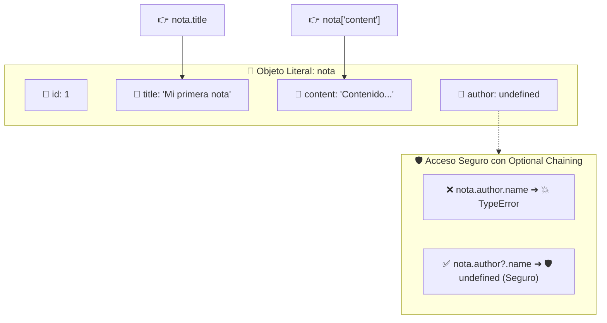
```mermaid
flowchart TD
    subgraph Objeto ["📁 Objeto Literal: nota"]
        K1["🔑 id: 1"]
        K2["🔑 title: 'Mi primera nota'"]
        K3["🔑 content: 'Contenido...'"]
        K4["🔑 author: undefined"]
    end

    DP["👉 nota.title"] --> K2
    DC["👉 nota['content']"] --> K3
    
    subgraph Seguridad ["🛡️ Acceso Seguro con Optional Chaining"]
        SE1["❌ nota.author.name ➔ 💥 TypeError"]
        SE2["✅ nota.author?.name ➔ 🛡️ undefined (Seguro)"]
    end

    K4 -.-> Seguridad
```

---

### 🔑 1. Acceso a Propiedades: Punto (`.`) vs. Corchetes (`[]`)

| Método de Acceso | Sintaxis | Cuándo usarlo | Ejemplo |
| :--- | :--- | :--- | :--- |
| **Notación de Punto** | `objeto.propiedad` | La clave es fija, conocida y cumple las reglas de identificadores de JS. | `nota.title` |
| **Notación de Corchetes** | `objeto[variable_o_string]` | La clave proviene de una variable dinámica, contiene espacios, guiones o números. | `const campo = "content";`<br>`nota[campo]` |

---

### 🛡️ 2. El Peligro de `undefined` y el Encadenamiento Opcional (`?.`)

Cuando intentas leer una propiedad que no existe en un objeto, JavaScript devuelve `undefined`:
```javascript
console.log(nota.author); // undefined (No rompe el programa)
```

Sin embargo, si intentas acceder a una **subpropiedad** de algo que ya es `undefined` o `null`, JavaScript lanzará un error fatal que detendrá la ejecución del programa:
```javascript
console.log(nota.author.name); 
// ❌ TypeError: Cannot read properties of undefined (reading 'name')
```

#### ✅ La Solución Moderna: Optional Chaining (`?.`)
Introducido en **ES2020**, el operador `?.` verifica si el valor a la izquierda es `null` o `undefined`. Si lo es, **detiene la evaluación inmediatamente** (_short-circuit_) y retorna `undefined` en lugar de arrojar un error:
```javascript
console.log(nota.author?.name); 
// 👉 undefined  (✅ Seguro, no rompe la aplicación)
```

---

### 📦 3. Desestructuración de Objetos (`Destructuring`)

La desestructuración es una sintaxis concisa de ES6 para **extraer propiedades de un objeto y almacenarlas directamente en variables independientes**:

```javascript
const nota2 = {
  id: 1,
  title: "Mi Segunda nota",
  content: "Contenido de la nota"
};

// 1. Extracción tradicional (verbosa):
const titleOld = nota2.title;

// 2. Desestructuración moderna:
const { id, content } = nota2;
console.log(id, content); // 1 "Contenido de la nota"

// 3. Desestructuración con Alias (Renombrar variables):
const { title: titulo } = nota2;
console.log(titulo); // "Mi Segunda nota" (crea la variable 'titulo')
```

---

### 🪄 4. Operador de Propagación (`Spread Operator ...`) en Objetos

El operador `...` permite "desempaquetar" las propiedades de un objeto dentro de otro nuevo:

#### A. Clonación Superficial (_Shallow Copy_)
Evita que dos variables apunten a la misma referencia en memoria:
```javascript
const notaOriginal = { id: 2, title: "Hola" };
const copia = { ...notaOriginal }; // Crea un nuevo objeto independiente

copia.id = 3; // Modificar la copia NO altera a notaOriginal
console.log(notaOriginal.id); // 👉 2 (Intacto)
console.log(copia.id);        // 👉 3
```

#### B. Fusión (_Merge_) y Sobreescritura
Permite combinar múltiples fuentes de datos en un solo objeto. Las propiedades declaradas más a la derecha tienen prioridad en caso de colisión:
```javascript
const base = { id: 1, title: "Nota base" };
const extras = { admin: true, edad: 18 };

const notaFinal = {
  ...base,
  content: "Nuevo contenido agregado",
  ...extras
};
```

---

### 🔍 5. Métodos Estáticos de `Object` (`keys`, `values`, `entries`)

La clase global `Object` provee métodos utilitarios para convertir las partes de un objeto en **arreglos iterables**:

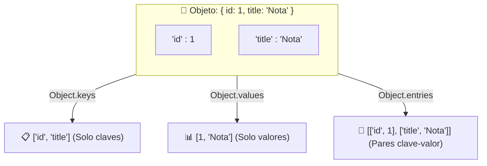
```mermaid
flowchart TD
    subgraph OBJ ["📁 Objeto: { id: 1, title: 'Nota' }"]
        direction TB
        P1["'id' : 1"]
        P2["'title' : 'Nota'"]
    end

    OBJ -->|Object.keys| OK["📋 ['id', 'title'] (Solo claves)"]
    OBJ -->|Object.values| OV["📊 [1, 'Nota'] (Solo valores)"]
    OBJ -->|Object.entries| OE["📑 [['id', 1], ['title', 'Nota']] (Pares clave-valor)"]
```

| Método | ¿Qué hace? | ¿Qué retorna? | Ejemplo sobre `{ a: 1, b: 2 }` |
| :--- | :--- | :--- | :--- |
| **`Object.keys(obj)`** | Extrae todos los nombres de las propiedades (claves) | Arreglo de strings `Array<string>` | `['a', 'b']` |
| **`Object.values(obj)`** | Extrae todos los valores asignados | Arreglo con los valores `Array<any>` | `[1, 2]` |
| **`Object.entries(obj)`** | Extrae pares `[clave, valor]` en matrices de 2 dimensiones | Arreglo de tuplas `Array<[string, any]>` | `[['a', 1], ['b', 2]]` |

---

### 💻 Código de la Clase Ilustrado y Comentado Paso a Paso

```javascript
// ==========================================
// 1. Declaración de un Objeto Literal
// ==========================================
const nota = {
  id: 1,
  title: "Mi primera nota",
  content: "Contenido de la nota",
  createAt: Date.now(),
  edad: 13,
  esAdmin: true,
  dates: [1, 1, 1, 1],
};

// Acceso por notación de punto:
console.log(nota.id);    // 👉 1
console.log(nota.title); // 👉 "Mi primera nota"

// Acceso por notación de corchetes con variable dinámica:
const campo = "content";
console.log(nota[campo]); // 👉 "Contenido de la nota"

// ==========================================
// 2. Manejo de undefined vs. Optional Chaining (?.)
// ==========================================
// Acceso a propiedad no declarada:
// console.log(nota.author.name); 
// ❌ TypeError: Cannot read properties of undefined (reading 'name')

// Acceso seguro con Optional Chaining:
console.log(nota.author?.name); 
// 👉 undefined (No explota ni detiene la ejecución)

// ==========================================
// 3. Desestructuración de Objetos
// ==========================================
const nota2 = {
  id: 1,
  title: "Mi Segunda nota",
  content: "Contenido de la nota",
  createAt: Date.now(),
  edad: 13,
  esAdmin: true,
  dates: [1, 1, 1, 1],
};

// Forma tradicional:
const title = nota2.title;

// Forma moderna con desestructuración y renombrado (alias):
const { id, title: titulo, content } = nota2;
console.log(id, titulo, content); 
// 👉 1 "Mi Segunda nota" "Contenido de la nota"

// ==========================================
// 4. Spread Operator (...) para Clonación y Fusión
// ==========================================
const nota3 = { id: 2, title: "Hola" };
const copia = { ...nota3 }; // Clon superficial
const data = { admin: true, edad: 18 };

console.log(nota3); // 👉 { id: 2, title: 'Hola' }
console.log(copia); // 👉 { id: 2, title: 'Hola' }

// Modificamos solo la copia:
copia.id = 3;

console.log(nota3); // 👉 { id: 2, title: 'Hola' } (El original permanece intacto)
console.log(copia); // 👉 { id: 3, title: 'Hola' }

// Fusión (Merge) y enriquecimiento de propiedades:
const notaActualizada = {
  ...nota3,
  content: "contenido de la nota",
  ...data,
};
console.log(notaActualizada);
// 👉 { id: 2, title: 'Hola', content: 'contenido de la nota', admin: true, edad: 18 }

// ==========================================
// 5. Métodos Estáticos de la Clase Object
// ==========================================

// Object.keys() -> Retorna un arreglo con las claves
console.log(Object.keys(notaActualizada));
// 👉 [ 'id', 'title', 'content', 'admin', 'edad' ]

// Object.values() -> Retorna un arreglo con los valores
console.log(Object.values(notaActualizada));
// 👉 [ 2, 'Hola', 'contenido de la nota', true, 18 ]

// Object.entries() -> Retorna un arreglo de pares [clave, valor]
console.log(Object.entries(notaActualizada));
// 👉 [
//      [ 'id', 2 ],
//      [ 'title', 'Hola' ],
//      [ 'content', 'contenido de la nota' ],
//      [ 'admin', true ],
//      [ 'edad', 18 ]
//    ]
```

---

## Clase 16: Métodos de Arreglos de Orden Superior (`map`, `filter`, `find`, `reduce`)

👉 [Ver código de la clase](./curso/src/16-methods.js)

Los **Métodos de Orden Superior** (_Higher-Order Methods_) en JavaScript son funciones que pertenecen al prototipo de `Array` y que **reciben otra función como argumento (callback)** para procesar, transformar o resumir sus elementos. 

Representan el paso de la **Programación Imperativa** (decirle a la computadora paso a paso con bucles `for` tradicionales *cómo* hacer la iteración) a la **Programación Declarativa / Funcional** (describir *qué* resultado deseamos obtener de forma limpia, legible e **inmutable**).

---

### 🏭 La Analogía de la Línea de Ensamblaje / Fábrica de Datos

Imagina que tu arreglo es una **cinta transportadora** por la que pasan cajas de productos:

- **`.map()` (La Estación de Transformación)**: Por cada caja que entra, sale exactamente **una caja transformada**. Transforma cada elemento $1 \text{ a } 1$ sin alterar el tamaño del arreglo ($N \to N$).
- **`.filter()` (El Inspector de Calidad / Aduana)**: Revisa cada caja con una regla estricta (¿Pasa la prueba? `true`/`false`). Solo deja pasar las cajas aprobadas a un nuevo contenedor ($N \to \le N$).
- **`.find()` (El Detective de Búsqueda)**: Va mirando las cajas una por una en la fila. En el instante exacto en que encuentra la primera que busca, **la toma y detiene la búsqueda de inmediato**. Si ninguna cumple, regresa con las manos vacías (`undefined`).
- **`.reduce()` (La Prensa Compactadora / Caja Registradora)**: Toma todas las cajas de la cinta y las combina una tras otra con un acumulador para producir **un único resultado condensado** (un número total, un string, un objeto o un nuevo array).

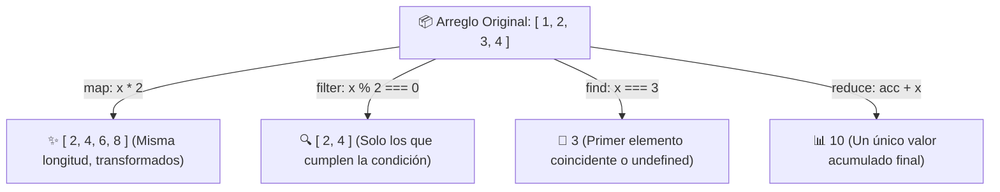
```mermaid
flowchart TD
    subgraph IN ["📦 Arreglo Original: [ 1, 2, 3, 4 ]"]
    end

    IN -->|map: x * 2| M["✨ [ 2, 4, 6, 8 ] (Misma longitud, transformados)"]
    IN -->|filter: x % 2 === 0| F["🔍 [ 2, 4 ] (Solo los que cumplen la condición)"]
    IN -->|find: x === 3| FD["🎯 3 (Primer elemento coincidente o undefined)"]
    IN -->|reduce: acc + x | R["📊 10 (Un único valor acumulado final)"]
```

---

### 🔑 1. Método `.map()`: Transformación 1 a 1

Crea un **nuevo arreglo** con los resultados de aplicar la función callback a cada uno de los elementos del arreglo original.

- **Regla de Oro**: Siempre retorna un arreglo con **la misma cantidad exacta de elementos** que el original.
- **Inmutabilidad**: El arreglo de origen nunca se modifica.

#### Casos de uso típicos:
1. **Extraer una sola propiedad de un array de objetos** (proyección de datos):
   ```javascript
   const titulos = notas.map((nota) => nota.title);
   // ['Nota 1', 'Nota 2', 'Nota 3']
   ```
2. **Enriquecer o clonar objetos agregando nuevos campos** con el operador spread (`...`):
   ```javascript
   const notasConFecha = notas.map((nota) => ({
     ...nota,
     fechaCreacion: Date.now(),
   }));
   ```

> [!NOTE]
> Al retornar un objeto literal directamente en una arrow function de una sola línea, debes envolverlo entre paréntesis `({ ... })` para que JavaScript no confunda las llaves del objeto con el cuerpo de la función.

---

### 🔍 2. Método `.filter()`: Selección y Filtrado

Crea un **nuevo arreglo** que contiene únicamente los elementos que **cumplen la condición dada por el callback** (es decir, cuando el callback retorna `true` o un valor *truthy*).

- Si ningún elemento cumple la condición, retorna un arreglo vacío `[]`.
- Si todos cumplen la condición, retorna una copia superficial con todos los elementos.

#### Casos de uso típicos:
1. **Filtrar por flags booleanas**:
   ```javascript
   const favoritas = notas.filter((nota) => nota.esFavorita);
   ```
2. **Búsqueda por texto insensible a mayúsculas/minúsculas**:
   ```javascript
   const resultado = notas.filter((nota) =>
     nota.title.toLowerCase().includes("nota 1")
   );
   ```

---

### 🎯 3. Método `.find()`: Búsqueda del Primer Elemento

Recorre el arreglo y devuelve el **valor del primer elemento** que cumpla la función de prueba proporcionada.

- En cuanto encuentra una coincidencia, **termina la ejecución inmediatamente** (_early exit_), lo que optimiza el rendimiento.
- Si ningún elemento satisface la condición, retorna `undefined`.

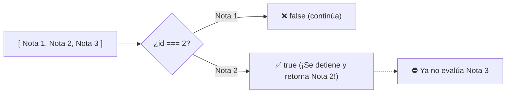
```mermaid
flowchart LR
    A["[ Nota 1, Nota 2, Nota 3 ]"] --> B{"¿id === 2?"}
    B -->|Nota 1| N1["❌ false (continúa)"]
    B -->|Nota 2| N2["✅ true (¡Se detiene y retorna Nota 2!)"]
    N2 -.-> STOP["⛔ Ya no evalúa Nota 3"]
```

#### Comparativa: `.find()` vs. `.filter()`

| Característica | `.find()` | `.filter()` |
| :--- | :--- | :--- |
| **¿Qué retorna?** | El **elemento directamente** (o `undefined`) | Un **Array** con todas las coincidencias (o `[]`) |
| **Cantidad máxima de resultados** | 1 elemento | $0$ hasta $N$ elementos |
| **Comportamiento al encontrar match** | Se detiene inmediatamente | Sigue evaluando hasta el último elemento |
| **Cuándo usarlo** | Buscar por ID único o primer registro | Obtener listas de elementos que comparten un criterio |

---

### 📊 4. Método `.reduce()`: Acumulación y Síntesis

Ejecuta una función reductora sobre cada elemento del arreglo, devolviendo como resultado un **único valor acumulado**.

```javascript
arreglo.reduce((acumulador, valorActual, indice, arregloOriginal) => {
  return nuevoAcumulador;
}, valorInicial);
```

#### Parámetros del Callback de `reduce`:
1. **`acumulador` (`acc`)**: Acumula el valor devuelto por la función en la iteración anterior.
2. **`valorActual` (`numero` / `item`)**: El elemento que se está procesando actualmente en el array.
3. **`valorInicial` (`0`, `[]`, `{}`, etc.)**: El valor con el que arranca el acumulador antes de procesar el primer elemento.

#### 🧠 Traza de Ejecución Paso a Paso (Sumatoria de `[1, 2, 3, 4, 5]` con valor inicial `0`):

| Iteración | `acc` (Entrada) | `numero` (Actual) | Operación (`acc + numero`) | `acc` (Retornado al siguiente ciclo) |
| :---: | :---: | :---: | :---: | :---: |
| **1ª** | `0` | `1` | `0 + 1` | `1` |
| **2ª** | `1` | `2` | `1 + 2` | `3` |
| **3ª** | `3` | `3` | `3 + 3` | `6` |
| **4ª** | `6` | `4` | `6 + 4` | `10` |
| **5ª** | `10` | `5` | `10 + 5` | **`15` (Resultado Final)** |

---

### 📊 Tabla Comparativa de Métodos de Iteración de Arreglos

| Método | Propósito Principal | Retorno | ¿Modifica el original? | ¿Se detiene antes? |
| :--- | :--- | :--- | :---: | :---: |
| **`map()`** | Transformar elementos uno a uno | `Array<NuevoTipo>` (Misma longitud) | ❌ No | ❌ No |
| **`filter()`** | Seleccionar elementos que cumplan una condición | `Array<Tipo>` (Longitud $\le N$) | ❌ No | ❌ No |
| **`find()`** | Obtener el primer elemento coincidente | `Elemento` \| `undefined` | ❌ No | ✅ Sí (al primer match) |
| **`reduce()`** | Acumular / condensar todos los elementos | Cualquier tipo (`number`, `object`, `array`, etc.) | ❌ No | ❌ No |
| **`forEach()`** | Ejecutar efectos secundarios por cada elemento | `undefined` | ❌ No | ❌ No |
| **`some()`** | Comprobar si **al menos un** elemento cumple la condición | `boolean` (`true` / `false`) | ❌ No | ✅ Sí (al primer `true`) |
| **`every()`** | Comprobar si **todos** los elementos cumplen la condición | `boolean` (`true` / `false`) | ❌ No | ✅ Sí (al primer `false`) |

---

### 💻 Código de la Clase Ilustrado y Comentado Paso a Paso

```javascript
// ==========================================
// 1. Método .map() - Transformación Inmutable
// ==========================================
const notas = [
  { id: 1, title: "Nota 1", content: "Contenido uno" },
  { id: 2, title: "Nota 2", content: "Contenido dos" },
  { id: 3, title: "Nota 3", content: "Contenido tres" },
];

// Extracción de una propiedad específica (proyección):
const titulos = notas.map((nota) => nota.title);
console.log(titulos);
// 👉 [ 'Nota 1', 'Nota 2', 'Nota 3' ]

// Enriquecimiento de objetos retornando una nueva estructura con Spread:
const notasConFecha = notas.map((nota) => ({
  ...nota,
  fechaCreacion: Date.now(),
}));
console.log(notasConFecha);
// 👉 [
//      { id: 1, title: 'Nota 1', content: 'Contenido uno', fechaCreacion: 1727413765000 },
//      { id: 2, title: 'Nota 2', content: 'Contenido dos', fechaCreacion: 1727413765000 },
//      { id: 3, title: 'Nota 3', content: 'Contenido tres', fechaCreacion: 1727413765000 }
//    ]

// ==========================================
// 2. Método .filter() - Filtrado Condicional
// ==========================================
const notas2 = [
  { id: 1, title: "Nota 1", content: "Contenido uno", esFavorita: true },
  { id: 2, title: "Nota 2", content: "Contenido dos", esFavorita: false },
  { id: 3, title: "Nota 3", content: "Contenido tres", esFavorita: true },
];

// Filtrar únicamente las notas marcadas como favoritas:
const favorites = notas2.filter((nota) => nota.esFavorita);
console.log(favorites);
// 👉 [
//      { id: 1, title: 'Nota 1', content: 'Contenido uno', esFavorita: true },
//      { id: 3, title: 'Nota 3', content: 'Contenido tres', esFavorita: true }
//    ]

// Búsqueda por coincidencia de texto (case-insensitive):
const title = notas2.filter((nota) =>
  nota.title.toLowerCase().includes("nota 1"),
);
console.log(title);
// 👉 [ { id: 1, title: 'Nota 1', content: 'Contenido uno', esFavorita: true } ]

// ==========================================
// 3. Método .find() - Búsqueda de Primer Registro
// ==========================================
const notas3 = [
  { id: 1, title: "Nota 1", content: "Contenido uno", esFavorita: true },
  { id: 2, title: "Nota 2", content: "Contenido dos", esFavorita: false },
  { id: 3, title: "Nota 3", content: "Contenido tres", esFavorita: true },
];

// Encuentra el primer objeto cuyo ID sea exactamente 2:
const nota = notas3.find((nota) => nota.id === 2);
console.log(nota);
// 👉 { id: 2, title: 'Nota 2', content: 'Contenido dos', esFavorita: false }

// ==========================================
// 4. Método .reduce() - Reducción / Acumulación
// ==========================================
const numeros = [1, 2, 3, 4, 5];

// Sumatoria de todos los elementos con valor inicial 0:
const sumatoria = numeros.reduce((acc, numero) => acc + numero, 0);
console.log(sumatoria);
// 👉 15
```

---

### ⚠️ Conceptos Clave y Buenas Prácticas

> [!IMPORTANT]
> **Inmutabilidad y Funciones Puras:**
> Ninguno de estos métodos (`map`, `filter`, `find`, `reduce`) muta o altera el arreglo original. Retornan nuevos arreglos o valores calculados, lo que evita efectos secundarios accidentales (_side effects_) y hace que tu código sea mucho más predecible y fácil de depurar.

> [!TIP]
> **Siempre define el `valorInicial` en `.reduce()`:**
> Si omites el segundo argumento (`valorInicial`), `reduce` tomará el primer elemento del arreglo como acumulador inicial y empezará la iteración desde el segundo elemento. Aunque funciona para sumas numéricas simples, omitirlo sobre colecciones de objetos o arreglos vacíos `[]` lanzará un error crítico `TypeError: Reduce of empty array with no initial value`.

> [!WARNING]
> **No olvides retornar un valor dentro de los callbacks:**
> Si usas arrow functions con cuerpo entre llaves `{}` en `map`, `filter` o `reduce`, es obligatorio colocar explícitamente la palabra clave `return`. Si lo olvidas, el callback retornará `undefined` en cada ciclo:
> ```javascript
> // ❌ Error común: retorna [undefined, undefined]
> const titulosErr = notas.map((n) => { n.title });
> 
> // ✅ Correcto con retorno explícito:
> const titulosOk1 = notas.map((n) => { return n.title; });
> 
> // ✅ Correcto con retorno implícito de una sola línea:
> const titulosOk2 = notas.map((n) => n.title);
> ```

---

## Clase 17: Manipulación del DOM: Selección, Creación y Renderizado Dinámico

👉 [Ver código de selección](./curso/src/dom/01-seleccionar-elementos.js) | [Ver código de renderizado dinámico](./curso/src/dom/app.js)

El **DOM** (_Document Object Model_ o Modelo de Objetos del Documento) es la interfaz de programación que representa cualquier documento HTML en memoria como un **árbol estructurado de nodos y objetos**. Gracias al DOM, JavaScript puede conectarse con la página web para leer, agregar, modificar o eliminar contenido, atributos, estilos y responder a eventos del usuario en tiempo real.

---

### 🌳 La Analogía del Plano Arquitectónico y la Maqueta Inteligente

- **El archivo HTML (El Plano de Construcción en Papel)**: Es el código estático escrito en el archivo `.html`. Solo contiene texto y etiquetas que describen cómo debería ser la estructura.
- **El DOM (La Maqueta Inteligente en la Sala de Control)**: Cuando el navegador carga el HTML, construye una maqueta 3D interactiva en memoria. Cada etiqueta (`<html>`, `<header>`, `<button>`) se convierte en un nodo u objeto con propiedades y métodos.
- **JavaScript (El Operador de la Maqueta)**: A través de JavaScript seleccionamos partes de esa maqueta (usando `document.querySelector` o `getElementById`) y al encender una luz o mover una pared en la maqueta, el navegador refleja el cambio inmediatamente en la pantalla.

```
                   document (Raíz del DOM)
                             │
                      ┌──────┴──────┐
                      │             │
                document.head  document.body
                                    │
                         ┌──────────┼──────────┐
                         │          │          │
                     <header>    <main>     <footer>
                         │          │
                     <nav>     <section>
                                    │
                                 <article> (.producto)
                                    │
                          ┌─────────┼─────────┐
                          │         │         │
                         <h3>      <p>    <button> (#btn-comprar)
```

---

### 🔑 1. Puntos de Entrada Globales del Objeto `document`

El objeto global `document` es la puerta de entrada a todo el árbol del DOM:

| Propiedad | Descripción | Retorno |
| :--- | :--- | :--- |
| **`document`** | Representa la totalidad del documento web cargado. | `HTMLDocument` |
| **`document.head`** | Acceso directo a la etiqueta `<head>` (metadatos, estilos, enlaces de fuentes, etc.). | `HTMLHeadElement` |
| **`document.body`** | Acceso directo al cuerpo visible `<body>` de la página. | `HTMLBodyElement` |

---

### 🎯 2. Métodos Modernos de Selección (Selectores CSS)

Son los métodos estándar y más recomendados en el desarrollo moderno debido a su flexibilidad, ya que aceptan cualquier selector de CSS válido (por ID, clase, etiqueta, pseudo-clase o combinadores):

#### A. `document.querySelector(selectorCSS)`
- **Qué hace**: Busca en el árbol y devuelve **el primer elemento** que coincida con el selector especificado.
- **Si no encuentra coincidencias**: Retorna `null`.

```javascript
// Selección por ID (usando prefijo '#')
const header = document.querySelector("#header");

// Selección por Clase (usando prefijo '.') -> Retorna solo el PRIMER elemento que tenga esa clase
const primerProducto = document.querySelector(".producto");

// Selección por Nombre de Etiqueta HTML
const primerTitulo = document.querySelector("h1");

// Selectores CSS avanzados / combinados
const botonComprarEnCard = document.querySelector(".card .producto-btn");
const productoConSku = document.querySelector('article[data-sku="NOVA-001"]');
```

#### B. `document.querySelectorAll(selectorCSS)`
- **Qué hace**: Busca y devuelve **todos los elementos** que coincidan con el selector especificado.
- **Retorno**: Una lista de nodos estática (**`NodeList`**).
- **Si no encuentra coincidencias**: Retorna un `NodeList` vacío (`length === 0`), nunca `null`.

```javascript
// Obtiene todos los elementos con la clase '.producto'
const todosLosProductos = document.querySelectorAll(".producto");

console.log(todosLosProductos.length); // 3 (según el HTML)

// NodeList incluye soporte directo para el método .forEach()
todosLosProductos.forEach((producto) => {
  console.log(producto);
});
```

---

### 🏛️ 3. Métodos Tradicionales / Específicos

Son métodos más antiguos pero aún ampliamente utilizados y muy rápidos para búsquedas directas:

#### A. `document.getElementById(id)`
- Busca un único elemento por su atributo `id`.
- **Nota**: Se pasa el nombre limpio del ID **sin el símbolo `#`**.
- Retorna el elemento HTML o `null` si no existe.

```javascript
const botonComprar = document.getElementById("btn-comprar");
```

#### B. `document.getElementsByClassName(className)`
- Busca todos los elementos que contengan la clase indicada.
- **Nota**: Se pasa el nombre de la clase **sin el punto `.`**.
- Retorna una colección viva (**`HTMLCollection`**).

```javascript
const botonesComprar = document.getElementsByClassName("btn-comprar");
```

#### C. `document.getElementsByTagName(tagName)`
- Busca todos los elementos que compartan la etiqueta HTML especificada (ej. `"button"`, `"div"`, `"a"`, `"h2"`).
- Retorna una colección viva (**`HTMLCollection`**).

```javascript
const todosLosBotones = document.getElementsByTagName("button");
```

---

### 📊 Tabla Comparativa de Métodos de Selección

| Método | Tipo de Selector | Retorno | Tipo de Dato | ¿Soporta `.forEach()` directo? |
| :--- | :--- | :--- | :--- | :---: |
| **`querySelector`** | Selector CSS (`#id`, `.clase`, `tag`) | **1er elemento** o `null` | `Element` \| `null` | N/A |
| **`querySelectorAll`** | Selector CSS (`#id`, `.clase`, `tag`) | **Todos** los coincidentes | `NodeList` (Estático) | ✅ Sí |
| **`getElementById`** | Nombre de ID (`"id"`) | **1er elemento** o `null` | `HTMLElement` \| `null` | N/A |
| **`getElementsByClassName`** | Nombre de Clase (`"clase"`) | **Todos** los coincidentes | `HTMLCollection` (Vivo) | ❌ No |
| **`getElementsByTagName`** | Nombre de Etiqueta (`"tag"`) | **Todos** los coincidentes | `HTMLCollection` (Vivo) | ❌ No |

---

### ⚡ 4. Diferencia Crucial: `NodeList` vs. `HTMLCollection`

| Característica | `NodeList` (de `querySelectorAll`) | `HTMLCollection` (de `getElementsBy...`) |
| :--- | :--- | :--- |
| **Naturaleza** | **Estática (Snapshot)**: Toma una "fotografía" del DOM en el instante de la consulta. Si se agregan nuevos elementos después, la lista no cambia. | **Viva (Live)**: Se mantiene sincronizada automáticamente en tiempo real si se agregan o eliminan elementos del DOM. |
| **Tipos de Nodos** | Puede contener elementos HTML, nodos de texto y comentarios. | Solo contiene elementos HTML (`Element`). |
| **Iteración Nativa** | ✅ Posee método `.forEach()` incorporado. | ❌ No posee `.forEach()`. Requiere conversión o bucle `for...of`. |
| **Conversión a Array** | `[...nodeList]` o `Array.from(nodeList)` | `[...htmlCollection]` o `Array.from(htmlCollection)` |

```javascript
// 💡 Cómo iterar sobre un HTMLCollection convirtiéndolo a un Array real:
const coleccionBotones = document.getElementsByTagName("button");

// Opción A: Con Spread Operator [...]
[...coleccionBotones].forEach((btn) => console.log(btn));

// Opción B: Con Array.from()
Array.from(coleccionBotones).map((btn) => btn.textContent);
```

---

### 💻 Código de la Clase Ilustrado y Comentado Paso a Paso

```javascript
// ==========================================
// 1. Puntos de Entrada Principales del DOM
// ==========================================
console.log(document);       // 👉 Muestra la estructura completa del documento HTML
console.log(document.body);  // 👉 Accede al nodo <body> con todo su contenido visible
console.log(document.head);  // 👉 Accede al nodo <head> (metadatos, scripts, estilos)

// ==========================================
// 2. Selección con querySelector (Primer Coincidencia)
// ==========================================
// Selección por ID con selector CSS '#':
const header = document.querySelector("#header");
console.log(header); // 👉 <header id="header">...</header>

// Selección por Clase con selector CSS '.':
// Retorna ÚNICAMENTE la primera tarjeta de producto encontrada:
const primerProducto = document.querySelector(".producto");
console.log(primerProducto); // 👉 <article class="card producto" data-sku="NOVA-001">...</article>

// Selección por Etiqueta HTML:
const tituloPrincipal = document.querySelector("h1");
console.log(tituloPrincipal); // 👉 <h1>Productos útiles, entrega rápida.</h1>

// ==========================================
// 3. Selección Múltiple con querySelectorAll
// ==========================================
// Retorna un NodeList con las 3 tarjetas de productos:
const listaProductos = document.querySelectorAll(".producto");
console.log(listaProductos); 
// 👉 NodeList(3) [ article.card.producto, article.card.producto, article.card.producto ]

// ==========================================
// 4. Métodos Tradicionales Específicos
// ==========================================
// Por ID (sin el caracter '#'):
const btnComprar = document.getElementById("btn-comprar");
console.log(btnComprar); // 👉 <button class="btn" id="btn-comprar">Ver ofertas</button>

// Por Clase (sin el caracter '.'):
// Retorna un HTMLCollection con los elementos que tengan esa clase:
const botonesPorClase = document.getElementsByClassName("btn-comprar");
console.log(botonesPorClase); // 👉 HTMLCollection [ button#btn-comprar.btn ]

// Por Nombre de Etiqueta:
// Retorna un HTMLCollection con todos los <button> del documento:
const todosLosBotones = document.getElementsByTagName("button");
console.log(todosLosBotones); 
// 👉 HTMLCollection(4) [ button#btn-comprar.btn, button.btn.secondary.producto-btn, ... ]
```

---

### 🧱 5. Creación y Renderizado Dinámico de Elementos

Manipular el DOM también implica **crear nuevos nodos desde JavaScript** e insertarlos en la interfaz:

| Método / Propiedad | Propósito | Ejemplo |
| :--- | :--- | :--- |
| **`document.createElement(tag)`** | Crea un nuevo nodo en memoria (sin insertar aún). | `const card = document.createElement('article');` |
| **`element.textContent`** | Asigna texto seguro (evita inyecciones XSS). | `nombre.textContent = "María";` |
| **`element.classList.add(clase)`** | Agrega una clase CSS al elemento. | `card.classList.add('opinion');` |
| **`element.dataset.propiedad`** | Maneja atributos personalizados `data-*`. | `card.dataset.id = 'op-1'; // data-id="op-1"` |
| **`parent.appendChild(child)`** | Inserta el nodo hijo al final del contenedor. | `contenedor.appendChild(card);` |
| **`parent.replaceChildren()`** | Limpia rápidamente todos los hijos del contenedor. | `contenedor.replaceChildren();` |

#### 💻 Código de Creación y Renderizado (Component Pattern)

```javascript
// 1. Función constructora del elemento (Componente)
function createOpinionElement(opinion) {
  const article = document.createElement('article');
  article.classList.add('opinion');
  article.dataset.id = opinion.id;

  const header = document.createElement('header');
  const meta = document.createElement('div');
  meta.classList.add('meta');

  const nombre = document.createElement('strong');
  nombre.textContent = opinion.nombre;

  const rating = document.createElement('span');
  rating.textContent = `★ ${opinion.rating}/5`;

  meta.appendChild(nombre);
  meta.appendChild(rating);

  const fecha = document.createElement('small');
  fecha.classList.add('muted');
  fecha.textContent = opinion.fecha;

  header.appendChild(meta);
  header.appendChild(fecha);

  const comentario = document.createElement('p');
  comentario.textContent = opinion.comentario;

  article.appendChild(header);
  article.appendChild(comentario);

  return article;
}

// 2. Función de renderizado en el contenedor
function renderOpinions(list) {
  const contenedor = document.querySelector('#opiniones');
  contenedor.replaceChildren(); // Limpia render previo

  list.forEach((opinion) => {
    const element = createOpinionElement(opinion);
    contenedor.appendChild(element);
  });
}
```

---

## Clase 18: Eventos del DOM y Manejo de Estado (`addEventListener`)

👉 [Ver código de la clase](./curso/src/events/app.js)

Los **eventos** son acciones que ocurren en el navegador (como clics, movimientos del ratón o teclas pulsadas) que JavaScript puede escuchar y responder mediante **manejadores de eventos** (_event listeners_).

---

### 🔑 1. Escuchadores de Eventos (`addEventListener`)

Permite suscribir una función que se ejecutará cada vez que ocurra el evento especificado:

```javascript
elemento.addEventListener('tipoEvento', (event) => {
  // Acción en respuesta al evento
});
```

#### Eventos Principales Utilizados:
- **`'click'`**: Se dispara al presionar y soltar un botón del mouse sobre el elemento.
- **`'mouseenter'`**: Se activa cuando el cursor entra en los límites del elemento.
- **`'mouseleave'`**: Se activa cuando el cursor sale del elemento.
- **`'keydown'`**: Se dispara al presionar cualquier tecla en el teclado. El objeto `event.key` contiene la tecla presionada.

---

### 🔄 2. Patrón de Arquitectura: Estado $\rightarrow$ Eventos $\rightarrow$ Render

En aplicaciones interactivas, la mejor práctica es **separar los datos (estado) de la interfaz (DOM)**:

1. **Estado (`state`)**: Objeto JavaScript con los datos dinámicos.
2. **Eventos**: Modifican únicamente los datos del `state`.
3. **Render (`render`)**: Actualiza la pantalla para reflejar el estado actual.

```
[ Usuario interactúa ] ──► [ Event Listener ] ──► [ Modifica state ] ──► [ render() ] ──► [ DOM Actualizado ]
```

---

### 🛠️ 3. Métodos y Propiedades Clave en la Interfaz

- **`element.classList.toggle('clase', boolean)`**: Agrega la clase si la condición es `true` y la remueve si es `false`.
- **`button.disabled = boolean`**: Habilita o deshabilita un botón.
- **`element.style.propiedad = valor`**: Modifica estilos inline directamente (ej. `btnReset.style.opacity = '0.55'`).

---

### 💻 Código de la Clase Ilustrado y Comentado

```javascript
// 1. Estado Central de la Aplicación
const state = {
  likes: 0,
  isHovering: false,
};

// 2. Función de Renderizado (Actualiza el DOM según el Estado)
function render() {
  const status = document.querySelector('#status');
  const btnReset = document.querySelector('#btn-reset');
  const hoverZone = document.querySelector('#hover-zone');
  const hoverPill = document.querySelector('#hover-pill');

  // Actualizar textos
  status.textContent = state.likes === 0 ? 'Aún no hay likes' : `Tienes ${state.likes} Likes`;

  // Deshabilitar botón y cambiar estilo
  btnReset.disabled = state.likes === 0;
  btnReset.style.opacity = state.likes === 0 ? '0.55' : '1';

  // Alternar clase CSS con toggle
  hoverZone.classList.toggle('is-hover', state.isHovering);
  hoverPill.textContent = state.isHovering ? 'mouse: dentro' : 'mouse: fuera';
}

// 3. Configuración de Eventos de Mouse
function setupEvents() {
  const btnLike = document.querySelector('#btn-like');
  const btnReset = document.querySelector('#btn-reset');
  const hoverZone = document.querySelector('#hover-zone');

  btnLike.addEventListener('click', () => {
    state.likes += 1;
    render();
  });

  btnReset.addEventListener('click', () => {
    state.likes = 0;
    render();
  });

  hoverZone.addEventListener('mouseenter', () => {
    state.isHovering = true;
    render();
  });

  hoverZone.addEventListener('mouseleave', () => {
    state.isHovering = false;
    render();
  });
}

// 4. Configuración de Eventos de Teclado (Tecla 'L' para Like)
function setupKeyBoardLike() {
  document.addEventListener('keydown', (event) => {
    if (event.key?.toLowerCase() !== 'l') return;
    state.likes += 1;
    render();
  });
}

// Inicialización
setupEvents();
setupKeyBoardLike();
```

---

## Clase 19: Formularios (`FormData`, `submit`, `preventDefault`) y Persistencia con `localStorage`

👉 [Ver código de la clase (JavaScript)](./curso/src/form/app.js) | [Ver interfaz (HTML)](./curso/src/form/index.html)

En esta clase se aborda uno de los flujos más comunes en el desarrollo web frontend: **la interacción con formularios de usuario**, el procesamiento de sus datos sin recargar la página y la **persistencia local en el navegador** utilizando la API de `localStorage`.

---

### 📬 La Analogía del Buzón Tradicional vs. La Libreta en el Escritorio

- **El comportamiento por defecto del formulario (El Buzón Tradicional)**: Antiguamente, al enviar un formulario (`<form>`), el navegador empaquetaba los datos y refrescaba toda la página para mandarle una petición HTTP al servidor. En aplicaciones modernas (_SPA_ o interfaces dinámicas), este refresco interrumpe la experiencia del usuario.
- **`event.preventDefault()` (El Mensajero Local)**: Es como interceptar la carta antes de que salga al buzón. Le decimos al navegador: *"Detén el envío tradicional, yo me encargo de leer la información con JavaScript en el cliente"*.
- **`localStorage` (La Libreta de Notas Permanente en el Escritorio)**: Las variables en JavaScript viven en la memoria RAM; si el usuario recarga la página (`F5`) o cierra el navegador, las variables se destruyen. `localStorage` es como anotar los datos en una libreta física que se queda guardada en el disco del navegador: **permanece intacta aunque se cierre la pestaña o se apague la computadora**.

---

### 🔑 Conceptos Clave

#### 1. Manejo del Evento `'submit'` y `event.preventDefault()`

El evento adecuado para capturar el envío de un formulario es siempre **`'submit'` sobre la etiqueta `<form>`** (y no un evento `'click'` en el botón). Esto asegura que funcione tanto al hacer clic en el botón como al presionar la tecla `Enter` dentro de un campo de texto:

```javascript
const contactForm = document.querySelector('#contact-form');

contactForm.addEventListener('submit', (event) => {
  // 🛑 Evita que el navegador recargue la página o intente enviar una petición GET/POST síncrona
  event.preventDefault();

  // Aquí procesamos los datos con JavaScript
});
```

---

#### 2. Extracción de Datos con la API `FormData`

La interfaz nativa `FormData` permite recolectar de forma automática todos los valores de los campos de un `<form>` mediante el atributo `name` de cada `<input>`, `<textarea>` o `<select>`:

```javascript
const form = event.target; // El formulario HTML que disparó el submit
const formData = new FormData(form);

// Obtenemos el valor de cada campo usando su atributo 'name'
const name = String(formData.get('name'));
const message = String(formData.get('message'));
```

> [!IMPORTANT]
> Para que `FormData.get('clave')` funcione, los elementos de entrada del HTML **deben tener definido el atributo `name`**:
> ```html
> <input type="text" name="name" required />
> <textarea name="message" required></textarea>
> ```

---

#### 3. ¿Qué es `localStorage` y cómo funciona?

`localStorage` es una propiedad del objeto global `window` que implementa la **Web Storage API**. Permite almacenar pares clave-valor en el navegador web con persistencia indefinida (no expira con el tiempo).

| Método | Descripción | Ejemplo |
| :--- | :--- | :--- |
| **`localStorage.setItem(key, value)`** | Guarda o actualiza un valor asociado a una clave. | `localStorage.setItem('form', jsonString);` |
| **`localStorage.getItem(key)`** | Obtiene el valor de una clave. Retorna `null` si no existe. | `const raw = localStorage.getItem('form');` |
| **`localStorage.removeItem(key)`** | Elimina una clave y su valor asociado. | `localStorage.removeItem('form');` |
| **`localStorage.clear()`** | Borra **todas** las claves almacenadas para el origen actual. | `localStorage.clear();` |
| **`localStorage.length`** | Retorna el número total de elementos almacenados. | `console.log(localStorage.length);` |

---

#### 4. Serialización y Deserialización con JSON (`JSON.stringify` y `JSON.parse`)

> [!WARNING]
> **`localStorage` solo almacena strings (cadenas de texto plano).**
> Si intentas guardar un objeto directamente:
> ```javascript
> localStorage.setItem('usuario', { nombre: 'Ana' });
> localStorage.getItem('usuario'); // 👉 "[object Object]" ❌ ¡Datos perdidos!
> ```

Para guardar y recuperar objetos o arreglos sin perder su estructura, debemos utilizar **JSON**:

1. **Serializar al Guardar (`JSON.stringify`)**: Convierte un objeto/arreglo JavaScript a un `string` con formato JSON.
   ```javascript
   const payload = { name: 'María', message: 'Excelente servicio' };
   localStorage.setItem('form', JSON.stringify(payload));
   // En localStorage se guarda: '{"name":"María","message":"Excelente servicio"}'
   ```

2. **Deserializar al Leer (`JSON.parse`)**: Convierte el `string` JSON recuperado de vuelta a un objeto JavaScript real.
   ```javascript
   const raw = localStorage.getItem('form'); // String o null
   if (raw) {
     const data = JSON.parse(raw); // Objeto JS: { name: 'María', message: '...' }
     console.log(data.name);       // 'María'
   }
   ```

---

#### 5. Tabla Comparativa: Mecanismos de Almacenamiento en el Cliente

| Característica | `localStorage` | `sessionStorage` | `Cookies` |
| :--- | :--- | :--- | :--- |
| **Persistencia** | Permanente (hasta que se borre por código o usuario) | Se destruye al cerrar la pestaña/ventana | Configurable mediante fecha de expiración (`Expires` / `Max-Age`) |
| **Capacidad** | $\approx 5\text{MB} - 10\text{MB}$ | $\approx 5\text{MB}$ | $\approx 4\text{KB}$ |
| **Envío al Servidor** | ❌ No (solo vive en el cliente) | ❌ No (solo vive en el cliente) | ✅ Sí (se envía automáticamente en cada cabecera HTTP) |
| **Ámbito (_Scope_)** | Mismo Origen (Protocolo + Dominio + Puerto) | Misma pestaña y mismo origen | Mismo dominio / rutas configuradas |
| **Uso Típico** | Preferencias, carritos de compra offline, borradores | Datos temporales de una sola sesión de navegación | Sesiones de autenticación, tokens de seguridad (`HttpOnly`) |

---

#### 6. 🔍 Dónde Inspeccionar `localStorage` en el Navegador (DevTools)

Para verificar y depurar los datos almacenados:

```
[ F12 o Clic Derecho -> Inspeccionar ] 
  └──► Pestaña "Application" (Chrome / Edge) o "Almacenamiento" (Firefox)
        └──► Menú Lateral "Storage" -> "Local Storage"
              └──► Seleccionar tu dominio (ej. http://127.0.0.1:5500 o file://)
```

Desde este panel puedes:
- Ver todas las claves (`Key`) y sus valores (`Value`).
- Editar manualmente cualquier valor haciendo doble clic.
- Eliminar claves individuales o vaciar todo el almacenamiento con el botón 🚫 (_Clear All_).

---

### 💻 Código de la Clase Ilustrado y Comentado Paso a Paso

```javascript
// ==========================================
// 1. Constante para la Clave de Almacenamiento
// ==========================================
// 💡 Buena práctica: Usar constantes para evitar errores tipográficos en las keys
const CONTACT_STORAGE_KEY = 'form';

// ==========================================
// 2. Función de Renderizado del Mensaje Guardado
// ==========================================
function renderSavedMessage() {
  const box = document.querySelector('#mensaje-guardado');
  if (!box) return;

  // 1. Obtener la cadena cruda desde localStorage
  const raw = localStorage.getItem(CONTACT_STORAGE_KEY);
  if (!raw) return;

  // 2. Deserializar la cadena JSON a un objeto JavaScript
  const data = JSON.parse(raw);

  // 3. Mostrar la caja en el DOM removiendo la clase 'hidden'
  box.classList.remove('hidden');

  // 4. Inyectar el contenido con los datos recuperados
  box.innerHTML = `
    <p><strong>Último mensaje guardado:</strong></p>
    <p><strong>Nombre:</strong> ${data.name}</p>
    <p><strong>Mensaje:</strong> ${data.message}</p>
    <p><small class="muted">Fecha: ${new Date(data.date).toLocaleString()}</small></p>
  `;
}

// ==========================================
// 3. Manejador del Evento Submit del Formulario
// ==========================================
function handleContactSubmit(event) {
  // 🛑 1. Prevenir la recarga de página por defecto del navegador
  event.preventDefault();

  // 📋 2. Extraer datos con la API FormData
  const form = event.target;
  const formData = new FormData(form);

  const name = String(formData.get('name')).trim();
  const message = String(formData.get('message')).trim();

  // 📦 3. Construir el objeto de datos (Payload) con metadatos útiles
  const payload = {
    name,
    message,
    date: new Date().toISOString(),
  };

  console.log('Guardando payload:', payload);

  // 💾 4. Serializar y guardar en localStorage
  localStorage.setItem(CONTACT_STORAGE_KEY, JSON.stringify(payload));

  // 🖥️ 5. Actualizar la interfaz con los nuevos datos guardados
  renderSavedMessage();

  // 🧹 6. Limpiar los campos del formulario para nueva entrada
  form.reset();
}

// ==========================================
// 4. Inicialización y Suscripción de Eventos
// ==========================================
const contactForm = document.querySelector('#contact-form');

if (contactForm) {
  contactForm.addEventListener('submit', handleContactSubmit);
}

// 🔄 Al cargar la página, verificamos si ya existía un mensaje previo guardado
renderSavedMessage();
```

---

> [!TIP]
> **Mejores Prácticas al Trabajar con `localStorage` y Formularios:**
> 1. **Manejo de Errores con `try...catch`**: En modos de navegación privada o cuando el disco está lleno, `localStorage.setItem()` puede arrojar una excepción `QuotaExceededError`. Envolver la lectura/escritura en bloques `try...catch` previene caídas de la aplicación.
> 2. **No Guardar Información Sensible**: Nunca almacenes contraseñas, datos bancarios ni tokens de autenticación altamente sensibles en `localStorage`, ya que es accesible por cualquier script que se ejecute en el mismo dominio (vulnerable a ataques _XSS_).
> 3. **Usar `form.reset()`**: Proporciona una forma limpia y estándar de vaciar todos los campos del formulario tras un envío exitoso.

---

## Clase 20: Módulos en JavaScript (ES Modules: `import` / `export`, Named vs. Default y Arquitectura Modular)

👉 [Ver código de ESM Básico](./curso/src/17-modules.js) | [Ver módulo matemático de utilidades](./curso/src/math.js) | [Ver punto de entrada modular](./curso/src/modules/app.js) | [Ver módulo de opiniones](./curso/src/modules/opinions.js) | [Ver módulo de contacto](./curso/src/modules/contact.js)

A medida que una aplicación web crece en complejidad, mantener todo el código en un solo archivo o enlazar decenas de etiquetas `<script>` desordenadas en el HTML se vuelve insostenible. 

Los **Módulos de ECMAScript (ES Modules o ESM)** introducidos en ES6 (2015) representan el estándar oficial y nativo del lenguaje para dividir aplicaciones en piezas pequeñas, independientes, reutilizables y con su propio ámbito cerrado (*file-level scope*).

---

### 🏢 La Analogía del Taller Desorganizado vs. La Red de Especialistas

- **JavaScript Clásico sin Módulos (El Galpón Desorganizado)**: Imagina un taller gigante donde todos los artesanos trabajan en el mismo salón y dejan sus herramientas tiradas en el mismo suelo (`window` global). Si dos personas nombran una herramienta `calcularTotal()`, una romperá el trabajo de la otra por accidente (_colisión de nombres_).
- **ES Modules (La Red de Talleres Especializados)**: Cada módulo es un taller independiente con puertas y paredes blindadas. Lo que ocurre dentro del módulo se queda dentro. Si un taller desea compartir una herramienta, la coloca en una ventanilla oficial etiquetada (**`export`**). Cualquier otro taller que la necesite puede solicitarla explícitamente (**`import`**), conociendo su origen exacto.

```mermaid
flowchart LR
    subgraph MATH ["📦 math.js (Módulo de Utilidades)"]
        PI["const PI = 3.14159"]
        sumar["function sumar(a, b)"]
        restar["function restar(a, b)"]
    end

    subgraph APP ["🚀 app.js (Módulo Principal)"]
        use["import { PI, sumar } from './math.js'"]
    end

    MATH -->|export { PI, sumar }| APP
```

---

### 🔑 Conceptos Clave

#### 1. Ámbito de Módulo (_Module Scope_) vs. Ámbito Global

Al usar módulos, las variables y funciones declaradas con `const`, `let`, `var` o `function` en el archivo **NO se agregan al objeto global `window`** del navegador. Tienen un ámbito léxico exclusivo del archivo.

```javascript
// math.js
const SECRETO = 'clave_interna'; // 🔒 Privado, nadie fuera de este archivo puede verlo
export const PI = 3.14159;       // 🌐 Público, disponible para importar
```

---

#### 2. Exportaciones Nombradas (_Named Exports_)

Permiten exportar múltiples variables, constantes o funciones desde un mismo archivo anteponiendo la palabra clave `export` o mediante una lista al final del archivo:

```javascript
// 📁 math.js
export const PI = 3.14159;

export function sumar(a, b) {
  return a + b;
}

export function restar(a, b) {
  return a - b;
}
```

##### ¿Cómo se importan las exportaciones nombradas?
Se deben importar **envolviendo los nombres exactos entre llaves `{}`**:

```javascript
// 📁 17-modules.js
import { PI, sumar, restar } from "./math.js";

console.log(PI);           // 3.14159
console.log(sumar(5, 2));  // 7
console.log(restar(3, 2)); // 1
```

> [!NOTE]
> **Uso de Alias con `as`**: Si necesitas renombrar una función importada para evitar colisiones con variables locales, puedes usar la palabra clave `as`:
> ```javascript
> import { sumar as sumarValores } from "./math.js";
> ```

---

#### 3. Exportaciones por Defecto (_Default Exports_) vs. Nombradas

| Característica | Exportaciones Nombradas (`Named`) | Exportaciones por Defecto (`Default`) |
| :--- | :--- | :--- |
| **Sintaxis de Exportación** | `export const valor = 10;` / `export { a, b };` | `export default function miFuncion() {}` |
| **Cantidad por Módulo** | Múltiples por archivo | **Solo una** por archivo |
| **Sintaxis de Importación** | Con llaves obligatorias: `import { valor } from './mod.js'` | Sin llaves y con cualquier nombre: `import miAlias from './mod.js'` |
| **Caso de Uso Ideal** | Librerías con muchas utilidades (ej. operaciones matemáticas, formatters) | Componentes principales, clases maestras o servicios centrales |

---

#### 4. Uso de Módulos en el Navegador (`type="module"`)

Para que el navegador ejecute archivos con sintaxis `import` y `export`, debemos indicarle explícitamente el atributo `type="module"` en la etiqueta `<script>`:

```html
<!-- Carga el punto de entrada de la aplicación modular -->
<script type="module" src="./src/modules/app.js"></script>
```

##### Propiedades clave de `<script type="module">`:
1. **Modo Estricto Automático**: Todo el código se ejecuta bajo `"use strict"` por defecto.
2. **Carga Diferida (`defer` automático)**: El navegador no bloquea el parseo del HTML mientras descarga los módulos; se ejecutan en orden una vez que el documento HTML está completamente parseado.
3. **Manejo de CORS**: Por seguridad, los módulos ESM deben servirse bajo el protocolo `http://` o `https://` (ej. usando un servidor local como Live Server, Vite o Node.js). Intentar cargarlos con el protocolo `file:///` arrojará un error de CORS.
4. **Rutas Relativas Explícitas**: Los navegadores exigen que las rutas comiencen con `./`, `../` o `/`, e incluyan la extensión `.js`.

---

#### 5. Configuración en Node.js (`package.json`)

Para habilitar la sintaxis de ES Modules de forma nativa en Node.js (sin necesidad de herramientas de compilación como Babel), se añade la propiedad `"type": "module"` en el archivo `package.json`:

```json
{
  "name": "curso",
  "version": "1.0.0",
  "type": "module"
}
```

---

#### 6. Inspección de Persistencia en las DevTools del Navegador

Al trabajar con `localStorage`, `sessionStorage` y cookies en aplicaciones modulares, la consola del navegador incluye herramientas visuales dedicadas:

```
Pestaña 'Application' (o 'Almacenamiento') en Chrome / Firefox DevTools:
├── Storage
│   ├── Local Storage (https://tudominio.com)
│   │   ├── Key: 'form'  | Value: {"name":"Christian","message":"Hola","date":"..."}
│   │   └── Key: 'notas' | Value: [...]
│   ├── Session Storage
│   ├── IndexedDB
│   └── Cookies
```

> [!TIP]
> Puedes inspeccionar, editar manualmente o limpiar todas las claves guardadas en tiempo real desde la pestaña **Application $\rightarrow$ Storage $\rightarrow$ Local Storage** sin necesidad de reiniciar tu aplicación.

---

### 🏗️ Patrón de Arquitectura Modular: Orquestador y Módulos de Dominio

Una arquitectura de software limpia en JavaScript divide las responsabilidades en capas claras:

```mermaid
flowchart TD
    HTML["📄 index.html (<script type='module' src='./app.js'>)"] --> APP["🚀 app.js (Orquestador / Entry Point)"]
    
    APP -->|import { initOpinions }| OPINIONS["💬 opinions.js (Módulo de Opiniones y Reseñas)"]
    APP -->|import { initContact }| CONTACT["📬 contact.js (Módulo de Formulario y Persistencia)"]
    
    OPINIONS --> DOM_OP["🖼️ Renderizado de Lista de Reseñas en el DOM"]
    CONTACT --> DOM_CT["💾 Captura FormData + LocalStorage + Renderizado de Confirmación"]
```

---

### 💻 Código de la Clase Ilustrado y Comentado

#### 1. Módulo de Utilidades Matemáticas (`math.js`)
```javascript
// 📁 curso/src/math.js
export const PI = 3.14159;

export function sumar(a, b) {
  return a + b;
}

export function restar(a, b) {
  return a - b;
}
```

#### 2. Módulo Encapsulado de Opiniones (`opinions.js`)
```javascript
// 📁 curso/src/modules/opinions.js

// Datos privados del módulo (No accesibles desde fuera)
const opiniones = [
  {
    id: 'op-1',
    nombre: 'María',
    rating: 5,
    comentario: 'Llegó rápido y la calidad es excelente.',
    fecha: '2025-01-10',
  },
  {
    id: 'op-2',
    nombre: 'Carlos',
    rating: 4,
    comentario: 'Buen producto. El empaque podría mejorar.',
    fecha: '2025-01-22',
  },
  {
    id: 'op-3',
    nombre: 'Luisa',
    rating: 5,
    comentario: 'Muy cómodo. Compraría de nuevo.',
    fecha: '2025-02-03',
  },
  {
    id: 'op-5',
    nombre: 'Oscar',
    rating: 5,
    comentario: 'Muy cómodo. Compraría de nuevo.',
    fecha: '2025-02-03',
  },
];

// Función auxiliar de creación de nodo (Privada)
function createOpinionElement(opinion) {
  const article = document.createElement('article');
  article.classList.add('opinion');
  article.dataset.id = opinion.id;

  const header = document.createElement('header');
  const meta = document.createElement('div');
  meta.classList.add('meta');

  const nombre = document.createElement('strong');
  nombre.textContent = opinion.nombre;

  const rating = document.createElement('span');
  rating.textContent = `★ ${opinion.rating}/5`;

  meta.appendChild(nombre);
  meta.appendChild(rating);

  const fecha = document.createElement('small');
  fecha.classList.add('muted');
  fecha.textContent = opinion.fecha;

  header.appendChild(meta);
  header.appendChild(fecha);

  const comentario = document.createElement('p');
  comentario.textContent = opinion.comentario;

  article.appendChild(header);
  article.appendChild(comentario);

  return article;
}

// Función de renderizado (Privada)
function renderOpinions(list) {
  const contenedor = document.querySelector('#opiniones');
  if (!contenedor) return;

  contenedor.replaceChildren(); // Limpia los hijos previos eficientemente

  list.forEach((opinion) => {
    const element = createOpinionElement(opinion);
    contenedor.appendChild(element);
  });
}

// Función pública exportada para inicializar el módulo
export function initOpinions(list = opiniones) {
  renderOpinions(list);
}
```

#### 3. Módulo Encapsulado de Formulario y Persistencia (`contact.js`)
```javascript
// 📁 curso/src/modules/contact.js
const CONTACT_STORAGE_KEY = 'form';

function renderSavedMessage() {
  const box = document.querySelector('#mensaje-guardado');
  if (!box) return;

  const raw = localStorage.getItem(CONTACT_STORAGE_KEY);
  if (!raw) return;

  const data = JSON.parse(raw);

  box.classList.remove('hidden');
  box.innerHTML = `
    <p><strong>Último mensaje guardado:</strong></p>
    <p><strong>Nombre:</strong> ${data.name}</p>
    <p><strong>Mensaje:</strong> ${data.message}</p>
  `;
}

function handleContactSubmit(event) {
  event.preventDefault();

  const form = event.target;
  const formData = new FormData(form);

  const name = String(formData.get('name') || '').trim();
  const message = String(formData.get('message') || '').trim();

  const payload = {
    name,
    message,
    date: new Date().toISOString(),
  };

  console.log('Guardando payload en localStorage:', payload);
  localStorage.setItem(CONTACT_STORAGE_KEY, JSON.stringify(payload));

  renderSavedMessage();
  form.reset();
}

// Inicializador público del módulo
export function initContact() {
  const contactForm = document.querySelector('#contact-form');
  if (contactForm) {
    contactForm.addEventListener('submit', handleContactSubmit);
  }
  renderSavedMessage();
}
```

#### 4. Punto de Entrada Principal / Orquestador (`app.js`)
```javascript
// 📁 curso/src/modules/app.js
import { initOpinions } from "./opinions.js";
import { initContact } from "./contact.js";

// Inicializamos los módulos de forma desacoplada
initOpinions();
initContact();
```

---

## 🚀 Proyecto Integrador: Sistema de Gestión de Notas en Markdown (`notes-md`)

👉 [Ver lógica de la aplicación](./notes-md/src/app.js) | [Ver interfaz HTML](./notes-md/src/index.html) | [Ver hoja de estilos](./notes-md/src/styles.css)

El proyecto **`notes-md`** es una aplicación web completa que consolida todos los conceptos aprendidos a lo largo del curso:
- **Tipos de datos y operadores**: Manejo de valores primitivos, comparaciones estrictas y coerción.
- **Procesamiento de strings y algoritmos**: Detección de saltos de línea, normalización con `.toLowerCase()` y truncado de texto.
- **Closures y Patrón Factory**: Encapsulación de estado privado mediante `createPersistentNotesStore()`.
- **Inmutabilidad y Métodos de Orden Superior**: Uso extensivo de `.map()`, `.filter()`, `.find()` y `.sort()`.
- **Persistencia en el navegador**: Serialización/deserialización con `localStorage` y `JSON`.
- **Manipulación avanzada del DOM**: Creación semántica de nodos, gestión de listas reactivas, estados vacíos y atributos de accesibilidad (`aria-current`).

```mermaid
flowchart TD
    UI["🖥️ Interfaz de Usuario (HTML/CSS)"]
    EVENT["⚡ Eventos de Usuario (Click, Input, Search)"]
    STORE["🔒 createPersistentNotesStore (Closure con Estado Privado)"]
    STORAGE["💾 LocalStorage ('markdown-notes')"]
    RENDER["🎨 renderNoteList() / showEditorAndPreview()"]

    UI --> EVENT
    EVENT --> STORE
    STORE <-->|loadFromStorage / saveToStorage| STORAGE
    STORE -->|Estado actualizado (getAllNotes, search)| RENDER
    RENDER --> UI
```

---

### 🧩 Desglose Técnico de la Arquitectura de `notes-md`

#### 1. Algoritmos de Utilidad de Texto
- **`deriveTitle(content)`**: Recorre el texto caracter por caracter hasta encontrar el primer salto de línea `\n`, extrayendo la primera línea como título. Si excede los 50 caracteres, trunca la cadena y agrega una elipsis `...`.
- **`deriveExcerpt(content, maxLen)`**: Genera un resumen limpio para mostrar en la barra lateral sin sobrecargar la vista.

```javascript
function deriveTitle(content) {
  if (!content || typeof content !== 'string') return 'Sin título';
  const cleanContent = content.trim();
  if (cleanContent === '') return 'Sin título';

  let firstLine = '';
  for (let i = 0; i < cleanContent.length; i++) {
    if (cleanContent[i] === '\n') break;
    firstLine += cleanContent[i];
  }

  if (firstLine.trim() === '') return 'Sin título';
  return firstLine.length > 50 ? firstLine.slice(0, 50).trim() + '...' : firstLine.trim();
}
```

---

#### 2. Generación de IDs y Modelo de Datos
- **`generateId()`**: Utiliza `Date.now()` para producir marcas de tiempo numéricas únicas en milisegundos.
- **Estructura de una Nota**:
  ```javascript
  {
    id: 1738790400000,
    title: "Apuntes de JavaScript",
    excerpt: "Los closures permiten encapsular datos...",
    content: "Los closures permiten encapsular datos de forma privada.",
    createdAt: 1738790400000,
    updatedAt: 1738790400000,
    favorite: false
  }
  ```

---

#### 3. El Store Persistente (`createPersistentNotesStore`)

Aplica el **patrón Factory con Closures** para aislar el array de notas `let notes = loadFromStorage();` en un entorno léxico protegido, impidiendo manipulaciones accidentales desde la consola global:

```javascript
function createPersistentNotesStore() {
  let notes = loadFromStorage(); // Estado privado e inaccesible desde fuera

  return {
    // ➕ Agregar nota
    addNote(content, title) {
      if (!content || content.trim() === '') {
        return { success: false, message: 'El contenido no puede estar vacío' };
      }
      const newNote = createNote(content, title);
      notes.push(newNote);
      saveToStorage(notes);
      return { success: true, note: newNote };
    },

    // 📋 Obtener todas (Retorna copias inmutables)
    getAllNotes() {
      return notes.map((note) => ({ ...note }));
    },

    // 🔍 Buscar por ID
    getNoteById(noteId) {
      const found = notes.find((note) => note.id === noteId);
      return found ? { ...found } : null;
    },

    // ✏️ Actualizar nota
    updateNote(noteId, updates) {
      const noteToUpdate = notes.find((note) => note.id === noteId);
      if (!noteToUpdate) return { success: false, message: 'Nota no encontrada' };

      if (updates.content !== undefined) {
        if (updates.content.trim() === '') {
          return { success: false, message: 'El contenido no puede estar vacío' };
        }
        noteToUpdate.content = updates.content;
        noteToUpdate.title = deriveTitle(updates.content);
        noteToUpdate.excerpt = deriveExcerpt(updates.content, 100);
      }

      if (updates.title) noteToUpdate.title = updates.title;
      if (updates.favorite !== undefined) noteToUpdate.favorite = updates.favorite;

      noteToUpdate.updatedAt = Date.now();
      saveToStorage(notes);
      return { success: true, note: { ...noteToUpdate } };
    },

    // 🗑️ Eliminar nota
    deleteNote(noteId) {
      const initialLen = notes.length;
      notes = notes.filter((note) => note.id !== noteId);
      if (notes.length === initialLen) {
        return { success: false, message: 'Nota no encontrada' };
      }
      saveToStorage(notes);
      return { success: true, message: 'Nota eliminada exitosamente' };
    },

    // 🔎 Búsqueda de texto en título o contenido
    searchNotes(query) {
      if (!query || query.trim() === '') return [];
      const q = query.toLowerCase().trim();
      return notes
        .filter((note) => note.title.toLowerCase().includes(q) || note.content.toLowerCase().includes(q))
        .map((note) => ({ ...note }));
    },

    // 📅 Ordenar por fecha más reciente
    getNotesOrderedByDate() {
      return notes.map((note) => ({ ...note })).sort((a, b) => b.updatedAt - a.updatedAt);
    },

    // ⭐ Filtrar favoritas
    getFavoriteNotes() {
      return notes.filter((note) => note.favorite).map((note) => ({ ...note }));
    },

    // 🔢 Contador total
    getNotesCount() {
      return notes.length;
    },
  };
}
```

---

#### 4. Renderizado Dinámico y Accesibilidad en el DOM

La función `renderNoteList(notes)` reconstruye la lista lateral aplicando buenas prácticas de desarrollo web:

1. **Limpieza Segura del Contenedor**: Uso de un bucle `while (container.firstChild)` para evitar fugas de memoria o acumulación de elementos huérfanos.
2. **Manejo de Estado Vacío (_Empty State_)**: Si el array no contiene elementos, inyecta un componente con mensaje orientativo.
3. **Identificación por `dataset`**: Asigna `item.dataset.id = String(note.id)` para facilitar la delegación de eventos.
4. **Accesibilidad Semántica**: Elementos `<time>` con formato de fecha legible (`toLocaleString()`) y atributos `aria-current="true"` en la nota seleccionada activamente.

```javascript
function renderNoteList(notes) {
  const container = document.querySelector('#note-list');
  if (!container) return;

  // 1. Limpiar contenedor
  while (container.firstChild) {
    container.removeChild(container.firstChild);
  }

  // 2. Estado vacío
  if (!Array.isArray(notes) || notes.length === 0) {
    const emptyState = document.createElement('div');
    emptyState.className = 'empty-state';
    emptyState.textContent = 'No hay notas aún. Crea una nota para empezar.';
    container.appendChild(emptyState);
    return;
  }

  // 3. Renderizar cada tarjeta
  notes.forEach((note) => {
    const item = document.createElement('div');
    item.className = 'note-item';
    item.dataset.id = String(note.id);

    const titleEl = document.createElement('h3');
    titleEl.className = 'note-title';
    titleEl.textContent = note.title || deriveTitle(note.content);

    const excerptEl = document.createElement('p');
    excerptEl.className = 'note-excerpt';
    excerptEl.textContent = note.excerpt || deriveExcerpt(note.content, 100);

    const dateEl = document.createElement('time');
    dateEl.className = 'note-date';
    dateEl.textContent = new Date(note.updatedAt || note.createdAt).toLocaleString();

    item.appendChild(titleEl);
    item.appendChild(excerptEl);
    item.appendChild(dateEl);

    if (String(note.id) === String(currentNoteId)) {
      item.classList.add('active');
      item.setAttribute('aria-current', 'true');
    }

    container.appendChild(item);
  });
}
```

---

### 🏆 Resumen Final del Curso

| Pilar de JavaScript | Conceptos Dominados |
| :--- | :--- |
| **Bases del Lenguaje** | Variables (`let`/`const`), Tipos Primitivos vs Referencia, Operadores, Coerción, Hoisting |
| **Estructuras de Flujo** | Condicionales (`if`/`switch`/ternario), Bucles (`for`/`for...of`/`while`), Funciones puras y Arrow Functions |
| **Arquitectura de Memoria** | Scope léxico, Cadena de Scope, Closures, Garbage Collector y Patrón Module/Factory |
| **Estructuras de Datos** | Arrays, Objetos Literales, Inmutabilidad, Destructuring, Spread Operator y Métodos de Orden Superior (`map`, `filter`, `find`, `reduce`) |
| **Interacción con el Navegador** | Selección del DOM, Event Listeners (`click`, `submit`, `keydown`), `FormData`, `localStorage` y ES Modules (`import`/`export`) |

---

_Hecho con ☕ y 💻 para el Curso de Fundamentos de JavaScript - Platzi_

