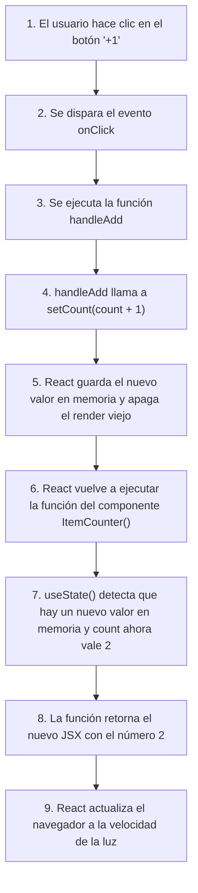

# 📘 Guía de Estudio: React - Reforzamiento de JS/TS

Esta guía contiene los apuntes de estudio, explicaciones detalladas y conceptos clave aprendidos durante el curso de React (Reforzamiento de JavaScript Moderno y TypeScript). El objetivo es documentar las bases esenciales de forma **sencilla, gráfica y accesible para cualquier tipo de audiencia**, conectando cada concepto técnico con su utilidad real al momento de construir aplicaciones en React.

---

## 📂 Índice de Clases

### 🛠️ Reforzamiento de TypeScript
- [Clase 01: Variables y Constantes (`let` & `const`) y Métodos de Strings](#clase-01-variables-y-constantes-let--const-y-m%C3%A9todos-de-strings)
- [Clase 02: Template Strings (Plantillas de Texto)](#clase-02-template-strings-plantillas-de-texto)
- [Clase 03: Objetos Literales, Interfaces y Copias (Superficial vs. Profunda)](#clase-03-objetos-literales-interfaces-y-copias-superficial-vs-profunda)
- [Clase 04: Arreglos (Arrays) e Inmutabilidad](#clase-04-arreglos-arrays-e-inmutabilidad)
- [Clase 05: Funciones, Retornos y Callback Functions](#clase-05-funciones-retornos-y-callback-functions)
- [Clase 06: Desestructuración de Objetos (Object Destructuring)](#clase-06-desestructuraci%C3%B3n-de-objetos-object-destructuring)
- [Clase 07: Desestructuración de Arreglos (Arrays) y Tuplas](#clase-07-desestructuraci%C3%B3n-de-arreglos-arrays-y-tuplas)
- [Clase 08: Importaciones, Exportaciones y Métodos de Arreglos con Enums](#clase-08-importaciones-exportaciones-y-m%C3%A9todos-de-arreglos-con-enums)
- [Clase 09: Promesas (Promises)](#clase-09-promesas-promises)
- [Clase 10: Fetch API](#clase-10-fetch-api)
- [Clase 11: Async / Await](#clase-11-async-await)

### ⚛️ Fundamentos de React
- [Clase 12: Primeros Pasos en React - ¿Cómo funciona React?](#clase-12-primeros-pasos-en-react---c%C3%B3mo-funciona-react)
- [Clase 13: Creando nuestro primer Componente y tipos de Exportaciones](#clase-13-creando-nuestro-primer-componente-y-tipos-de-exportaciones)
- [Clase 14: Variables en React (Dentro vs. Fuera del Componente)](#clase-14-variables-en-react-dentro-vs-fuera-del-componente)
- [Clase 15: Agregar Estilos en React y CSSProperties](#clase-15-agregar-estilos-en-react-y-cssproperties)
- [Clase 16: Creación del Componente ItemCounter y Envío de Props](#clase-16-creaci%C3%B3n-del-componente-itemcounter-y-env%C3%ADo-de-props)
- [Clase 17: Mostrar Elementos Listados y Uso de .map() en Arreglos](#clase-17-mostrar-elementos-listados-y-uso-de-map-en-arreglos)
- [Clase 18: Eventos en Botones y Elementos HTML](#clase-18-eventos-en-botones-y-elementos-html)
- [Clase 19: Hooks en React - useState](#clase-19-hooks-en-react---usestate)
- [Clase 20: Archivos CSS y CSS Modules en React](#clase-20-archivos-css-y-css-modules-en-react)

### 🧪 Pruebas Automáticas - Unit Testing
- [Clase 21: Mis Primeras Pruebas Unitarias con Vitest](#clase-21-mis-primeras-pruebas-unitarias-con-vitest)
- [Clase 22: Agrupar Pruebas Similares (describe)](#clase-22-agrupar-pruebas-similares-describe)
- [Clase 23: Pruebas sobre Componentes (React Testing Library)](#clase-23-pruebas-sobre-componentes-react-testing-library)

---

## Clase 01: Variables y Constantes (`let` & `const`) y Métodos de Strings
👉 [Ver código de la clase](./01-reforzamiento/src/bases/01-const-let.ts)

En el desarrollo de JavaScript moderno y TypeScript, la forma en que guardamos datos en memoria ha evolucionado para evitar errores lógicos comunes.

### 📦 La Analogía de las Cajas de Almacenamiento
Imagina que declarar una variable es como comprar una caja de cartón para guardar cosas y ponerle una etiqueta con su nombre:
*   **`const` (Constante)**: Es una caja que, una vez que le pones un objeto dentro y la cierras, queda **soldada**. No puedes cambiar el objeto completo que está en su interior por otro diferente (es decir, no puedes reasignar la variable).
*   **`let` (Variable)**: Es una caja con una tapa de velcro. Puedes abrirla en cualquier momento, sacar lo que tiene dentro y meter algo completamente nuevo (reescribir su valor).
*   **`var` (El antepasado obsoleto)**: Era una caja sin tapa que andaba flotando por toda la casa (*ámbito global/hoisting*). Cualquiera podía tropezar con ella y cambiar su contenido sin querer. **¡Ya no se usa!**

---

### 🔑 Conceptos Clave:

1.  **Ámbito de Bloque (Block Scope)**: `let` y `const` solo existen dentro de las llaves `{}` donde fueron creadas. Si creas una variable dentro de un ciclo o una función, fuera de ellos nadie sabrá que existe.
2.  **Inferencia de Tipos en TypeScript**: Si declaras una variable y le asignas un valor de inmediato, TypeScript es lo suficientemente inteligente como para saber qué tipo de dato es sin que se lo digas explícitamente.
3.  **Método de Strings `.includes()`**: Sirve para buscar si un texto contiene a otro. Es **sensible a mayúsculas y minúsculas** (*case-sensitive*), por lo que `"r"` no es igual a `"R"`.

---

### 💻 Código de la Clase Ilustrado:
```typescript
// 1. Declaración con let (su valor cambiará en el futuro)
let firstName: string = 'Christian'; // Definimos explícitamente que es un string

// 2. Declaración con const (su referencia no cambiará)
const lastName = "Beltran"; // TypeScript infiere automáticamente que es un string

let diceNumber = 5;
diceNumber = 3; // Permitido: let nos deja cambiar el valor de 5 a 3

// 3. Uso de métodos de strings (.includes es sensible a mayúsculas)
const containsLetterR = lastName.includes("r"); // Devuelve true porque 'Beltran' tiene una 'r' minúscula
const containsLetterR_Upper = lastName.includes("R"); // Devuelve false porque no contiene 'R' mayúscula
const containsLetterH = lastName.includes("h"); // Devuelve false porque no contiene 'h'

console.log({ containsLetterR, containsLetterR_Upper, containsLetterH, diceNumber, firstName });
```

> [!NOTE]
> **Buena práctica en React:** Usa siempre `const` por defecto para todas tus variables. Solo cambia a `let` si tienes la absoluta certeza de que vas a reescribir su valor (por ejemplo, en acumuladores de ciclos). Esto hace tu código más predecible y reduce errores.

---

## Clase 02: Template Strings (Plantillas de Texto)
👉 [Ver código de la clase](./01-reforzamiento/src/bases/02-template-string.ts)

Los template strings son una forma cómoda y legible de construir cadenas de texto combinando palabras estáticas con variables o código.

### ✉️ La Analogía de las Cartas Pre-impresas
Imagina que quieres enviar invitaciones de cumpleaños. En lugar de escribir toda la invitación a mano para cada invitado, compras tarjetas pre-diseñadas que dicen: `"Hola [Nombre], te invito a mi fiesta de [Edad] años"`. Los template strings hacen exactamente eso mediante marcadores de posición.

---

### 🔑 Conceptos Clave:
1.  **Comillas invertidas (Backticks - `` ` ``)**: En lugar de usar comillas simples (`'`) o dobles (`"`), los template strings se envuelven en comillas invertidas.
2.  **Interpolación (`${ expresión }`)**: Permite incrustar cualquier expresión de JavaScript o variable directamente dentro del texto.
3.  **Cadenas multilínea**: Permiten dar saltos de línea presionando "Enter" de forma natural en tu editor de código. No necesitas concatenar renglón por renglón ni usar caracteres especiales como `\n`.
4.  **Adiós al escape de comillas**: Si tu texto incluye comillas simples o dobles, no tienes que usar barras invertidas (`\`) para evitar que el código se rompa.

---

### 💻 Código de la Clase Ilustrado:
```typescript
let firstName: string = 'Christian';
const lastName = "O'Neal"; // Comillas dobles externas permiten usar comilla simple adentro sin escapar

// Complicación tradicional: Si usamos comillas simples externas y el texto lleva una comilla simple interna,
// debemos "escaparla" usando una barra invertida (\'), de lo contrario JS pensará que el texto terminó ahí.
const lastName2 = 'O\'Neal "es el apellido de alguien"'; 

// 🚀 La solución moderna: Template Strings con Backticks
const fullName = `${firstName} ${lastName}`; // Combinación limpia de variables

// Ejemplo multilínea nativo
const message = `
Hola ${firstName},
Espero que estés aprendiendo React.
Tu apellido es: ${lastName}.
`;

console.log(fullName); // Imprime: Christian O'Neal
console.log(message);
```

---

## Clase 03: Objetos Literales, Interfaces y Copias (Superficial vs. Profunda)
👉 [Ver código de la clase](./01-reforzamiento/src/bases/03-object-literal.ts)

Entender cómo se guardan los objetos en memoria y cómo estructurarlos es uno de los requisitos más importantes para dominar el estado (*state*) en React.

### 👥 La Analogía de las Referencias y las Copias
*   **Paso por Referencia (Compartir Enlace)**: Imagina que creas un documento en Google Docs y le compartes el enlace a un amigo. Si tu amigo entra y borra un párrafo, el documento original cambia para ambos. Eso pasa en JS: cuando asignas un objeto a otra variable (`const obj2 = obj1`), no estás duplicando los datos, solo estás compartiendo un "enlace" (dirección de memoria) al mismo objeto.
*   **Copia Superficial (Shallow Copy)**: Es como fotocopiar la primera página de un expediente. Si esa página tiene pegada una nota física que dice *"Ver cajón de archivos adjuntos"*, ambos expedientes (el original y la copia) siguen compartiendo y apuntando al mismo cajón físico. Si modificas algo dentro del cajón, se altera para ambos.
*   **Copia Profunda (Deep Copy)**: Es como duplicar con una impresora 3D mágica todo el archivero, incluyendo todos los cajones y documentos que estén en su interior. Son 100% independientes.

---

### 🔑 Conceptos Clave:

1.  **Interfaces (El Plano de Construcción)**: Son contratos en TypeScript que definen qué propiedades y de qué tipos debe ser un objeto. **Dato importante:** Las interfaces no generan código JavaScript final; al compilar el proyecto, desaparecen por completo.
2.  **Operador Spread (`...`)**: Sirve para crear copias superficiales. Desparrama las propiedades de un objeto dentro de uno nuevo.
3.  **`structuredClone()`**: Función nativa de los navegadores modernos y Node.js que realiza copias profundas sin necesidad de librerías externas.

---

### 💻 Código de la Clase Ilustrado:
```typescript
// 🏷️ 1. Definición de la estructura usando Interfaces
interface Person {
    firstName: String;
    lastName: String;
    age: number;
    address: address; // Propiedad que usa otra interfaz (anidación)
}

interface address {
    postalCode: string;
    city: string;
}

// 🦸 2. Creación de objetos que deben respetar la interfaz
const ironman: Person = {
    firstName: "Tony",
    lastName: "Stark",
    age: 45,
    address: {
        postalCode: 'ABC123',
        city: 'New York'
    }
}

// ⚠️ 3. Copia Superficial (Shallow Copy) usando Spread Operator
// spiderman duplica las propiedades de primer nivel (firstName, lastName, age),
// pero 'address' sigue apuntando a la misma dirección de memoria que ironman.address.
const spiderman = { ...ironman };
spiderman.firstName = "Peter";
spiderman.lastName = "Parker";
spiderman.age = 22;

// Si hiciéramos: spiderman.address.city = "Manhattan";
// ¡El objeto ironman también cambiaría su ciudad a "Manhattan"!

// 🛡️ 4. Copia Profunda (Deep Copy) usando structuredClone
// cloneSpiderman es completamente independiente en todos sus niveles.
const cloneSpiderman = structuredClone(ironman);
cloneSpiderman.address.city = "Girardot"; // Cambiar esto NO afecta en nada a ironman

console.log({ ironman, spiderman, cloneSpiderman });
```

> [!IMPORTANT]
> **¿Por qué esto es vital en React?**
> React utiliza la comparación de referencias de memoria para saber si un estado cambió y debe volver a generar la interfaz. Si haces `estado.nombre = "Pedro"`, la referencia del objeto sigue siendo la misma y React no se dará cuenta del cambio. Debes crear un objeto nuevo: `setEstado({ ...estado, nombre: "Pedro" })`.

---

## Clase 04: Arreglos (Arrays) e Inmutabilidad
👉 [Ver código de la clase](./01-reforzamiento/src/bases/04-arrays.ts)

Los arreglos son colecciones ordenadas de información. Al igual que los objetos, en React debemos tratarlos con mucho cuidado para evitar mutaciones directas.

### 📚 La Analogía del Estante de Libros
Imagina un estante con libros ordenados.
*   **Métodos Mutadores (`.push()`)**: Es como tomar un marcador y pintar directamente sobre las hojas del libro del estante. Has cambiado el estante original directamente.
*   **Métodos No Mutadores (`.map()`, Spread)**: Es como tomar una fotocopiadora, sacar una copia del estante completo en una hoja nueva y añadirle un libro al final de esa copia. Tu estante original sigue intacto.

---

### 🔑 Conceptos Clave:
1.  **Tipado de Arreglos**:
    *   **Simple**: `number[]` indica que el arreglo solo puede contener números.
    *   **Unión**: `(number | string)[]` indica que el arreglo puede mezclar números y textos.
2.  **Inmutabilidad**: En React, está estrictamente prohibido usar métodos que modifiquen el arreglo original directamente (como `.push()`, `.pop()`, `.shift()`, `.unshift()`). En su lugar, creamos una copia modificada.

---

### 💻 Código de la Clase Ilustrado:
```typescript
// 1. Arreglo con unión de tipos (números y textos mezclados)
let miArreglo: (number | string)[] = ['1', 2, 3, 4, 5, "6"];

// 2. Arreglo estrictamente de números
let myArray: number[] = [1, 2, 3, 4, 5, 6];

// ⚠️ Intento de modificación directa (Mutación) - Evitar en React
// myArray.push(7); // Modificaría myArray directamente en su dirección de memoria original

// 🚀 Forma correcta: Crear una copia y modificar la copia
// Usamos el operador spread para crear una copia superficial
let myArray2 = [ ...myArray ]; 
myArray2.push(7); // Añadimos el 7 a la copia, el original queda intacto

// También podemos hacer copia profunda si el arreglo contiene objetos complejos
let myArreglo3 = structuredClone(myArray);

console.log({ myArray, myArray2, myArreglo3 });
// myArray: [1, 2, 3, 4, 5, 6] (Intacto)
// myArray2: [1, 2, 3, 4, 5, 6, 7] (Modificado)
```

---

## Clase 05: Funciones, Retornos y Callback Functions
👉 [Ver código de la clase](./01-reforzamiento/src/bases/05-functions.ts)

Las funciones son las unidades básicas de lógica en JavaScript. En React moderno, casi todo (incluyendo los propios componentes) son funciones.

### 🍕 La Analogía de la Pizza y el Repartidor (Callbacks)
Imagina que llamas a una pizzería para pedir comida. Le dices al repartidor: *"Cuando llegues a mi casa, toca el timbre tres veces y deja la pizza sobre la mesa del jardín"*.
Tú no estás yendo a entregar la pizza; le estás entregando una **función con instrucciones** (un *callback*) al repartidor para que él la ejecute en el momento adecuado (cuando llegue a tu casa).

---

### 🔑 Conceptos Clave:

1.  **Funciones Tradicionales vs. Flecha (`Arrow Functions`)**:
    *   Las tradicionales (`function`) tienen su propio contexto para la palabra `this`.
    *   Las de flecha (`() => {}`) no tienen su propio `this`, son más cortas y son el estándar de oro en React.
2.  **Retorno Implícito**: Si tu función de flecha solo tiene una línea que devuelve algo, puedes borrar las llaves `{}` y la palabra `return`. **¡Ojo!** Si devuelves un objeto literal, debes envolverlo entre paréntesis `({ ... })` para que JavaScript no se confunda pensando que las llaves del objeto son el cuerpo de la función.
3.  **Callback**: Una función que se pasa como argumento a otra función para ser ejecutada después.
4.  **Pasar por Referencia Directa**: Si una función callback recibe exactamente los mismos argumentos que otra función externa va a ejecutar, puedes ahorrar código pasando solo el nombre de la función externa (ej: `forEach(console.log)`).

---

### 💻 Código de la Clase Ilustrado:
```typescript
interface User {
    uid: string;
    username: string;
}

// 1. Función tradicional tipada (Argumento string, Retorna string)
function greet(name: string): string {
    return `Hola soy ${name}`;
}

// 2. Arrow function tipada
const greet2 = (name: string): string => {
    return `Hola ${name}`;
};

// 3. Retorno implícito de un objeto literal (Nótese los paréntesis envolviendo a las llaves)
const getUser3 = () => ({
    uid: 'ABC-123',
    username: 'Elpapi_21',
});

// 4. Tipado de retorno preciso usando Interfaces
const getUser4 = (): User => {
    return {
        uid: 'ABC-1234',
        username: 'Elpapi_4',
    };
};

// 5. Ejemplos de Callbacks con forEach
const myNumbers: number[] = [1, 2, 3, 4, 5];

// Opción A: Callback clásico con función anónima tradicional
myNumbers.forEach(function (value) {
    console.log(value);
});

// Opción B: Callback moderno con Arrow Function
myNumbers.forEach(value => console.log(value));

// Opción C: Callback con múltiples argumentos disponibles (valor, índice, arreglo completo)
myNumbers.forEach((value, index, arr) => {
    console.log({ value, index, arr });
});

// Opción D: Simplificado al extremo (Shorthand)
// Como forEach le pasa un valor a su callback, y ese callback solo hace console.log(valor),
// podemos pasar directamente la referencia a console.log.
myNumbers.forEach(console.log); 
```

---

## Clase 06: Desestructuración de Objetos (Object Destructuring)
👉 [Ver código de la clase](./01-reforzamiento/src/bases/06-obj-destructuring.ts)

La desestructuración es un atajo sintáctico que nos permite extraer propiedades de un objeto y convertirlas en variables individuales de forma muy limpia.

### 🧳 La Analogía de Desempacar la Maleta
Imagina que regresas de viaje con una maleta llena de ropa. En lugar de llevar toda la maleta arrastrando cada vez que necesites cambiarte de zapatos, abres la maleta, sacas únicamente los **zapatos** y la **camisa**, y los dejas sobre la cama listos para usar. Eso es desestructurar: sacar solo lo que necesitas de un objeto gigante.

---

### 🔑 Conceptos Clave:
1.  **Extracción por Nombre**: En los objetos, extraes los valores escribiendo el nombre exacto de la propiedad dentro de llaves `{}`. El orden en que los escribas no importa.
2.  **Renombrado**: Si ya tienes una variable con el mismo nombre y quieres evitar conflictos, puedes renombrarla usando dos puntos: `{ propiedadOriginal: nuevoNombre }`.
3.  **Valores por Defecto**: Si una propiedad es opcional (`rank?: string`) y su valor viene vacío o `undefined`, puedes asignarle un valor de respaldo usando el signo igual (`=`).
4.  **Desestructuración en Parámetros**: Puedes desestructurar un objeto directamente en los paréntesis de una función, evitando tener que escribir `objeto.propiedad` dentro del cuerpo del código.

---

### 💻 Código de la Clase Ilustrado:
```typescript
interface Hero {
    name: string;
    age: number;
    key: string;
    rank?: string; // Propiedad opcional (puede no existir)
}

const person: Hero = {
    name: 'Tony',
    age: 45,
    key: 'Ironman',
};

// 1. Desestructuración básica y renombrado de variables
// Extraemos 'name' y lo guardamos en 'ironmanName', 'age' en 'ironmanAge', y 'key' se queda igual.
const { name: ironmanName, age: ironmanAge, key } = person;
console.log({ ironmanName, ironmanAge, key }); // Imprime: Tony, 45, Ironman

// 2. Desestructuración directamente en la firma de la función
// Si rank viene vacío, tomará el valor por defecto 'Recruit'
const useContext = ({ name, age, key, rank = 'Recruit' }: Hero) => {
    return {
        keyName: key,
        user: {
            name,
            age
        },
        userRank: rank
    };
};

// 3. Desestructuración paso a paso (Recomendado sobre desestructuraciones anidadas complejas)
const { keyName, user, userRank } = useContext(person);
const { name } = user; // Extraemos del sub-objeto 'user' de forma limpia
const { age } = user;

console.log({ keyName, name, age, userRank });
```

> [!TIP]
> **Relevancia en React:** Cuando creas un componente en React, este recibe un objeto llamado `props`. En lugar de escribir `props.title` o `props.imageUrl` por todo tu código, es estándar desestructurarlas en la firma del componente:
> `const Card = ({ title, imageUrl, active = false }) => { ... }`

---

## Clase 07: Desestructuración de Arreglos (Arrays) y Tuplas
👉 [Ver código de la clase](./01-reforzamiento/src/bases/07-arr-destructuring.ts)

A diferencia de los objetos, los arreglos no tienen nombres de propiedades; tienen posiciones indexadas (0, 1, 2...). La desestructuración de arreglos se basa puramente en este orden.

### 🥇 La Analogía del Podio Olímpico
Imagina una carrera donde compiten tres corredores. Al terminar, el que llegó en la posición 1 se lleva la medalla de Oro, el de la posición 2 la de Plata, y el de la 3 la de Bronce. No importa cómo se llamen los corredores; sus premios se asignan **estrictamente por el orden de llegada**.

---

### 🔑 Conceptos Clave:

1.  **Asignación Posicional**: Extraes los elementos usando corchetes `[ variable1, variable2 ]`. La primera variable recibirá el valor de la posición `0`, la segunda la posición `1`, y así sucesivamente.
2.  **Ignorar Posiciones**: Si solo te interesa el tercer elemento, puedes dejar espacios en blanco separados por comas: `[ , , tercero ]`.
3.  **Tuplas en TypeScript (`as const`)**:
    *   Si tienes un arreglo con datos mixtos (como un string y una función), TypeScript asumirá que el arreglo es de tipo `(string | Function)[]`.
    *   Al usar `as const` al final, le indicas a TypeScript que es una **Tupla estricta e inmutable** (de solo lectura). Así, TypeScript sabe exactamente que en la posición `0` siempre habrá un string y en la posición `1` siempre habrá una función específica.

---

### 💻 Código de la Clase Ilustrado:
```typescript
const characterNames = ['Goku', 'Vegueta', 'Trunks'];

// 1. Extraer elementos en base a su posición ordenada
const [ gold, silver, bronze ] = characterNames;
console.log(gold); // Imprime: Goku (Posición 0)

// 2. Extraer ignorando posiciones mediante comas
const [, p2] = characterNames; // Ignoramos la posición 0, extraemos la posición 1
console.log(p2); // Imprime: Vegueta

const [, , p3] = characterNames; // Ignoramos posiciones 0 y 1, extraemos la 2
console.log(p3); // Imprime: Trunks

// 3. Uso de 'as const' para definir una tupla estricta
const returnsArrayFn = () => {
    return ["ABC", 123] as const; // Indica que la posición 0 es string y la 1 es number invariablemente
};

const [letters, numbers] = returnsArrayFn();
console.log(numbers + 100); // Válido y seguro porque TS sabe que 'numbers' es de tipo number.

// 4. Implementación de una simulación del hook useState de React
const useState = (name: string) => {
    return [
        name,
        (newValue: string) => {
            console.log(`Cambiando estado a: ${newValue}`);
        }
    ] as const; // Crucial para que TypeScript no mezcle los tipos de retorno
};

const [ name, setName ] = useState('Goku');
console.log(name); // Goku
setName('Vegueta'); // Imprime: Cambiando estado a: Vegueta
```

---

## Clase 08: Importaciones, Exportaciones y Métodos de Arreglos con Enums
👉 Ver código de la clase: [08-imp-exp.ts (Lógica)](./01-reforzamiento/src/bases/08-imp-exp.ts) | [heroes.data.ts (Datos)](./01-reforzamiento/src/data/heroes.data.ts)

En esta clase organizamos la lógica separando los datos del código que los procesa, aprendimos a realizar búsquedas eficientes y vimos cómo estructurar listas de opciones fijas.

### 📂 La Analogía del Menú y la Cocina
*   **Módulos (Import/Export)**: Es como separar la despensa de la cocina. No guardas los ingredientes crudos encima de la estufa. Tienes un cuarto de despensa separado (`heroes.data.ts`) y cuando la cocina (`08-imp-exp.ts`) necesita tomates, va y los **importa**.
*   **Enums (El menú con opciones fijas)**: Imagina un restaurante donde solo puedes pedir Coca-Cola, Fanta o Agua. En lugar de dejar que el cliente escriba a mano *"Coke"* de formas inconsistentes, le das un menú de opciones fijas y pre-validadas.

---

### 🔑 Conceptos Clave:

1.  **Exportaciones Nombradas (`export`)**: Permiten exportar múltiples variables o funciones de un archivo. Al importarlas, debes llamarlas por su nombre exacto dentro de llaves: `import { heroes } from './path'`.
2.  **Exportación por Defecto (`export default`)**: Es el elemento principal que exporta un archivo. Solo puede haber uno por archivo y se importa sin llaves, pudiendo renombrarse libremente.
3.  **Enums en TypeScript**:
    *   A diferencia de las interfaces, los `enum` **sí generan código JavaScript real** cuando se compila la aplicación.
    *   **Detalle de Configuración:** En proyectos modernos con Vite y TypeScript, el compilador puede dar errores si intentas usar enums con configuraciones estrictas de borrado de sintaxis. Para permitir su uso, debes tener en tu archivo `tsconfig.json`:
        ```json
        "erasableSyntaxOnly": false
        ```
4.  **Enfoque Imperativo vs. Enfoque Declarativo**:
    *   **Imperativo (Cómo hacer las cosas)**: Le especificas al computador cada paso exacto y detallado para lograr el objetivo. Requiere que declares variables mutables y gestiones bucles manualmente.
    *   **Declarativo (Qué hacer)**: Le dices al computador qué resultado quieres obtener y dejas que los métodos de JavaScript hagan el trabajo sucio. No muta datos y es el enfoque estándar preferido en React.

---

### 💻 Código de la Clase Ilustrado:

#### 📜 Archivo de Datos (`src/data/heroes.data.ts`):
```typescript
export interface Hero {
    id: number;
    name: string;
    owner: Owner;
}

// 🏷️ Definición del Enum (Lista cerrada de creadores de cómics)
export enum Owner {
    DC = 'DC',
    Marvel = 'Marvel' // El valor original corregido
}

// Exportación nombrada de la constante 'heroes'
export const heroes: Hero[] = [
  { id: 1, name: 'Batman', owner: Owner.DC },
  { id: 2, name: 'Spiderman', owner: Owner.Marvel },
  { id: 3, name: 'Superman', owner: Owner.DC },
  { id: 4, name: 'Flash', owner: Owner.DC },
  { id: 5, name: 'Wolverine', owner: Owner.Marvel }
];

// Exportación por defecto del arreglo de héroes
export default heroes;
```

#### 🛠️ Archivo de Lógica (`src/bases/08-imp-exp.ts`):
```typescript
import heroes, { Owner, type Hero } from "../data/heroes.data";

// 🔍 Buscar un único héroe por ID usando .find() (Método Declarativo)
const getHeroById = (id: number): Hero | undefined => {
    return heroes.find( (hero) => hero.id === id );
};

// ==========================================
// ⚔️ TAREA: IMPERATIVO vs DECLARATIVO
// ==========================================

// 1. Solución Imperativa (Mi Solución):
// Creamos una lista mutable temporal y recorremos uno por uno agregando los elementos.
// Estamos diciéndole a JS el paso a paso ("cómo hacerlo").
export const getHeroByOwner = (owner: Owner) : Hero[] => {
    console.log(owner);
    let newHeroes: Hero[] = []; // Arreglo mutable intermedio

    heroes.forEach( (hero) => {
        if(hero.owner === owner) {
            newHeroes.push(hero); // Mutación manual del arreglo
        }
    });

    return newHeroes;
}

// 2. Solución Declarativa (Solución del Profesor):
// Usamos el método .filter(). Solo definimos qué queremos lograr (filtrar por el owner).
// Es mucho más corta, limpia y no muta ninguna variable intermedia. ¡La preferida en React!
export const getHeroesByOwner = (owner: Owner) => {
    return heroes.filter( (hero) => hero.owner === owner );
}

console.log( getHeroById(4) ); // Devuelve el objeto de Flash
console.log( getHeroesByOwner(Owner.DC) ); // Devuelve [Batman, Superman, Flash]
```

> [!NOTE]
> **Por qué preferir la Declaratividad en React:** Al evitar mutar variables internas y delegar la lógica a métodos funcionales como `.filter()`, `.map()`, o `.find()`, hacemos que nuestro código sea menos propenso a efectos secundarios y más fácil de depurar en arquitecturas de datos inmutables como la de React.

---

## Clase 09: Promesas (Promises)
👉 [Ver código de la clase](./01-reforzamiento/src/bases/09-promises.ts)

Las promesas son objetos que representan una operación asíncrona. Nos permiten ejecutar código que toma tiempo en completarse (como traer información del servidor) sin congelar la aplicación en el navegador.

### 🤝 La Analogía de la Promesa Financiera
Imagina que un amigo te pide $100 pesos prestados y te dice: *"Te prometo que te los devolveré en 2 días"*.
1.  **Estado Pendiente (Pending)**: Desde que le prestas el dinero hasta que pasan los 2 días, la promesa está en el aire. No sabes si te pagará o no.
2.  **Estado Resuelto (Fulfilled/Resolved - `.then()`)**: Dos días después, tu amigo llega con el dinero. La promesa se cumplió con éxito. Tú recibes el dinero y haces cosas con él (ej: comprar un café).
3.  **Estado Rechazado (Rejected - `.catch()`)**: Tu amigo regresa sin dinero y te dice: *"Lo siento, perdí mi cartera"*. La promesa falló. Debes manejar este problema (ej: enojarte o perdonar la deuda).
4.  **Estado Finalizado (Finally - `.finally()`)**: Pase lo que pase (si te devolvió el dinero o no), tú debes seguir con tu día a día (ej: ir a trabajar).

---

### 🔑 Conceptos Clave:

1.  **Asincronía**: JavaScript ejecuta el código línea por línea. Sin embargo, cuando se topa con una operación asíncrona (como `setTimeout` o una llamada a base de datos), la manda a una "lista de espera" (Event Loop) para que se procese en segundo plano y no bloquee el resto del programa.
2.  **Genéricos en Promesas (`Promise<Tipo>`)**: En TypeScript, definimos el tipo de dato que va a retornar la promesa cuando sea exitosa usando la sintaxis angular `<Tipo>`. Esto permite que el argumento del método `.then()` esté correctamente tipado.
3.  **Estructura de Consumo**:
    *   **`.then(callback)`**: Se ejecuta cuando la promesa se resuelve exitosamente.
    *   **`.catch(callback)`**: Se ejecuta cuando la promesa falla o es rechazada.
    *   **`.finally(callback)`**: Se ejecuta siempre al final, independientemente del éxito o fracaso de la promesa.

---

### 💻 Código de la Clase Ilustrado:
```typescript
// 1. Creación de la promesa
// Indicamos con <number> que cuando la promesa se resuelva, devolverá un número.
const myPromise = new Promise<number>((resolve, reject) => {
    setTimeout(() => {
        // resolve(100); // Si la promesa es exitosa, devolvemos 100
        
        // Simulamos un rechazo de la promesa
        reject('Mi amigo se perdió con el dinero'); 
    }, 2000); // Se ejecutará después de 2 segundos (2000 milisegundos)
});

// 2. Consumo de la promesa
myPromise
    .then((miMoney) => {
        // miMoney es de tipo number gracias al tipado genérico <number>
        console.log(`Tengo mi dinero: $${miMoney}`);
    })
    .catch((reason) => {
        // reason contiene el texto enviado en el reject()
        console.warn(reason); // Imprime la advertencia: 'Mi amigo se perdió con el dinero'
    })
    .finally(() => {
        // Se ejecuta siempre, ideal para limpiar cargadores o pantallas de carga
        console.log('Sigo con mi vida :)');
    });
```

> [!IMPORTANT]
> **Relevancia en React:** Cuando realizamos peticiones HTTP (por ejemplo, fetching de APIs usando `fetch()` o `axios`), estamos interactuando directamente con promesas. Es común usar el bloque `.finally()` para apagar estados de carga del tipo `setIsLoading(false)`, de modo que la animación de carga se detenga sin importar si la petición HTTP fue exitosa o falló.

---

## Clase 10: Fetch API
👉 [Ver código de la clase](./01-reforzamiento/src/bases/10-fetch-api.ts)

La **Fetch API** es una interfaz nativa de los navegadores modernos que nos permite realizar peticiones HTTP (traer información de bases de datos, APIs de terceros, etc.) de forma asíncrona usando promesas.

---

### 📦 La Analogía del Cartero y el Paquete Sellado
Para entender por qué `fetch` funciona como lo hace, imagina que quieres comprar un libro en una tienda online:

1. **La Petición (`fetch`)**: Envías una orden de compra por internet. El cartero (`fetch`) viaja a la bodega de la tienda (el servidor o API).
2. **El Primer `.then()` (El Paquete Sellado - `Response`)**: El cartero vuelve sumamente rápido y te entrega una **caja de cartón sellada** (el objeto `Response`). Esta caja tiene una etiqueta de envío por fuera que te dice si la entrega fue exitosa o no (el código de estado HTTP, por ejemplo, `200 OK` o `404 Not Found`). Sin embargo, **aún no puedes ver ni leer el libro** porque la caja sigue cerrada.
3. **El Segundo `.then()` (Desempacar el Contenido - `response.json()`)**: Para poder leer el libro, necesitas abrir la caja y sacar el contenido. Esta acción de "desempacar" y traducir el contenido de texto plano JSON a un objeto que JavaScript entienda (`response.json()`) toma un pequeño momento. Por lo tanto, ¡es otra promesa! Una vez abierta la caja, finalmente tienes los datos reales en tus manos (`data`) para usarlos en tu programa.

---

### 🔑 Conceptos Clave:

1. **¿Por qué son necesarios dos `.then()`?**:
   - El primer `.then()` recibe la cabecera de la respuesta HTTP tan pronto como el servidor responde. En este punto, el cuerpo de los datos (que puede ser muy pesado, como imágenes o listas largas) todavía podría estar transmitiéndose.
   - Para esperar a que se complete la descarga y parsear el contenido a formato JSON, llamamos a `response.json()`, lo cual genera una **segunda promesa**.
   
2. **Encadenamiento de Promesas (Promise Chaining)**:
   - Evita el **Promise Hell** (anidar promesas una dentro de otra, lo cual hace el código difícil de leer).
   - En JavaScript, si un `.then()` retorna una promesa (como `response.json()`), puedes enganchar el siguiente `.then()` inmediatamente abajo, al mismo nivel. El resultado resuelto de la promesa retornada será el argumento del siguiente `.then()`.

3. **Tipado de la Respuesta (`TypeScript`)**:
   - Cuando trabajamos con TypeScript, es fundamental tipar los datos que recibimos de la API para tener autocompletado y evitar errores de escritura (por ejemplo, escribir mal la propiedad de un objeto).
   - En el código de la clase, esto lo logramos desestructurando el resultado y asignando el tipo `{ data }: GiphyRandomResponse`.

---

### 💻 Código de la Clase Ilustrado:

#### ❌ La Forma Anidada (Evitar - Produce código espagueti)
```typescript
const API_KEY = "b2niNO6mLP7izOfU6vrYV3XDOxmYBUAo";

// ⚠️ No hagas esto. Anidar un .then dentro de otro recrea el Callback Hell.
fetch(`https://api.giphy.com/v1/gifs/random?api_key=${API_KEY}`)
    .then((response) => {
        response.json().then((data) => {
            console.log(data); // El código se empieza a mover hacia la derecha
        });
    });
```

#### 🚀 La Forma Correcta: Encadenamiento de Promesas (Promise Chaining)
```typescript
import type { GiphyRandomResponse } from "../data/giphy.response";

const API_KEY = "b2niNO6mLP7izOfU6vrYV3XDOxmYBUAo";

// 1. Iniciamos la petición HTTP (Retorna una promesa con el Response)
const myRequest = fetch(`https://api.giphy.com/v1/gifs/random?api_key=${API_KEY}&tag=&rating=g`);

// Función auxiliar para insertar una imagen en la pantalla
const createImageUrl = (imageUrl: string) => {
    const imageElement = document.createElement('img');
    imageElement.src = imageUrl;
    document.body.append(imageElement);
};

// Consumo limpio y encadenado
myRequest
    .then((response) => {
        // Retornamos la promesa que convierte la respuesta a JSON
        return response.json(); 
    })
    .then(({ data }: GiphyRandomResponse) => {
        // Recibimos los datos convertidos y tipados. Extraemos la URL del GIF
        const imageUrl = data.images.original.url;
        
        // Creamos y agregamos la imagen al HTML
        createImageUrl(imageUrl);
    })
    .catch((error) => {
        // Atrapa cualquier error ocurrido en la petición o en la conversión a JSON
        console.error('Ocurrió un error:', error);
    });
```

---

### ⚛️ Relevancia en React

En React, realizar peticiones HTTP directamente en el cuerpo de un componente es una **mala práctica** porque se ejecutaría en cada ciclo de renderizado, provocando peticiones infinitas y bloqueos de rendimiento.

En su lugar, Fetch API se utiliza combinada con:
1. **`useEffect`**: Para realizar la petición únicamente cuando el componente se monta por primera vez en la pantalla.
2. **`useState`**: Para almacenar los datos recibidos (por ejemplo, la URL del GIF) en el estado del componente. Cuando el estado cambia con la respuesta de la API, React redibuja la pantalla con la nueva información de manera automática.

**Ejemplo conceptual en React:**
```jsx
import { useState, useEffect } from 'react';

const GifApp = () => {
    const [gifUrl, setGifUrl] = useState('');
    const [isLoading, setIsLoading] = useState(true);

    useEffect(() => {
        fetch(`https://api.giphy.com/v1/gifs/random?api_key=TU_API_KEY`)
            .then(res => res.json())
            .then(({ data }) => {
                setGifUrl(data.images.original.url);
            })
            .catch(err => console.error(err))
            .finally(() => setIsLoading(false)); // Apaga el cargador sin importar si tuvo éxito o falló
    }, []); // Arreglo de dependencias vacío = solo se ejecuta al montar

    if (isLoading) return <p>Cargando GIF...</p>;

    return (
        <div>
            
        </div>
    );
};
```

---

## Clase 11: Async / Await
👉 [Ver código de la clase](./01-reforzamiento/src/bases/11-async-await.ts)

La combinación de las palabras clave `async` y `await` es una mejora de sintaxis (conocida como *syntactic sugar*) introducida en JavaScript para facilitar el trabajo con **promesas**, permitiéndonos escribir código asíncrono que se lee casi exactamente como si fuera síncrono.

---

### 📦 La Analogía del Cajero de Supermercado
Para entender la diferencia entre promesas clásicas y `async/await`, imagina que vas a hacer tus compras:

*   **Con Promesas Clásicas (`.then()`)**: Llegas a la caja de cobro, colocas tus productos y el cajero te dice: *"Esto va a tardar un poco. Ve a la sala de espera y te llamo cuando esté listo (el callback del `.then`)"*. Tú te vas a sentar y tienes que estar pendiente de cuándo te llaman. Esto puede volverse complejo cuando tienes que encadenar múltiples trámites seguidos (el cartero, la caja, el empaque...).
*   **Con `async / await`**:
    *   **`async` (El súper poder de esperar)**: Al declarar una función con `async`, colocas un cartel en la puerta que dice: *"Dentro de esta función ocurren cosas asíncronas y tengo el poder de pausar la ejecución en ciertos puntos"*.
    *   **`await` (La espera en la caja)**: Colocar la palabra `await` antes de una promesa es como si te quedaras parado frente al cajero esperando a que termine su proceso de cobro. **La ejecución del código dentro de tu función se detiene** de forma no bloqueante en esa línea exacta hasta que el cajero te entrega el recibo (la promesa se resuelve). En cuanto la entrega termina, continúas con la siguiente línea de código inmediatamente abajo.
    *   **No bloquea el navegador**: Aunque tu función esté "esperando" en esa línea de código, el navegador no se congela. JavaScript sigue atendiendo a otros clientes y procesos del sitio web en segundo plano de manera normal.

---

### 🔑 Conceptos Clave para Juniors y Principiantes:

1.  **Regla de Oro: Pareja Inseparable 🤝**:
    *   Solo puedes usar el operador `await` dentro de funciones que tengan la palabra clave `async` al inicio de su declaración. Si intentas poner `await` en una función normal, TypeScript detectará un error y tu código no compilará.
2.  **Las funciones `async` siempre devuelven una Promesa 🎁**:
    *   Toda función con `async` está obligada a retornar una promesa. Incluso si en tu código escribes `return "Hola Mundo";`, JavaScript lo envolverá automáticamente dentro de una promesa que se resuelve con ese texto (`Promise<string>`).
    *   Por esta razón, al llamar a una función `async` desde fuera, debes usar `.then()` o usar `await` dentro de otra función asíncrona.
3.  **Manejo de Errores con `try / catch` 🛡️**:
    *   En las promesas tradicionales usábamos el método `.catch()`. Con `async/await` no hay un método `.catch()` directo en el flujo lineal.
    *   Para atrapar errores (por ejemplo, si te quedas sin conexión a internet), debes envolver tu código en un bloque `try {} catch (error) {}`. Si algo falla dentro del `try`, el programa saltará de inmediato al bloque `catch` para que puedas controlar el error sin que la aplicación se caiga.

---

### 💻 Código de la Clase Ilustrado:

Vamos a ver cómo simplificamos la petición de Giphy que creamos en la clase anterior:

#### 📜 Código Paso a Paso:
```typescript
import type { GiphyRandomResponse } from "../data/giphy.response";

const API_KEY = "b2niNO6mLP7izOfU6vrYV3XDOxmYBUAo";

// Función auxiliar para renderizar la imagen en el DOM
const createImageUrl = (imageUrl: string) => {
    const imageElement = document.createElement('img');
    imageElement.src = imageUrl;
    document.body.append(imageElement);
};

// 1. Declaramos la función asíncrona indicando que retornará un Promise<string>
const getRandomGifUrl = async (): Promise<string> => {
    
    // try/catch para controlar cualquier fallo de red o parseo de datos
    try {
        // 2. Hacemos el fetch y ESPERAMOS a que el servidor responda
        const response = await fetch(`https://api.giphy.com/v1/gifs/random?api_key=${API_KEY}&tag=&rating=g`);
        
        // 3. ESPERAMOS a que finalice la descarga del cuerpo JSON y lo desestructuramos
        const { data }: GiphyRandomResponse = await response.json();

        // 4. Retornamos la URL. Aunque aquí retornamos un string plano, 
        // al estar dentro de una función 'async', automáticamente devuelve un Promise<string>
        return data.images.original.url;
        
    } catch (error) {
        console.error('Error al obtener el GIF:', error);
        throw new Error('No se pudo obtener el GIF');
    }
};

// 5. Consumo de la función: como devuelve una promesa, la resolvemos usando .then()
getRandomGifUrl()
    .then(createImageUrl)
    .catch(error => console.error('Error en el flujo principal:', error));
```

---

### ⚛️ Relevancia en React

En el desarrollo diario con React, `async/await` es el estándar preferido para hacer llamadas a APIs porque hace que el código de carga sea mucho más limpio que usar encadenamiento de `.then()`.

Aquí puedes ver cómo reescribiríamos el componente de la clase anterior de forma mucho más legible:

```jsx
import { useState, useEffect } from 'react';

const GifApp = () => {
    const [gifUrl, setGifUrl] = useState('');
    const [isLoading, setIsLoading] = useState(true);
    const [hasError, setHasError] = useState(false);

    useEffect(() => {
        // En useEffect no se puede poner 'async' directamente en la función de callback.
        // Se debe crear una función asíncrona interna y llamarla de inmediato:
        const fetchGif = async () => {
            try {
                const response = await fetch(`https://api.giphy.com/v1/gifs/random?api_key=TU_API_KEY`);
                const { data } = await response.json();
                setGifUrl(data.images.original.url);
            } catch (error) {
                console.error(error);
                setHasError(true);
            } finally {
                setIsLoading(false); // Se ejecuta tanto si sale bien como si hay error
            }
        };

        fetchGif();
    }, []); // Solo se ejecuta al montar el componente

    if (isLoading) return <p>Cargando GIF...</p>;
    if (hasError) return <p>Hubo un error cargando el GIF.</p>;

    return (
        <div>
            
        </div>
    );
};
```

> [!TIP]
> **Consejo de React:** Nota que no puedes declarar el callback del hook `useEffect` como asíncrono directamente (por ejemplo: `useEffect(async () => { ... })`). Esto se debe a que React espera que `useEffect` retorne o bien nada (`undefined`) o bien una función de limpieza (*cleanup function*). Como las funciones `async` siempre devuelven una promesa, React daría un error. Por eso la práctica recomendada es crear una función asíncrona dentro del hook y mandarla llamar, como hicimos en `const fetchGif = async () => { ... }`.

---

## Clase 12: Primeros Pasos en React - ¿Cómo funciona React?
👉 [Ver index.html](./02-first-steps/index.html) | [Ver main.tsx](./02-first-steps/src/main.tsx) | [Ver App.tsx](./02-first-steps/src/App.tsx)

React es una librería de JavaScript para construir interfaces de usuario interactivas basadas en componentes. En lugar de manipular el DOM del navegador directamente de forma lenta, React utiliza un enfoque declarativo y un **Virtual DOM** para realizar actualizaciones ultra rápidas de la interfaz.

### 🏛️ La Analogía del Director de Teatro y la Maqueta (Virtual DOM)
Imagina que el DOM real de tu navegador es un **gran escenario de teatro físico** con escenografía pesada. Cambiar algo directamente en el escenario físico (como mover un piano de un lado a otro o pintar una pared de rojo) requiere mucho esfuerzo, tiempo y es propenso a cometer accidentes o dañar otras partes (manipulación directa del DOM).

*   **React** es como un **diseñador de producción meticuloso** que trabaja en una **maqueta a escala (el Virtual DOM)** en su oficina.
*   Cuando quieres hacer un cambio, el diseñador no corre al escenario real. Primero realiza el cambio en su maqueta de plástico (estado/props actualizados).
*   Luego, compara la maqueta vieja con la maqueta nueva (*reconciliation* / algoritmo de *diffing*) para ver **exactamente qué cambió** (por ejemplo: *"Ah, solo hay que mover esta silla 2 cm a la derecha y no tocar nada más"*).
*   Finalmente, le da instrucciones precisas al equipo técnico (**React DOM**) para que hagan **únicamente** ese cambio mínimo en el escenario real del teatro.

---

### 🔑 Conceptos Clave de la Estructura Inicial:

1.  **El Punto de Montaje (`index.html`)**: El navegador carga un archivo HTML casi vacío con un contenedor especial: `<div id="root"></div>`. Este es el "lienzo" o "escenario" en blanco donde React va a dibujar toda la aplicación.
2.  **El Puente de Conexión (`main.tsx`)**: Es el punto de entrada de JavaScript. Utiliza `createRoot` de `react-dom/client` para tomar el elemento `#root` del HTML y decirle a React: *"Toma el control de este espacio"*.
    -   `StrictMode`: Es una herramienta que ayuda a identificar problemas potenciales en el código durante el desarrollo (ejecutando renderizados dobles, detectando efectos secundarios inesperados, etc.).
3.  **Los Componentes (`App.tsx`)**: Son las piezas de construcción de nuestra interfaz (como bloques de Lego). Un componente de React es simplemente una función de JavaScript/TypeScript que retorna JSX y su nombre **siempre debe empezar con mayúscula**.
4.  **JSX (JavaScript XML)**: Es una extensión de sintaxis que nos permite escribir código estructurado como HTML directamente dentro de nuestro código de JavaScript. Tras bambalinas, herramientas como Vite compilan este JSX a llamadas de funciones de React estándar (`React.createElement`).
5.  **Fragmentos (`<> ... </>`)**: En React, un componente debe retornar un único elemento padre. Si no queremos agregar etiquetas `<div>` innecesarias al DOM que arruinen nuestro diseño o estructura CSS, usamos fragmentos vacíos `<> ... </>`.

---

### 💻 Código de la Clase Ilustrado:

Para entender el flujo, veamos cómo se conectan las tres piezas principales de tu código actual:

#### 1. El Escenario ([index.html](./02-first-steps/index.html))
```html
<!-- ... -->
<body>
  <!-- Aquí es donde React renderizará toda nuestra interfaz -->
  <div id="root"></div>
  
  <!-- Cargamos el script principal de nuestra aplicación -->
  <script type="module" src="/src/main.tsx"></script>
</body>
<!-- ... -->
```

#### 2. El Conector ([src/main.tsx](./02-first-steps/src/main.tsx))
```typescript
import { StrictMode } from 'react';
import { createRoot } from 'react-dom/client';
import './index.css';
import App from './App.tsx';

// 1. Buscamos el div con id 'root' en el HTML.
// El signo '!' al final le dice a TypeScript que estamos seguros de que este elemento existe.
const rootElement = document.getElementById('root')!;

// 2. Creamos la raíz de React en ese elemento y renderizamos nuestro componente <App />
createRoot(rootElement).render(
  <StrictMode>
    <App />
  </StrictMode>
);
```

#### 3. El Bloque de Construcción ([src/App.tsx](./02-first-steps/src/App.tsx))
```typescript
import './App.css';

// Un componente funcional de React. ¡Debe comenzar con mayúscula!
function App() {
  return (
    // Fragmento para agrupar múltiples elementos sin añadir un contenedor innecesario en el HTML final
    <>
      <h1>Hola Mundo</h1>
      <p>Hola soy Christian soy un parrafo</p>
    </>
  );
}

export default App;
```

---

> [!NOTE]
> **Buena práctica en React:** Siempre mantén tus componentes enfocados en hacer una sola cosa (Principio de Responsabilidad Única). Si el contenido dentro de tu `App.tsx` empieza a crecer mucho, es momento de dividirlo en componentes más pequeños dentro de una carpeta llamada `components/`.

---

## Clase 13: Creando nuestro primer Componente y tipos de Exportaciones
👉 [Ver FirstStepsApp.tsx](./02-first-steps/src/FirstStepsApp.tsx) | [Ver MyAwesomeApp.tsx](./02-first-steps/src/MyAwesomeApp.tsx) | [Ver main.tsx](./02-first-steps/src/main.tsx)

En React, los componentes son las piezas fundamentales de la interfaz. Piensa en ellos como piezas de Lego que creas una vez y puedes reutilizar en cualquier parte de tu aplicación.

### 🧱 La Analogía del Molde de Galletas (Componente) y la Galleta (Elemento)
*   **El Componente (El Molde):** Es la definición de la estructura (por ejemplo: un molde con forma de estrella que dice que cada galleta tendrá puntas, un color y chispas). En código, este molde es la función de JavaScript/TypeScript (como `MyAwesomeApp` o `FirstStepsApp`).
*   **El Elemento (La Galleta):** Es lo que obtienes cuando usas el molde y lo metes a hornear. En código, se representa cuando pones el componente dentro de las etiquetas JSX: `<MyAwesomeApp />`. Puedes crear tantas galletas (instancias) como quieras a partir de un solo molde.

---

### 🔑 Conceptos Clave:

1.  **Sintaxis del Componente:**
    *   **Función Tradicional:**
        ```typescript
        export function FirstStepsApp() {
            return ( ... );
        }
        ```
    *   **Función Flecha (Arrow Function):** Muy popular en React moderno porque es corta, limpia y se acopla excelente con TypeScript.
        ```typescript
        export const MyAwesomeApp = () => {
            return ( ... );
        }
        ```
2.  **Exportación Nombrada (Named Export) vs. Exportación por Defecto (Default Export):**
    *   **Exportación por Defecto (`export default App`):**
        *   *Cómo se exporta:* `export default App;` al final del archivo.
        *   *Cómo se importa:* `import App from './App';` (puedes cambiarle el nombre al importarlo, ej: `import MiAppPrincipal from './App'`).
        *   *Detalle:* Solo puede haber una exportación por defecto por archivo.
    *   **Exportación Nombrada (`export const MyAwesomeApp`):**
        *   *Cómo se exporta:* Anteponiendo la palabra `export` al declarar la función/constante.
        *   *Cómo se importa:* Usando llaves `{}` y obligatoriamente con el nombre exacto: `import { MyAwesomeApp } from './MyAwesomeApp'`.
        *   *Ventaja:* Evita errores de nombres (TypeScript te avisará de inmediato si el nombre no coincide) y facilita la auto-importación en el editor. **Es la práctica más recomendada en proyectos modernos.**

---

### 💻 Código de la Clase Ilustrado:

Así es como estructuraste tus componentes y los consumiste en el punto de entrada:

#### 1. Componente con Función Tradicional ([src/FirstStepsApp.tsx](./02-first-steps/src/FirstStepsApp.tsx))
```typescript
// Exportación Nombrada (Named Export)
export function FirstStepsApp() {
    return (
        <>
            <h1>Hola Desde Main</h1>
            <p>Hola esto es un parrafo</p>
            <button>Click me</button>
            <div>
                <h2>Hola dentro de un div</h2>
            </div>
        </>
    );
}
```

#### 2. Componente con Función Flecha ([src/MyAwesomeApp.tsx](./02-first-steps/src/MyAwesomeApp.tsx))
```typescript
// Exportación Nombrada usando Arrow Function (Muy moderno y limpio)
export const MyAwesomeApp = () => {
    return (
        <>
            <h1>Christian Camilo</h1>
            <h3>Beltrán</h3>
        </>
    );
};
```

#### 3. Consumo e Importación en el Punto de Entrada ([src/main.tsx](./02-first-steps/src/main.tsx))
```typescript
import { StrictMode } from 'react';
import { createRoot } from 'react-dom/client';

// Al usar exportaciones nombradas, es OBLIGATORIO usar las llaves '{}'
import { FirstStepsApp } from './FirstStepsApp';
import { MyAwesomeApp } from './MyAwesomeApp';

createRoot(document.getElementById('root')!).render(
  <StrictMode>
    {/* Comentado para no renderizarlo actualmente */}
    {/* <FirstStepsApp/> */}

    {/* Renderizamos nuestro nuevo componente MyAwesomeApp */}
    <MyAwesomeApp/>
  </StrictMode>,
);
```

---

> [!TIP]
> **Consejo del Editor (VS Code / Curso):** Cuando usas exportaciones nombradas, tu editor de código te sugerirá automáticamente la importación correcta a medida que escribes la etiqueta del componente (por ejemplo, al escribir `<MyAw...` autocompletará la importación con las llaves `{ MyAwesomeApp }`). Esto ahorra mucho tiempo y previene errores de tipeo.

---

## Clase 14: Variables en React (Dentro vs. Fuera del Componente)
👉 [Ver código de la clase](./02-first-steps/src/MyAwesomeApp.tsx)

En React, podemos usar expresiones de JavaScript/TypeScript directamente en nuestro JSX envolviéndolas entre llaves `{}`. Sin embargo, un aspecto crucial para el rendimiento y la organización del código es decidir dónde declarar nuestras variables estáticas (aquellas que no cambian ni dependen del estado o de las props del componente).

### 🏢 La Analogía de la Planta de Ensamblaje (Componente) y el Almacén Externo
Imagina que un componente es como una **planta de ensamblaje (fábrica)** que fabrica juguetes y se activa cada vez que hay que pintar o rediseñar algo (el renderizado).

*   **Variables dentro del Componente (Fabricar las herramientas en cada turno):**
    Si colocas tus variables dentro del componente, es como si al inicio de cada jornada de ensamblaje la fábrica tuviera que comprar, fabricar y desechar los destornilladores, martillos y moldes (`const firstName`, `const address`, etc.) para luego tirarlos a la basura al final del turno. En el siguiente renderizado, tiene que volver a fabricarlos de nuevo. ¡Un desperdicio enorme de recursos (memoria)!
*   **Variables fuera del Componente (El Almacén Central Permanente):**
    Si declaras las variables fuera del componente (a nivel de archivo/módulo), es como tener un almacén central al lado de la fábrica. Las herramientas se fabrican **una sola vez** cuando se abre el almacén (se carga el módulo) y quedan ahí disponibles para que la fábrica las use en cualquier momento, sin importar cuántos turnos o ensamblajes haga la fábrica.

---

### 🔑 Conceptos Clave:

1. **El Ciclo de Renderizado:**
   Cada vez que el estado (`state`) o las propiedades (`props`) de un componente cambian, la función del componente se ejecuta desde el principio hasta el final para calcular el nuevo JSX.
2. **Reasignación y Limpieza de Memoria (Garbage Collection):**
   Si declaras variables u objetos dentro de la función:
   - Se vuelven a crear en memoria (nueva dirección de referencia) en **cada renderizado**.
   - El recolector de basura de JavaScript (Garbage Collector) tiene que trabajar más limpiando las variables viejas que ya no se usan.
   - Para datos estáticos como strings, arreglos estáticos u objetos de configuración, declararlos fuera ahorra este procesamiento.
3. **Expresiones en JSX:**
   Dentro de las llaves `{}` en JSX puedes colocar cualquier expresión válida de JavaScript (operaciones matemáticas como `{2 + 2}`, operadores ternarios `{isActive ? 'Activo' : 'Inactivo'}`, llamadas a métodos como `{favoriteGames.join(', ')}`), pero **no puedes renderizar objetos de forma directa** (por ejemplo, `{address}`). Si intentas renderizar un objeto directamente, React lanzará un error. Para depurarlo o mostrarlo temporalmente, puedes usar `{JSON.stringify(address)}`.

---

### 💻 Código de la Clase Ilustrado:

#### 🚀 Práctica Recomendada: Variables fuera del componente ([src/MyAwesomeApp.tsx](./02-first-steps/src/MyAwesomeApp.tsx))
```typescript
// 1. Estas variables se crean una sola vez en memoria cuando se carga el módulo.
// No se vuelven a crear en cada render.
const firstName = "Christian Camilo";
const lastName = "Beltrán";

const favoriteGames = [
  "GTA V",
  "FC 26",
  "Fortnite",
  "Forza Horizon 6",
  "Red Dead Redemption",
];
const isActive = true;

const address = {
  zipCode: "ABC-123",
  country: "Colombia",
};

export const MyAwesomeApp = () => {
  // 2. El componente puede hacer render 100 veces, pero las variables de arriba
  // no se volverán a procesar.
  return (
    <>
      <h1> {firstName} </h1>
      <h3> {lastName} </h3>
      {/* Expresiones válidas */}
      <p> {favoriteGames.join(", ")} </p>
      <p> {2 + 2} </p>

      {/* Operadores condicionales */}
      <h2>{isActive ? "Activo" : "No Activo"}</h2>

      {/* Serialización de objetos (no se pueden renderizar directamente como {address}) */}
      <p>{JSON.stringify(address)}</p>
    </>
  );
};
```

> [!IMPORTANT]
> **Regla General:**
> - **Fuera del componente:** Declara aquí toda constante, objeto, arreglo o función que **no dependa de las props o del estado** del componente y que no necesite cambiar su valor durante la vida de la aplicación.
> - **Dentro del componente:** Declara aquí las variables que dependan de propiedades del componente (`props`), de estados (`useState`), o funciones de manejo de eventos (como un `onClick`) que necesitan interactuar con el estado del componente.

---

## Clase 15: Agregar Estilos en React y CSSProperties
👉 [Ver código de la clase](./02-first-steps/src/MyAwesomeApp.tsx)

En React, la forma de aplicar estilos en línea (inline styles) cambia respecto al HTML tradicional. En lugar de pasar una cadena de texto, pasamos un objeto de JavaScript. Además, al usar TypeScript, podemos tipar estos estilos para tener una experiencia de desarrollo mucho más segura y robusta.

### 🎨 La Analogía de la Ficha Técnica de Diseño
Imagina que vas con un sastre a mandar a hacer un traje.
*   **En HTML clásico (Instrucciones en papel arrugado):** Le entregas una nota a mano que dice: `"color: rojo; esquinas: redondeadas 10px; espaciado: 10px;"`. Si cometes un error ortográfico en la nota (ej: escribir `"colro: rojo"`), el sastre no entiende tu letra, ignora esa instrucción y el traje sale sin color. **El navegador hace lo mismo en HTML tradicional si escribes mal una propiedad CSS: simplemente la ignora de forma silenciosa sin avisarte.**
*   **En React (Ficha técnica digital):** Le entregas un formulario digital estructurado (un objeto JS) con casillas predefinidas. En lugar de usar guiones, las propiedades se escriben usando formato camelCase (`backgroundColor` en lugar de `background-color`, `borderRadius` en lugar de `border-radius`).
*   **Con `CSSProperties` (El Inspector de Calidad de la Ficha Técnica):** Es un software de validación que revisa tu formulario digital *antes* de enviárselo al sastre. Si cometes un error (como escribir `backgorundColor` o poner un valor inválido como `display: "bloque"`), el inspector hace sonar una alarma (error de TypeScript en rojo) y no te deja avanzar hasta que lo corrijas.

---

### 🔍 ¿Qué es `CSSProperties` y cuál es su Propósito Real?

`CSSProperties` es una **interfaz de TypeScript** provista por la librería de React. Su propósito principal es **convertir errores de diseño CSS silenciosos en errores de compilación ruidosos**.

#### 🎯 Los 3 Propósitos Fundamentales de `CSSProperties`:

#### 1. Seguridad contra Errores de Escritura (Evitar Bugs Silenciosos)
Normalmente, si creas un objeto de estilos en JavaScript plano, no hay nada que te proteja de cometer errores tipográficos en los nombres de las propiedades.
* **❌ Objeto de JS normal (Sin protección):**
  ```typescript
  const cardStyle = {
    backGroundColor: 'blue', // ⚠️ Error tipográfico: la 'G' mayúscula es incorrecta, debería ser 'backgroundColor'.
    pading: 10,             // ⚠️ Error tipográfico: falta una 'd' en padding.
  };
  // HTML resultante: <div style="back-ground-color: blue; pading: 10px;"></div>
  // ¡El navegador simplemente ignora ambas propiedades y el componente se ve roto sin ningún aviso de error!
  ```
* **✔️ Con `CSSProperties` (Protegido por TypeScript):**
  ```typescript
  import type { CSSProperties } from 'react';

  const cardStyle: CSSProperties = {
    backGroundColor: 'blue', // ❌ ERROR de TS: 'backGroundColor' no existe en el tipo 'CSSProperties'. ¿Quisiste decir 'backgroundColor'?
    pading: 10,             // ❌ ERROR de TS: 'pading' no existe en el tipo 'CSSProperties'.
  };
  // Tu editor te marcará el código en rojo de inmediato, impidiendo que envíes estilos rotos a producción.
  ```

#### 2. Validación de Valores CSS Permitidos
`CSSProperties` no solo valida los nombres de las propiedades, sino que también conoce qué **valores** son válidos para cada propiedad CSS en particular.
```typescript
const containerStyle: CSSProperties = {
  display: 'block-inline',  // ❌ ERROR de TS: El tipo '"block-inline"' no es asignable al tipo 'Display'. ¿Quisiste decir '"inline-block"'?
  flexDirection: 'column',  // ✔️ Correcto: 'column' es uno de los valores permitidos para flexDirection.
};
```

#### 3. Experiencia de Desarrollo Premium (Autocompletado e Intellisense)
Al declarar que un objeto es del tipo `CSSProperties`, tu editor de código (como VS Code) te ofrecerá autocompletado inteligente mientras escribes:
* Si escribes `flexD...` y presionas `Ctrl + Espacio`, te sugerirá `flexDirection`.
* Si te paras sobre la propiedad `justifyContent`, te mostrará una descripción emergente detallada de MDN Web Docs explicando qué hace esa propiedad y qué navegadores la soportan.

---

### 🔑 Conceptos Clave:

1.  **Doble Llave en Estilos Inline (`style={{ ... }}`)**:
    *   La primera llave `{}` le indica a React: *"¡Atención!, aquí adentro voy a escribir código de JavaScript en lugar de un string estático"*.
    *   La segunda llave `{}` define el **objeto literal** de JavaScript que contiene las propiedades CSS (ej: `{ color: 'blue' }`).
2.  **Valores Numéricos Automáticos**:
    *   Para propiedades que aceptan valores en píxeles (como `padding`, `margin`, `borderRadius`, `fontSize`), puedes pasar simplemente un número (`10`) en lugar de un string con la unidad (`"10px"`). React agregará automáticamente la unidad `"px"` al renderizar.
3.  **Tipado con `CSSProperties`**:
    *   Importando `CSSProperties` desde la librería de `'react'`, definimos el tipo de nuestros objetos de diseño para habilitar la validación y autocompletado descritos arriba. Esto es ideal cuando declaramos estilos fuera del componente para evitar recrearlos en memoria en cada render.
4.  **Estilos Condicionales con `undefined`**:
    *   Si queremos aplicar estilos solo bajo cierta condición (por ejemplo, si un elemento está activo), podemos usar un operador ternario para decidir si pasamos el objeto de estilos o `undefined`:
        ```typescript
        style={ isActive ? misEstilos : undefined }
        ```
    *   **¿Cómo se comporta React con `undefined`?** React es inteligente y, al recibir `undefined`, **elimina por completo** el atributo `style` del HTML final en el navegador, en lugar de renderizar texto basura como `style="undefined"` o un atributo vacío `style=""`.
    *   **Comparación del HTML final generado en el navegador:**
        *   **Si `isActive` es `true`:**
            ```html
            <p style="background-color: red; border-radius: 10px; padding: 10px;">Texto</p>
            ```
        *   **Si `isActive` es `false` (usando `undefined` como respaldo):**
            ```html
            <p>Texto</p> <!-- ¡HTML 100% limpio sin atributo style! -->
            ```
        *   **Evita usar objetos vacíos `{}` de respaldo (`isActive ? misEstilos : {}`):**
            Si usas `{}` de respaldo, el HTML resultante mantendrá un atributo vacío innecesario:
            ```html
            <p style="">Texto</p> <!-- Suciedad en el DOM -->
            ```

---

### 💻 Código de la Clase Ilustrado:

Así es como estructuramos y aplicamos estilos utilizando TypeScript y `CSSProperties` en nuestro componente:

```typescript
import type { CSSProperties } from 'react';

// 1. Declaramos el objeto de estilos fuera del componente (Práctica Recomendada)
// Usamos CSSProperties para habilitar el autocompletado y validación de TypeScript
const cardStyles: CSSProperties = {
  backgroundColor: 'red',
  borderRadius: 10,  // Equivalente a '10px'
  padding: 10,       // Equivalente a '10px'
};

const address = {
  zipCode: "ABC-123",
  country: "Colombia",
};

export const MyAwesomeApp = () => {
  return (
    <>
      {/* 2. Aplicación de estilos inline directos usando doble llave (Comentado en clase) */}
      {/* 
      <p style={{ backgroundColor: 'red', borderRadius: 10, padding: 10 }}>
        {JSON.stringify(address)}
      </p> 
      */}

      {/* 3. Aplicación de un objeto de estilos estructurado y tipado */}
      <p style={cardStyles}>
        {JSON.stringify(address)}
      </p>
    </>
  );
};
```

---

> [!TIP]
> **Rendimiento e Inmutabilidad en Estilos:**
> Al igual que con las variables estáticas, si defines un objeto de estilos directamente en línea `style={{ ... }}` dentro del JSX, React tendrá que crear un nuevo objeto en memoria en cada renderizado. Para optimizar el rendimiento, si los estilos son estáticos, defínelos **fuera del componente** (como `const cardStyles: CSSProperties = { ... }`). Si los estilos dependen de alguna variable del componente, entonces sí decláralos dentro o usa estilos en línea variables.

---

## Clase 16: Creación del Componente ItemCounter y Envío de Props
👉 Ver código de la clase: [ItemCounter.tsx](./02-first-steps/src/shopping-cart/ItemCounter.tsx) | [main.tsx](./02-first-steps/src/main.tsx)

En esta clase aprendimos a crear un componente reutilizable llamado `ItemCounter` y cómo pasarle información dinámica desde un componente padre utilizando **Props (Propiedades)**, además de tiparlas adecuadamente con TypeScript.

### ☕ La Analogía de la Cafetería y los Pedidos Personalizados (Props)
* **El Vaso del Café (El Componente - `ItemCounter`):** Es una estructura predefinida que tiene una forma, una tapa y un espacio. Todos los vasos se fabrican igual en serie.
* **Los Detalles del Pedido (Las Props - `productName`, `quantity`):** Al pedir un café, le indicas al barista: *"Quiero un Capuchino Mediano"* o *"Un Espresso Chico"*. El barista escribe esos detalles en el vaso. El vaso (Componente) recibe y usa esas instrucciones (Props) para saber exactamente qué servir y qué mostrar al cliente. Sin estas instrucciones, todos los vasos serían idénticos e impersonales.

---

### 🔑 Conceptos Clave:

1. **¿Qué son las Props?**:
   Son los parámetros que reciben los componentes de React para personalizar su comportamiento o contenido. Las props viajan en una sola dirección: **de padre a hijo (flujo de datos unidireccional)** y son estrictamente de **solo lectura** (inmutables) para el componente que las recibe.

2. **TypeScript e Interfaces para Props (`interface Props`)**:
   Para asegurar que el componente reciba exactamente los datos que necesita, definimos un contrato en TypeScript. Si intentamos pasar un tipo de dato incorrecto o si olvidamos una propiedad obligatoria, el compilador nos avisará de inmediato.
   - Usar `?` en el tipo (ej: `quantity?: number`) indica que la propiedad es opcional.

3. **Desestructuración de Props**:
   En lugar de acceder a los datos mediante un objeto genérico `props` (ej: `props.productName`), es una buena práctica desestructurar las propiedades directamente en la firma de la función:
   ```typescript
   export const ItemCounter = ({ productName, quantity }: Props) => { ... }
   ```

4. **Props como Estado Inicial**:
   Si una prop sirve para establecer el valor inicial de una variable que cambiará a lo largo del tiempo (como el contador), la pasamos al hook `useState` para inicializar el estado local:
   ```typescript
   const [count, setCount] = useState(quantity);
   ```

5. **Reusabilidad de Componentes**:
   Podemos renderizar múltiples instancias del mismo componente en la interfaz con diferentes valores de props:
   ```tsx
   <ItemCounter productName="Nintendo Switch 2" quantity={1} />
   <ItemCounter productName="Pro Controller" quantity={2} />
   ```

---

### 💻 Código de la Clase Ilustrado:

#### 🛠️ Componente Hijo ([src/shopping-cart/ItemCounter.tsx](./02-first-steps/src/shopping-cart/ItemCounter.tsx)):
```typescript
import { useState } from "react";

// 1. Definimos la interfaz para tipar las props que el componente espera recibir
interface Props {
  productName: string;
  quantity?: number; // Propiedad opcional
}

// 2. Desestructuramos las props directamente en los parámetros de la función
export const ItemCounter = ({ productName, quantity }: Props) => {
  // 3. Inicializamos nuestro estado local usando la prop 'quantity' como valor inicial
  const [count, setCount] = useState(quantity);

  return (
    <section
      style={{
        display: "flex",
        alignItems: "center",
        gap: 10,
      }}
    >
      <span
        style={{
          width: 200,
        }}
      >
        {productName}
      </span>
      <button> -1 </button>
      <span> {count} </span>
      <button> +1 </button>
    </section>
  );
};
```

#### 🏛️ Componente Padre / Punto de Entrada ([src/main.tsx](./02-first-steps/src/main.tsx)):
```typescript
import { StrictMode } from "react";
import { createRoot } from "react-dom/client";
import { FirstStepsApp } from "./FirstStepsApp";
import { ItemCounter } from "./shopping-cart/ItemCounter";

createRoot(document.getElementById("root")!).render(
  <StrictMode>
    <FirstStepsApp />

    {/* 4. Enviamos diferentes props a cada instancia del componente ItemCounter */}
    <ItemCounter productName="Nintendo Switch 2" quantity={1} />
    <ItemCounter productName="Celda Brave of the wild" quantity={1} />
    <ItemCounter productName="Pro Controller" quantity={2} />
  </StrictMode>,
);
```

---

> [!IMPORTANT]
> **Las Props son de Solo Lectura:**
> Un componente hijo nunca debe alterar sus `props` directamente. Si necesitas cambiar un valor en respuesta a una interacción del usuario, debes usar un estado local (`useState`) o recibir una función Callback desde el padre para notificar el cambio.

---

## Clase 17: Mostrar Elementos Listados y Uso de `.map()` en Arreglos
👉 Ver código de la clase: [FirstStepsApp.tsx](./02-first-steps/src/FirstStepsApp.tsx)

En esta clase aprendimos a renderizar listas de elementos dinámicamente en React utilizando el método `.map()`, comprendimos la importancia de la propiedad `key` para la optimización del DOM y analizamos los errores más comunes de sintaxis al retornar elementos JSX en bucles.

### 📰 La Analogía de la Imprenta de Periódicos (Renderizado de Listas)
Imagina que trabajas en una imprenta y te dan una lista con los nombres de 10 productos que se van a vender. Si quieres imprimir una tarjeta para cada uno:
* **Enfoque manual (Duplicar código):** Escribirías el código de diseño de la tarjeta 10 veces, una por una, cambiando solo el nombre del artículo. Si la lista cambia, tendrías que reescribir todo el periódico.
* **Enfoque automático (El Rodillo / `.map()`):** Creas una máquina con un rodillo grabador (el componente). Le pasas la lista de datos a la máquina y, a medida que avanza, el rodillo imprime automáticamente cada producto con el formato exacto.
* **El Código de Barras (La `key`):** Para que la imprenta organice la bodega y sepa exactamente qué artículo se imprimió en qué posición (por si hay que modificar uno solo en el futuro sin reimprimir todo el lote), le pega un **código de barras único** a cada tarjeta.

---

### 🔑 Conceptos Clave:

1. **Transformación de Datos a JSX con `.map()`**:
   En React, no podemos utilizar bucles imperativos como `for` o `while` directamente dentro de las llaves `{}` de JSX porque no retornan una expresión evaluable en un solo valor. En su lugar, el estándar declarativo es usar el método `.map()`, que toma cada objeto del arreglo de datos y lo transforma en un elemento JSX.

2. **La Propiedad Obligatoria `key`**:
   Cada elemento que se renderiza dentro de un arreglo en React **debe tener un atributo `key` único** en su etiqueta contenedora de primer nivel (ej: `<ItemCounter key={productName} ... />`).
   * **¿Por qué?** React usa esta `key` para asociar los datos del modelo con los elementos del DOM real. Si un elemento cambia de posición, se agrega o se elimina, React solo re-renderiza ese elemento en específico en lugar de volver a dibujar toda la lista completa.
   * **⚠️ Regla de Oro:** Evita usar el `index` de la iteración (`map((item, index) => ... key={index})`) si la lista es dinámica (puede cambiar de orden, filtrarse o eliminarse), ya que puede generar problemas con el estado interno de los componentes hijos y causar bugs visuales extraños.

3. **El Error Común del Retorno Implícito**:
   Cuando usamos funciones de flecha (Arrow Functions) dentro de `.map()`, debemos tener mucho cuidado con el uso de llaves `{}`:
   * **❌ Error (Llaves `{}` sin `return`):** Si abres llaves en la función flecha, JavaScript espera que uses la palabra clave `return`. Si la omites, la función retornará `undefined` por defecto y **nada se dibujará en la pantalla**.
     ```tsx
     {itemsInCart.map(({ productName, quantity }) => {
       // ❌ ¡Error! Falta la palabra 'return'
       <ItemCounter productName={productName} quantity={quantity} />
     })}
     ```
   * **✔️ Correcto (Con `return` explícito):**
     ```tsx
     {itemsInCart.map(({ productName, quantity }) => {
       return <ItemCounter productName={productName} quantity={quantity} />;
     })}
     ```
   * **🚀 Correcto e Implícito (Con Paréntesis `()`):** Es la sintaxis más limpia y recomendada. Los paréntesis le indican a JavaScript que devuelva directamente la expresión que contienen sin necesidad de escribir la palabra `return`.
     ```tsx
     {itemsInCart.map(({ productName, quantity }) => (
       <ItemCounter productName={productName} quantity={quantity} />
     ))}
     ```

---

### 💻 Código de la Clase Ilustrado:

#### 🛠️ Componente de Lista ([src/FirstStepsApp.tsx](./02-first-steps/src/FirstStepsApp.tsx)):
```typescript
import { ItemCounter } from "./shopping-cart/ItemCounter";

interface ItemInCart {
  productName: string;
  quantity: number;
}

// 1. Datos estáticos definidos fuera del componente (no se recrean en cada renderizado)
const itemsInCart: ItemInCart[] = [
  { productName: "Nintendo Switch 2", quantity: 1 },
  { productName: "Pro Controller", quantity: 3 },
  { productName: "Super Smash", quantity: 8 },
];

export function FirstStepsApp() {
  return (
    <>
      <h1>Carrito de Compras</h1>

      {/* 2. Mapeamos la lista de objetos convirtiéndolos en componentes ItemCounter */}
      {/* 3. Usamos paréntesis () para retornar implícitamente el JSX */}
      {itemsInCart.map(({ productName, quantity }) => (
        // 4. Asignamos una 'key' única a cada componente (en este caso el productName es único)
        <ItemCounter 
          key={productName} 
          productName={productName} 
          quantity={quantity} 
        />
      ))}
    </>
  );
}
```

---

> [!WARNING]
> **Consola Limpia:**
> Si olvidas colocar la propiedad `key` en tus elementos listados, React seguirá funcionando pero mostrará una advertencia en la consola del navegador: `Warning: Each child in a list should have a unique "key" prop.` Mantén siempre tu consola limpia de advertencias para evitar problemas silenciosos de rendimiento.

---

## Clase 18: Eventos en Botones y Elementos HTML
👉 Ver código de la clase: [ItemCounter.tsx](./02-first-steps/src/shopping-cart/ItemCounter.tsx)

En esta clase aprendimos cómo manejar las interacciones del usuario en React utilizando el sistema de eventos, su sintaxis adaptada (camelCase), y cómo pasar argumentos o referencias a funciones controladoras (event handlers) de forma correcta.

### 🛎️ La Analogía del Timbre de Recepción (Controladores de Eventos)
Imagina que estás en la recepción de un hotel y hay un timbre de metal sobre el mostrador. 
* **El Elemento HTML (`<button>`):** Es el timbre físico.
* **El Evento (`onClick`):** Es la acción física de presionar el timbre con tu mano.
* **La Función Controladora (`handleClick`):** Es la instrucción que tiene el recepcionista: *"Cuando el timbre suene, sal de la oficina, saluda al cliente y regístralo"*. 
Si el timbre estuviera roto (sin `onClick`), los clientes podrían presionarlo pero nada pasaría. Si no hay instrucción (función) asignada al timbre, el recepcionista nunca sabría que tiene que salir.

---

### 🔑 Conceptos Clave:

1. **Sintaxis camelCase**:
   A diferencia del HTML nativo donde los eventos se escriben en minúsculas (ej: `onclick`, `onchange`), en React se utiliza la sintaxis **camelCase** obligatoriamente (`onClick`, `onChange`, `onSubmit`).

2. **Pasar la Función como Referencia**:
   Para registrar el evento, pasamos la función por su nombre (referencia) **sin los paréntesis**:
   * **✔️ Correcto (Referencia):** `onClick={handleClick}`. React guardará la instrucción y la ejecutará únicamente cuando ocurra el clic.
   * **❌ Incorrecto (Ejecución inmediata):** `onClick={handleClick()}`. Esto ejecutará la función en el instante en que el componente se dibuje (durante la fase de renderizado) y no cuando el usuario haga clic.

3. **El Objeto del Evento (`SyntheticEvent`)**:
   Por defecto, React pasa automáticamente un objeto de evento como primer argumento a la función controladora. Este es un envoltorio propio de React llamado `SyntheticEvent`, que garantiza que los eventos funcionen de forma idéntica en cualquier navegador (Chrome, Safari, Firefox).
   ```typescript
   const handleClick = (event: React.MouseEvent<HTMLButtonElement>) => {
     console.log(event); // Contiene detalles del clic, posición, etc.
   };
   ```

4. **Pasar Parámetros a las Funciones de Eventos**:
   Si necesitas pasar información personalizada a la función (por ejemplo, el nombre del producto), debes envolver la llamada dentro de una **función flecha anónima**:
   * **Sintaxis:** `onClick={() => handleClick(productName)}`.
   * De esta forma, React registra la función anónima como referencia, y cuando el usuario hace clic, ejecuta esa función anónima, la cual a su vez llama a `handleClick` con el parámetro deseado.

---

### 💻 Código de la Clase Ilustrado:

#### 🛠️ Componente con Control de Eventos ([src/shopping-cart/ItemCounter.tsx](./02-first-steps/src/shopping-cart/ItemCounter.tsx)):
```typescript
interface Props {
  productName: string;
  quantity?: number;
}

export const ItemCounter = ({ productName, quantity }: Props) => {
  
  // 1. Declaramos la función controladora del evento (Event Handler)
  // Por buena práctica, se suele anteponer 'handle' o 'on' a su nombre.
  const handleClick = () => {
    console.log(`Click en ${productName}`);
  };

  return (
    <section
      style={{
        display: "flex",
        alignItems: "center",
        gap: 10,
      }}
    >
      <span style={{ width: 200 }}>
        {productName}
      </span>
      
      {/* Botón de decrementar (sin evento asignado actualmente) */}
      <button> -1 </button>
      
      <span> {quantity} </span>
      
      {/* 2. Asignamos la referencia de la función handleClick al evento onClick */}
      <button onClick={handleClick}> +1 </button>
    </section>
  );
};
```

---

> [!TIP]
> **Funciones dentro del Componente:**
> A diferencia de las constantes estáticas que colocamos fuera del componente, las funciones que manejan eventos (`handleClick`) se declaran **dentro del componente** porque necesitan acceder a las props (`productName`) o al estado interno del componente para realizar su trabajo.

---

## Clase 19: Hooks en React - `useState`
👉 Ver código de la clase: [ItemCounter.tsx](./02-first-steps/src/shopping-cart/ItemCounter.tsx)

En esta clase aprendimos qué son los **Hooks** y cómo implementar el más famoso y fundamental: `useState`. Vimos cómo darle memoria local a un componente funcional para que recuerde datos y actualice la pantalla automáticamente ante cualquier interacción del usuario.

---

### ❓ ¿Por qué necesitamos Hooks? (La Analogía del Pez Dory)
Un componente funcional de React es, al final del día, una **función simple de JavaScript**. 
* Las funciones normales en JavaScript son como el pez **Dory** de la película *Buscando a Nemo*: se ejecutan, hacen su trabajo, olvidan todo lo que pasó y se apagan.
* Si declaras una variable tradicional dentro de un componente (`let counter = 1;`) y la incrementas con un clic, React no sabrá que cambió y, aunque volviera a dibujar la pantalla, tu variable volvería a crearse desde cero (`counter = 1`).
* **La solución son los Hooks (Ganchos):** Son cables especiales que conectan (o enganchan) nuestro componente funcional con el "banco de memoria a largo plazo" de React. De esta forma, el componente puede recordar valores a través del tiempo sin perder la memoria en cada parpadeo (re-renderizado).

---

### 💡 La Analogía del Marcador de Puntuación Digital (useState)
Imagina que estás en un partido de tenis y tienes un **marcador de puntuación digital** en el estadio.
* **El Valor Inicial (`initialState`):** Al empezar el juego, configuras el marcador en `1` (el valor inicial).
* **La Pantalla LED (`count`):** Es la pantalla gigante que todos ven. Es de **solo lectura** para el público. No puedes meter tu mano dentro de los focos LED para pintar un número nuevo.
* **El Control Remoto (`setCount`):** Es el único dispositivo que tiene el poder de alterar los números de la pantalla. Si el árbitro presiona el botón `+1` en el control remoto, este manda una señal, el sistema de React lo procesa y la pantalla LED dibuja instantáneamente el nuevo número (`2`).

---

### 🔬 Desglose Paso a Paso de la Sintaxis:
Cuando escribes esta línea de código:
```typescript
const [count, setCount] = useState(quantity);
```
Estás haciendo tres cosas mágicas:

1. **`useState(quantity)`**: 
   Le dices a React: *"Quiero reservar una casilla de memoria y meterle el valor inicial de `quantity`"*.
2. **`[count, setCount]` (Desestructuración de Arreglos)**: 
   `useState` siempre nos devuelve una pareja de cosas en un arreglo: `[elValorActual, laFuncionControladora]`. En lugar de obtener el arreglo completo y acceder como `res[0]` y `res[1]`, usamos los corchetes a la izquierda para "desempacar" y ponerles nombres personalizados directamente:
   * **`count`**: Es la variable que guarda el valor actual (la pantalla LED).
   * **`setCount`**: Es la función controladora para modificar el valor (el control remoto).
3. **¿Por qué `const` si el estado cambia?**: 
   Esta es la mayor confusión. Si `count` cambia, ¿por qué es una constante (`const`) en lugar de `let`?
   * **La explicación:** En React, el valor de `count` **nunca cambia mientras el componente se está ejecutando**. Durante esa ejecución específica, `count` es inmutable y vale, por ejemplo, `1`. Cuando usas `setCount(2)`, no estás modificando la variable `count` actual. Le estás diciendo a React: *"Destruye este render y vuelve a ejecutar la función desde el principio, pero esta vez dame un count que valga 2"*. En la nueva ejecución, `count` vuelve a ser una constante, pero ahora vale `2`.

---

### 🔄 El Ciclo de Vida de la Reactividad (¿Cómo fluye la información?)

Para entender cómo React actualiza la interfaz, sigue este mapa de lo que ocurre tras bambalinas cuando el usuario presiona el botón `+1`:



---

### 💻 Código de la Clase Ilustrado y Explicado:

#### 🛠️ El Componente Hijo ([src/shopping-cart/ItemCounter.tsx](./02-first-steps/src/shopping-cart/ItemCounter.tsx)):
```typescript
import { useState } from "react";

interface Props {
  productName: string;
  quantity?: number;
}

// 1. Asignamos un valor por defecto (quantity = 1) en la firma del componente
export const ItemCounter = ({ productName, quantity = 1 }: Props) => {
  
  // 2. Conectamos con la memoria de React. 'count' guardará el número, 'setCount' lo modificará.
  const [count, setCount] = useState(quantity);

  // 3. Función controladora para sumar
  const handleAdd = () => {
    setCount(count + 1); // Usamos el control remoto para pedirle a React que actualice count a count + 1
  };

  // 4. Función controladora para restar con validación
  const handleSubstract = () => {
    if (count === 1) return; // Evitamos que la cantidad sea menor a 1 (salida temprana)
    setCount(count - 1); // Disminuimos la cantidad en 1
  };

  return (
    <section
      style={{
        display: "flex",
        alignItems: "center",
        gap: 10,
      }}
    >
      <span style={{ width: 200 }}>
        {productName}
      </span>
      
      {/* 5. Vinculamos el evento onClick a la función handleSubstract */}
      <button onClick={handleSubstract}> -1 </button>
      
      {/* 6. Mostramos el estado actual 'count' en la pantalla */}
      <span> {count} </span>
      
      {/* 7. Vinculamos el evento onClick a la función handleAdd */}
      <button onClick={handleAdd}> +1 </button>
    </section>
  );
};
```

---

### ⚠️ Trampas Comunes para Principiantes (¡Para no perder la cabeza!):

#### 1. La Trampa de la Asincronía (¿Por qué mi `console.log` muestra el valor viejo?)
Si escribes este código en tu función:
```typescript
const handleAdd = () => {
  setCount(count + 1);
  console.log(count); // ❌ ¡Aquí verás el valor anterior, no el nuevo!
};
```
* **¿Por qué pasa esto?** `setCount` no cambia la variable inmediatamente en la línea siguiente. Es como meter una carta en el buzón pidiendo mudarte de casa; no te mudas en el milisegundo en que la carta cae en el buzón. Devés esperar a que la función termine y React haga el re-render.
* **La solución:** Si necesitas usar el nuevo valor de inmediato dentro de la misma función, calcúlalo primero en una variable intermedia:
  ```typescript
  const nextValue = count + 1;
  setCount(nextValue);
  console.log(nextValue); // ✔️ Ahora sí tienes el valor correcto e inmediato
  ```

#### 2. Llamar a los Hooks Condicionalmente (El orden importa)
Nunca metas un `useState` dentro de un bloque `if` o un ciclo:
```typescript
// ❌ ¡ERROR GRAVE! React se romperá
if (isActive) {
  const [count, setCount] = useState(0);
}
```
* **¿Por qué pasa esto?** React no sabe los nombres de tus variables de estado. Solo sabe el **orden** en el que se declaran en el código (ej: *"Hook 1 es para contador, Hook 2 es para tema..."*). Si metes un hook en un `if` que a veces no se ejecuta, el orden de los hooks se desfasa por completo en el siguiente render, causando errores graves en la aplicación.

---

> [!IMPORTANT]
> **El Estado es Inmutable:**
> Nunca hagas `count = count + 1` directamente en tu código. React no detecta las mutaciones directas a variables. La única forma de cambiar un estado y hacer que la pantalla se actualice es invocando la función actualizadora del Hook (en este caso, `setCount`).

---

## Clase 20: Archivos CSS y CSS Modules en React
👉 Ver código de la clase: [ItemCounter.tsx](./02-first-steps/src/shopping-cart/ItemCounter.tsx) | [ItemCounter.css](./02-first-steps/src/shopping-cart/ItemCounter.css) | [ItemCounter.module.css](./02-first-steps/src/shopping-cart/ItemCounter.module.css)

En esta clase aprendimos cómo aplicar estilos a nuestros componentes de React de manera limpia y modular, comparando la importación de CSS tradicional (global) con el uso de **CSS Modules** para encapsular estilos localmente y evitar colisiones de diseño.

### 👔 La Analogía del Estilista y los Uniformes (CSS Global vs. CSS Modules)
* **CSS Tradicional (`import "./ItemCounter.css"`)**: Es como dictar una regla general para toda la empresa: *"Todos los botones de todos los departamentos deben ser de color azul"*. Es muy fácil y rápido de aplicar, pero si mañana en el departamento de contabilidad necesitas un botón rojo con la misma clase, se generará una **colisión de estilos** y el botón se pintará azul por error.
* **CSS Modules (`import styles from "./ItemCounter.module.css"`)**: Es como diseñar uniformes personalizados con etiquetas de código de barras únicas. En tu archivo escribes la clase `.item-text`, pero tras bambalinas, herramientas como Vite la renombran automáticamente a algo único en toda la aplicación (ej: `_item-text_abc123`). De esta manera, el estilo queda encapsulado localmente y es imposible que afecte a otros componentes del proyecto.

---

### 🔑 Conceptos Clave:

1. **CSS Tradicional (Estilos Globales)**:
   * Se importa directamente: `import "./ItemCounter.css";`.
   * Se aplica usando texto plano en el atributo HTML: `className="item-row"`.
   * **Riesgo:** Sus reglas se inyectan de forma global en el navegador, lo que significa que si otra clase tiene el mismo nombre en cualquier otra parte de la aplicación, sus estilos se cruzarán.

2. **CSS Modules (Estilos Encapsulados)**:
   * El archivo debe terminar con la extensión `.module.css` (ej: `ItemCounter.module.css`).
   * Se importa como un objeto de JavaScript: `import styles from "./ItemCounter.module.css";`.
   * Se aplica inyectando la clase desde el objeto `styles`: `className={styles["item-text"]}` o `className={styles.itemText}`.
   * **Ventaja:** Vite genera clases con nombres únicos en el HTML final del navegador, eliminando por completo las colisiones.

3. **Sintaxis de Llaves y Corchetes**:
   * Si el nombre de tu clase CSS contiene guiones (ej: `.item-text`), debes usar la sintaxis de corchetes de JavaScript para acceder a ella: `styles["item-text"]`.
   * Si la clase se escribe en camelCase (ej: `.itemText`), puedes acceder usando la notación de punto tradicional: `styles.itemText`.

---

### 💻 Código de la Clase Ilustrado:

#### 1. Archivo CSS Tradicional ([src/shopping-cart/ItemCounter.css](./02-first-steps/src/shopping-cart/ItemCounter.css)):
```css
.item-row {
  display: flex;
  align-items: center;
  gap: 10px;
  margin-bottom: 5px;
}
```

#### 2. Archivo CSS Module ([src/shopping-cart/ItemCounter.module.css](./02-first-steps/src/shopping-cart/ItemCounter.module.css)):
```css
.item-text {
  width: 200px;
}

.red {
  color: red;
}
```

#### 3. Componente React utilizando ambos estilos ([src/shopping-cart/ItemCounter.tsx](./02-first-steps/src/shopping-cart/ItemCounter.tsx)):
```typescript
import { useState } from "react";

// Importación de CSS Tradicional (Global)
import "./ItemCounter.css";

// Importación de CSS Module (Local/Encapsulado)
import styles from "./ItemCounter.module.css";

interface Props {
  productName: string;
  quantity?: number;
}

export const ItemCounter = ({ productName, quantity = 1 }: Props) => {
  const [count, setCount] = useState(quantity);

  const handleAdd = () => setCount(count + 1);
  const handleSubstract = () => {
    if (count === 1) return;
    setCount(count - 1);
  };

  return (
    // Aplicamos clase global
    <section className="item-row">
      
      {/* Aplicamos clase local del CSS Module y estilo condicional */}
      <span
        className={styles["item-text"]}
        style={{ color: count === 1 ? "red" : "black" }}
      >
        {productName}
      </span>
      
      <button onClick={handleSubstract}> -1 </button>
      <span> {count} </span>
      <button onClick={handleAdd}> +1 </button>
    </section>
  );
};
```

---

> [!TIP]
> **¿Cuándo usar cada uno?**
> * Usa **CSS Tradicional** (`index.css` o `App.css`) para definir estilos globales de la aplicación, como tipografías, variables de color CSS, y estilos para etiquetas base (`body`, `h1`, `a`).
> * Usa **CSS Modules** para dar estilo a componentes individuales reutilizables. Esto asegura que el diseño de tu componente sea robusto y autónomo.

---

# 🧪 Sección: Pruebas Automáticas - Unit Testing
En esta sección documentaremos los fundamentos de las pruebas automatizadas, pruebas de integración y pruebas unitarias en React (utilizando herramientas como Jest, Vitest, React Testing Library, etc.).

---

## Clase 21: Mis Primeras Pruebas Unitarias con Vitest
👉 Ver código de la clase: [math.helper.ts](./02-first-steps/src/helpers/math.helper.ts) | [math.helper.test.ts](./02-first-steps/src/helpers/math.helper.test.ts)

En esta clase dimos nuestros primeros pasos en el mundo del Testing Automatizado. Configuramos **Vitest** en el proyecto, aprendimos la importancia de escribir pruebas unitarias y estudiamos el patrón clásico **AAA (Arrange, Act, Assert)** para estructurar pruebas legibles y profesionales.

### 🧪 La Analogía de la Fábrica de Juguetes (Unit Testing)
Imagina que eres dueño de una **fábrica de carros de juguete**. 
* **El Enfoque Manual:** Una vez armado el carro completo, lo pones en el piso, lo empujas y ves si rueda bien. Si no rueda, tienes que desarmar todo el carro completo para adivinar qué parte falló (si las ruedas, los ejes, el motor o el chasis). Esto consume mucho tiempo y esfuerzo.
* **El Enfoque del Unit Testing (Pruebas Unitarias):** Antes de ensamblar el carro, tienes una pequeña máquina especial para probar **cada pieza individual por separado** (*en aislamiento*). Pruebas si la rueda gira sola, si el eje resiste peso por sí mismo, etc. Si la rueda pasa la prueba, sabes con absoluta certeza que esa "unidad" de código funciona de manera independiente. Si algo falla más adelante, sabrás exactamente qué pieza culpar.

---

### 🔑 Conceptos Clave:

1. **¿Qué es una Prueba Unitaria (Unit Test)?**:
   Es una prueba automatizada que valida el correcto funcionamiento de una **unidad de código pequeña** (habitualmente una única función, método o clase) de manera completamente aislada, sin interactuar con bases de datos, APIs externas o el DOM completo del navegador.

2. **¿Por qué usar Vitest en lugar de Jest?**:
   * **Vitest** es un framework de testing ultra rápido diseñado específicamente para trabajar en conjunto con **Vite**.
   * No requiere complejas configuraciones de Babel o compiladores externos para entender TypeScript y JSX, ya que utiliza el mismo pipeline de compilación de Vite tras bambalinas.
   * Ejecuta las pruebas en paralelo a la velocidad de la luz y tiene un modo interactivo de recarga en caliente (*Hot Module Replacement*) asombroso.

3. **El Patrón AAA (Las Tres Columnas de una Prueba)**:
   Cualquier prueba unitaria profesional, sin importar el lenguaje o framework, debe estar dividida en tres pasos claros:
   * 1. **Arrange (Organizar/Preparar):** Creamos las variables de entrada, preparamos los datos mock o definimos el estado necesario que requiere la función que vamos a probar.
   * 2. **Act (Actuar):** Ejecutamos la función o acción que queremos poner a prueba con las entradas preparadas, y guardamos el resultado.
   * 3. **Assert (Afirmar/Comprobar):** Comparamos el resultado obtenido contra el valor que esperábamos recibir. Si coinciden, la prueba pasa; si no, la prueba falla.

4. **Las Claves del Testing (`test` y `expect`)**:
   * **`test("descripción", () => { ... })`**: Función global de Vitest que define una prueba. La descripción debe ser clara y detallada de lo que debe ocurrir (ej: *"Should add two positive numbers"*).
   * **`expect(actual).toBe(expected)`**: La afirmación (assertion). Le indica a Vitest que esperamos que el valor real (`actual`) sea estrictamente igual al valor esperado (`expected`).

---

### ⚙️ Instalación, Configuración y Scripts de Vitest

Para habilitar Vitest en un proyecto basado en Vite y TypeScript, seguimos estos sencillos pasos:

#### 1. Instalación del Paquete
Instalamos Vitest en las dependencias de desarrollo (`devDependencies`):
```bash
npm install -D vitest
```

#### 2. Configuración en Vite (`vite.config.ts`)
Vitest lee el mismo archivo de configuración que Vite. Si deseamos habilitar el autocompletado y tipado de propiedades de testing en el archivo de configuración, agregamos una referencia de tipo con triple barra al inicio del archivo:

```typescript
/// <reference types="vitest" />
import { defineConfig } from 'vite'
import react, { reactCompilerPreset } from '@vitejs/plugin-react'
import babel from '@rolldown/plugin-babel'

export default defineConfig({
  plugins: [
    react(),
    babel({ presets: [reactCompilerPreset()] })
  ],
  // Opcional: Configuraciones adicionales de pruebas si se requieren (ej. entorno de DOM)
  // test: {
  //   environment: 'jsdom',
  //   globals: true,
  // }
})
```

#### 3. Declaración de Scripts en `package.json`
Agregamos los comandos para correr nuestras pruebas en la sección de `scripts` en el archivo [`package.json`](./02-first-steps/package.json):
```json
"scripts": {
  "dev": "vite",
  "build": "tsc -b && vite build",
  "lint": "eslint .",
  "preview": "vite preview",
  "test": "vitest",
  "test:ui": "vitest --ui",
  "coverage": "vitest run --coverage"
}
```

* **`npm run test` (o `npm test`):** Ejecuta Vitest en **Watch Mode** (modo reloj). Vitest se queda escuchando los cambios en los archivos; cada vez que guardas un cambio, vuelve a ejecutar la prueba correspondiente al instante de forma automática.
* **`npm run test:ui`:** Abre una interfaz gráfica interactiva en el navegador que te permite ver visualmente qué pruebas pasaron, cuáles fallaron, analizar dependencias y depurar visualmente de forma muy amigable.
* **`npm run coverage`:** Genera un reporte de cobertura (*coverage report*) para auditar qué porcentaje de tus líneas de código, archivos y funciones están cubiertas por las pruebas.

---

### 💻 Código de la Clase Ilustrado:

#### 🛠️ Archivo de Ayuda Matemático ([src/helpers/math.helper.ts](./02-first-steps/src/helpers/math.helper.ts)):
```typescript
export const add = (a: number, b: number) => {
  return a + b;
};

export const subtract = (a: number, b: number) => {
  return a - b;
};

export const multiply = (a: number, b: number) => {
  return a * b;
};

export const divide = (a: number, b: number) => {
  return a / b;
};
```

#### 🧪 Archivo de Pruebas Unitarias Inicial ([src/helpers/math.helper.test.ts](./02-first-steps/src/helpers/math.helper.test.ts)):
```typescript
import { test, expect } from "vitest";
import { add } from "./math.helper";

test("Should add two positive numbers", () => {
  // 1. Arrange (Preparar los datos de entrada)
  const a = 1;
  const b = 2;

  // 2. Act (Ejecutar la función que queremos probar)
  const result = add(a, b);

  // 3. Assert (Verificar que el resultado sea el esperado)
  expect(result).toBe(3); // 3 es equivalente a a + b (1 + 2)
});
```

---

> [!TIP]
> **El Nombre de los Archivos de Pruebas:**
> Por convención, para que Vitest encuentre automáticamente tus pruebas en el proyecto, debes nombrarlas con la extensión `.test.ts`, `.test.tsx`, `.spec.ts` o `.spec.tsx`. De esta manera, el comando `vitest` en tu terminal sabrá de inmediato qué archivos contienen las pruebas.

---

## Clase 22: Agrupar Pruebas Similares (describe)
👉 Ver código de la clase: [math.helper.test.ts](./02-first-steps/src/helpers/math.helper.test.ts)

En esta clase aprendimos cómo estructurar de forma profesional nuestros archivos de pruebas utilizando la función `describe` para agrupar múltiples pruebas relacionadas bajo un mismo contenedor (o **Test Suite**).

### 📁 La Analogía de las Carpetas y Expedientes (describe)
Imagina que eres un inspector de calidad en un almacén. 
* Si realizas 50 pruebas y escribes cada resultado en hojas de papel sueltas y las dejas tiradas sobre tu escritorio, eventualmente tendrás un caos ilegible.
* Usar `describe` es el equivalente a comprar **carpetas físicas con pestañas de colores**. Creas una carpeta llamada `"Inspección de Sumas"`, otra llamada `"Inspección de Restas"` y otra llamada `"Inspección de Multiplicaciones"`.
* Dentro de la carpeta de "Suma" guardas únicamente las hojas de prueba (`test`) que evalúan sumas positivas y negativas. 
* Cuando el jefe de almacén (Vitest en la terminal) te pida el informe, no le darás una pila desordenada de hojas; le presentarás carpetas perfectamente organizadas. Si algo falló en las multiplicaciones, podrás ir directo a esa carpeta específica.

---

### 🔑 Conceptos Clave:

1. **¿Qué es `describe`?**:
   Es una función proporcionada por frameworks de testing (como Vitest) que se utiliza para agrupar un conjunto de pruebas individuales (`test` o `it`) relacionadas, creando una **Suite de Pruebas** (*Test Suite*).

2. **Propósitos de usar `describe`**:
   * **Organización Visual:** En los reportes de consola o de la interfaz gráfica (`test:ui`), las pruebas se mostrarán indentadas y agrupadas bajo el título de su suite, facilitando la detección rápida de errores.
   * **Limpieza de Código:** Agrupa lógicamente funciones o componentes para que sea fácil navegar por el archivo.
   * **Encapsulación de Ciclos de Vida (Hooks):** Permite ejecutar funciones de configuración (ej: limpiar variables o mockear servicios con `beforeEach` o `afterEach`) de forma exclusiva para el grupo de pruebas que está dentro de ese `describe`, sin afectar a los demás tests del archivo.

3. **Sintaxis de Agrupación**:
   Recibe dos argumentos:
   - Un `string` con el nombre del grupo (ej: el nombre de la función `"Add"` o del componente).
   - Una función flecha (callback) que contiene todas las pruebas individuales (`test`).
   ```typescript
   describe("Nombre de la Suite", () => {
     test("Prueba 1", () => { ... });
     test("Prueba 2", () => { ... });
   });
   ```

---

### 💻 Código de la Clase Ilustrado:

#### 🧪 Archivo de Pruebas Unitarias Agrupadas ([src/helpers/math.helper.test.ts](./02-first-steps/src/helpers/math.helper.test.ts)):
```typescript
import { test, expect, describe } from "vitest";
import { add, subtract, multiply } from "./math.helper";

describe("Add", () => {
  test("Should add two positives numbers", () => {
    // console.log("Hola mundo");
    // ! 1.Arrange
    const a = 1;
    const b = 2;

    // ! 2.Act
    const result = add(a, b);

    //! 3. Assert
    expect(result).toBe(a + b);
  });

  test("Should add two negatives numbers", () => {
    // console.log("Hola mundo");
    // ! 1.Arrange
    const a = -1;
    const b = -3;

    // ! 2.Act
    const result = add(a, b);

    //! 3. Assert
    expect(result).toBe(a + b);
  });
});

describe("Subtact", () => {
  test("Should subtract two numbers", () => {
    const a = 3;
    const b = 2;

    const result = subtract(a, b);

    expect(result).toBe(a - b);
  });

  test("Should subtract four numbers", () => {
    const a = 8;
    const b = 4;

    const result = subtract(a, b);

    expect(result).toBe(4);
  });
});

describe("multiply", () => {
  test("Should multiply two numbers", () => {
    const a = 2;
    const b = 2;

    const result = multiply(a, b);

    expect(result).toBe(4);
  });

  test("Should multiply two numbers", () => {
    const a = 8;
    const b = 2;

    const result = multiply(a, b);

    expect(result).toBe(a * b);
  });
});
```

---

> [!TIP]
> **Jerarquía y Anidación:**
> Puedes anidar bloques `describe` dentro de otros si necesitas sub-categorías de pruebas. Por ejemplo, un `describe("Componente ItemCounter")` principal y dentro de él un `describe("Botón +1")` y un `describe("Botón -1")`. Esto te permite estructurar pruebas tan detalladas como desees.

---

## Clase 23: Pruebas sobre Componentes (React Testing Library)
👉 Ver código de la clase: [vite.config.ts](./02-first-steps/vite.config.ts) | [MyAwesomeApp.test.tsx](./02-first-steps/src/MyAwesomeApp.test.tsx)

En esta clase aprendimos cómo dar el salto de probar funciones de JavaScript puras a realizar pruebas sobre **Componentes de React** visuales. Instalamos y configuramos el entorno de pruebas, entendimos cómo montar un componente en un DOM simulado y cómo auditar el HTML resultante.

### 🎭 La Analogía de la Maqueta y el Simulador Virtual (jsdom & Testing Library)
Imagina que eres un arquitecto y has diseñado una maqueta de una casa de cartón.
* **El Componente (`<MyAwesomeApp />`):** Es el plano o maqueta del componente.
* **El Simulador Virtual (`jsdom`):** Probar tu maqueta en la realidad física real (abrir un navegador real de forma manual como Chrome o Safari) es sumamente pesado y lento. Así que usas un simulador virtual en tu computadora (Node.js) que recrea de manera invisible las leyes de la física (los elementos `document`, `window`, el DOM). Eso es `jsdom`.
* **El Sostenedor (`render`):** Es la base donde colocas tu maqueta dentro del simulador para que se sostenga derecha y se pueda ver.
* **El Espejo Mágico (`screen.debug()`):** Es un espejo que proyecta en la terminal exactamente cómo se ve la estructura tridimensional de la casa ensamblada (el HTML completo resultante) para que puedas auditarla sin tener que verla en una pantalla real.

---

### 🔑 Conceptos Clave:

1. **`jsdom` (El Entorno DOM Virtual)**:
   TypeScript y Node.js no tienen una interfaz gráfica nativa por sí solos. `jsdom` es una librería que simula un navegador web completo en memoria de forma ultra ligera para que React pueda renderizar componentes y podamos interactuar con ellos en las pruebas como si estuviéramos en Chrome.

2. **React Testing Library (`@testing-library/react`)**:
   Es la librería estándar de la industria para probar componentes de React. Su filosofía es: *"Prueba tus componentes de la misma forma en que tus usuarios reales interactúan con ellos"*. No le importan los detalles internos de implementación, sino lo que se renderiza y se ve en pantalla.

3. **`render`**:
   Función que toma un componente de React en formato JSX/TSX y lo "dibuja" o monta en el DOM simulado de `jsdom`.

4. **`screen` y `screen.debug()`**:
   * `screen` es un objeto que representa el DOM virtual renderizado. Contiene métodos para buscar textos, botones, inputs y más.
   * `screen.debug()` es una herramienta utilitaria indispensable durante el desarrollo que imprime en la terminal el código HTML del componente renderizado actual para poder auditar visualmente su estructura.

---

### 🛠️ Paso a Paso para Configurar y Probar Componentes:

#### Paso 1: Instalar dependencias de testing
Para poder probar componentes y simular el navegador, instalamos las siguientes herramientas en las dependencias de desarrollo (`devDependencies`):
```bash
npm install -D jsdom @testing-library/react @testing-library/dom
```

#### Paso 2: Configurar Vite para pruebas de componentes (`vite.config.ts`)
Para que Vitest sepa que nuestras pruebas se ejecutarán en un ambiente de navegador virtual (`jsdom`) y use el tipado correcto de Vitest, modificamos [`vite.config.ts`](./02-first-steps/vite.config.ts) importando `defineConfig` desde **`vitest/config`**:

```typescript
// 1. Importamos defineConfig desde vitest/config en lugar de vite
import { defineConfig } from "vitest/config";
import react, { reactCompilerPreset } from "@vitejs/plugin-react";
import babel from "@rolldown/plugin-babel";

export default defineConfig({
  plugins: [
    react(),
    babel({ presets: [reactCompilerPreset()] })
  ],
  // 2. Agregamos el bloque 'test' para indicar el entorno DOM simulado
  test: {
    environment: "jsdom",
    globals: true, // Permite utilizar funciones como test y describe sin importarlas
  },
});
```

#### Paso 3: Crear el archivo de pruebas en formato `.tsx`
El archivo de pruebas debe terminar en la extensión `.test.tsx` (o `.spec.tsx`) porque utilizaremos sintaxis JSX (`<MyAwesomeApp />`) para instanciar nuestro componente de React.

#### Paso 4: Escribir la prueba y auditar con `screen.debug()`
Escribimos el test importando `render` y `screen` desde `@testing-library/react` y renderizando el componente.

---

### 💻 Código de la Clase Ilustrado:

#### 🧪 Archivo de Pruebas del Componente ([src/MyAwesomeApp.test.tsx](./02-first-steps/src/MyAwesomeApp.test.tsx)):
```typescript
import { test, describe } from "vitest";
import { render, screen } from "@testing-library/react";
import { MyAwesomeApp } from "./MyAwesomeApp";

describe("MyAwesomeApp", () => {
  test("Should render Firstname and Lastname", () => {
    // 1. Montamos/Renderizamos el componente en el DOM virtual de jsdom
    render(<MyAwesomeApp />);

    // 2. Imprimimos el HTML resultante en consola para depurarlo visualmente
    screen.debug();
  });
});
```

#### 🖥️ Salida de `screen.debug()` en Terminal al Ejecutar Pruebas:
Al ejecutar `npm run test` (o `npx vitest run`), verás que Vitest imprime la estructura HTML exacta que tu componente genera:
```html
<body>
  <div>
    <h1>
      Christian Camilo
    </h1>
    <h3>
      Beltrán
    </h3>
    <p>
      GTA V, FC 26, Fortnite, Forza Horizon 6, Red Dead Redemption
    </p>
    <p>
      4
    </p>
    <h2>
      Activo
    </h2>
    <p style="background-color: red; border-radius: 10px; padding: 10px;">
      {"zipCode":"ABC-123","country":"Colombia"}
    </p>
  </div>
</body>
```

---

> [!WARNING]
> **Importación de `defineConfig`:**
> Si olvidas cambiar la importación de `defineConfig` en tu archivo de configuración de `vite` a `"vitest/config"`, TypeScript te arrojará un error de compilación indicándote que la propiedad `test` no existe en el objeto de configuración de Vite. Siempre utiliza la importación correcta de `"vitest/config"`.


